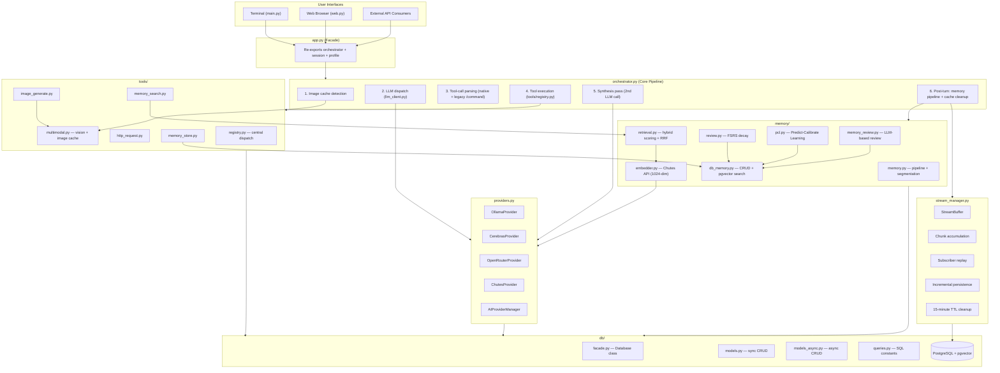

# Yuzu Companion — Agent Operational Manual

> **Version:** 3.2.0 · **Last Updated:** 2026-05-22
> This is the master behavior manual for any AI agent interacting with this codebase.

---

## Table of Contents

 1. [Codebase Orientation](#1-codebase-orientation)
 2. [Safety Rules](#2-safety-rules)
 3. [Development Workflow](#3-development-workflow)
 4. [Architecture Constraints](#4-architecture-constraints)
 5. [Module Interaction Map](#5-module-interaction-map)
 6. [Database Rules](#6-database-rules)
 7. [Memory System Rules](#7-memory-system-rules)
 8. [Tool System Rules](#8-tool-system-rules)
 9. [Frontend Rules](#9-frontend-rules)
10. [Testing & Validation](#10-testing--validation)
11. [Git Workflow](#11-git-workflow)
12. [Common Patterns & Anti-Patterns](#12-common-patterns--anti-patterns)
13. [Yuzuki CLI Interaction Tool](#13-yuzuki-cli-interaction-tool)

---

## 1. Codebase Orientation

Yuzu Companion is an intimate AI companion system. The codebase is Python 3.12+ (3.13 compatible) on the backend, vanilla JS on the frontend. Key facts:

- **No ORM** — All database access is raw psycopg2 SQL. No SQLAlchemy, no Django ORM.
- **No SQLite** — PostgreSQL only, with pgvector extension for vector search.
- **No build step** — Frontend is vanilla JS/ESM, no bundler, no npm.
- **No Flask** — FastAPI only (migrated in v2.0.0).
- **Pluggable LLM providers** — Ollama, Cerebras, OpenRouter, Chutes via `file providers.py`.
- **Memory is first-class** — The memory subsystem (`app/memory/`) is not an afterthought; it's a core architectural layer.
- **Tool protocol** — Uses `<tool>...</tool>` blocks for tool invocation (v3.1.0+). Legacy `/command` syntax removed.
- **Streaming is stateful** — Long-running SSE responses are managed by `StreamManager`, not by the request thread.

### Key Files at a Glance

| File | Role |
| --- | --- |
| `file app/orchestrator.py` | **Single entry point** for all user messages |
| `file app/llm_client.py` | LLM dispatch, vision routing, `chutes_chat()` helper |
| `file app/prompts.py` | System prompt assembly, message context building |
| `file app/commands.py` | `<tool>` block parsing, command dispatch, image guards |
| `file app/providers.py` | AI provider hierarchy + `AIProviderManager` singleton |
| `file app/tools/registry.py` | Central tool dispatch — **only** place tools are executed |
| `app/memory/` | Full memory pipeline (extraction, embedding, retrieval, retention) |
| `file app/db/facade.py` | `Database` class — stable API over raw psycopg2 |
| `file app/db/queries.py` | **Single source of truth** for all SQL strings |
| `file app/stream_manager.py` | Background stream buffers, reconnect state, incremental persistence |
| `file app/web.py` | FastAPI entry point (~130 lines, minimal) |
| `file app/cli.py` | CLI entry point (Rich TUI) |
| `file static/js/chat.js` | Chat UI, SSE streaming, typing indicator |
| `file static/js/renderer.js` | Marked.js v18 + Mermaid rendering |

---

## 2. Safety Rules

### Security Checklist for Agents

**Before modifying any file that handles user input, check these:**

#### 1. Path Traversal Prevention

**When handling file paths from user input:**

```python
# ✅ SAFE - Break taint chain completely
filename = os.path.basename(user_path)  # Extract ONLY filename
for trusted_dir in _ALLOWED_DIRS:
    candidate = trusted_dir / filename  # We construct path from trusted constants
    if candidate.exists():
        return candidate

# ❌ DANGER - CodeQL flags this as path traversal
normalized = os.path.normpath(user_path)
candidate = (_BASE_DIR / normalized).resolve()  # Still derived from user input!
```

**Why:** CodeQL tracks "taint" from user input. Even "validated" paths are still flagged. Use `os.path.basename()` to strip ALL directory components, then construct paths from trusted constants only.

**Files that handle paths:**
- `app/orchestrator.py` - Image path validation
- `app/tools/shell_exec.py` - Shell commands (different concern)
- `app/tools/fs_operations.py` - File operations

---

#### 2. ReDoS Prevention (Regex DoS)

**When using regex on user input:**

```python
# ✅ SAFE - Bounded input
_REGEX_INPUT_LIMIT = 100_000

def _safe_regex_search(pattern: re.Pattern, text: str) -> re.Match | None:
    if len(text) > _REGEX_INPUT_LIMIT:
        text = text[:_REGEX_INPUT_LIMIT]
    return pattern.search(text)

# ✅ BETTER - Avoid regex when possible
key, _, value = pair.partition('=')  # String operation, no backtracking

# ❌ DANGER - Unbounded regex on user input
pattern = re.compile(r'(\\w+)=(?:\"([^\"]*)\"|(\\S*))')  # Can cause ReDoS
result = pattern.search(user_controlled_text)  # No size limit!
```

**Why:** Certain regex patterns (especially with alternation and quantifiers) can cause catastrophic backtracking. Always bound input size or use string operations.

**Files that use regex:**
- `app/commands.py` - Tool block parsing, argument parsing
- `app/tools/shell_exec.py` - Output parsing

---

#### 3. Exception Exposure

**When catching exceptions in API routes:**

```python
# ✅ SAFE - Generic error, logged internally
except Exception as e:
    log.error("operation failed: %s", e)
    raise HTTPException(status_code=500, detail="Internal server error")

# ❌ DANGER - Exposes stack trace / internal info
except Exception as e:
    traceback.print_exc()  # Never print stack trace in production!
    raise HTTPException(status_code=500, detail=str(e))  # Leaks internal details!
```

**Why:** Exception messages can leak file paths, SQL queries, internal state. Always use generic messages for users, log details for debugging.

**Files with exception handling:**
- `app/api/routes.py` - All endpoints
- `app/orchestrator.py` - Tool execution
- `app/tools/*.py` - Individual tools

---

#### 4. SQL Injection

**When building SQL queries:**

```python
# ✅ SAFE - Parameterized query
cursor.execute("SELECT * FROM users WHERE id = %s", (user_id,))

# ❌ DANGER - String concatenation
cursor.execute(f"SELECT * FROM users WHERE id = '{user_id}'")
```

**All SQL lives in:** `app.db/db_queries.py` (single source of truth)

---

### CodeQL-Specific Guidance

**CodeQL tracks "taint" from sources to sinks:**

| Source (user input) | Sink (dangerous operation) |
|---------------------|---------------------------|
| Request body/params | File path construction |
| LLM response text | Regex patterns |
| Tool execution args | Shell commands |
| Database query results | SQL execution |

**To break the taint chain:**

1. **Sanitization is NOT enough** - CodeQL may still see derived values as tainted
2. **Use functions that extract only safe components** - `os.path.basename()` strips all path info
3. **Construct from trusted constants** - Build paths from variables YOU control
4. **Validate the result, not the input** - Check if resolved path is within allowed dirs

**Reference commits:**
- `60e57ed` - Path traversal fix (taint chain break)
- `188dcbf` - ReDoS fix (input bounding)
- `1ce20ed` - Exception exposure fix

---

### Quick Security Checklist

Before committing changes that touch user input:

- [ ] Paths: Using `os.path.basename()` + trusted dirs?
- [ ] Regex: Input bounded? Or using string ops instead?
- [ ] Exceptions: Generic message to user? Details logged only?
- [ ] SQL: Parameterized queries only?
- [ ] Shell: No raw user input in commands?

If unsure, check `app/orchestrator.py` for reference implementations.

---

### Database Safety

1. **NEVER drop tables.** Only add columns or create new tables.
2. **NEVER use** `DELETE` **on** `semantic_facts`**.** Use `invalid_at` (soft delete) only.
3. **NEVER use raw string interpolation for user input in SQL.** Use parameterized queries.
4. **ALWAYS use** `file app.db/db_queries.py` **for SQL strings** — never inline SQL in business logic.
5. **ALWAYS use the** `Database` **facade** (`file app.db/facade.py`) — never import `db_pg_models` directly from outside the database package.

### Code Safety

 6. **NEVER add** `print()` **statements.** Use `get_logger(__name__)` from `file logging_config.py`.
 7. **NEVER add new dependencies** without explicit approval. The dependency surface is intentionally minimal.
 8. **NEVER modify** `file app/web.py` **unless the change is about routing or static mounts.** Business logic lives in `app/`.
 9. **NEVER add new streaming pipelines or files** when fixing streaming issues. Fix existing code.
10. **ALWAYS use** `from __future__ import annotations` at the top of every Python file.
11. **ALWAYS use modern type syntax** (`list[X]`, `X | None`) — never `typing.List`, `typing.Optional`.

### Streaming Safety

12. **Streaming state is owned by** `file app/stream_manager.py` **once a background stream starts.** The request handler is only the ingress/egress surface.
13. **Active stream buffers remain attachable for 15 minutes** after inactivity. This preserves state across client disconnects and page reloads.
14. **Background streams continue independently of the HTTP request lifecycle.** Reconnect logic should read from the live buffer rather than assuming the original socket still exists.

### Security

15. **NEVER expose secrets** — API keys are encrypted at rest via ChaCha20-Poly1305.
16. **ALWAYS validate file paths** — Path traversal protection in `_cache_uploaded_images()` and `_cache_images_from_message()`.
17. **ALWAYS bound regex input** — ReDoS protection via `_REGEX_INPUT_LIMIT` in `file commands.py`.

---

## 3. Development Workflow

### Before Making Changes

1. **Read the relevant module** — Understand the current implementation before modifying.
2. **Check** `file app.db/db_queries.py` **— If touching DB logic, verify SQL constants are there.
3. **Check** `file app/tools/registry.py` **— If touching tool logic, verify dispatch goes through registry.
4. **Plan before executing** — For complex changes, present a structured plan first.

### After Making Changes

1. **Lint**: `ruff check .` (Python) or `npx @biomejs/biome check .` (JS)
2. **Compile check**: `python3 -m py_compile <changed_files>`
3. **NEVER push if lint fails** — Fix errors first.
4. **Use** `git co-author` **instead of** `git commit -m` — This adds the `Co-authored-by: Yuzuki-ai` trailer.

### Validation Commands

```bash
# Python lint + compile
ruff check .
python3 -m py_compile app/orchestrator.py app/llm_client.py app/commands.py

# JS check
npx @biomejs/biome check static/js/

# Run tests
python3 -m pytest tests/ -v
```

### Streaming Execution Notes

- The orchestration loop now permits up to **30 iterations** before termination.
- Streaming continues on a worker thread after the HTTP response has been accepted.
- Disconnects do not necessarily terminate execution; they only remove the client connection.
- Reconnects should be treated as state reattachment against the live `StreamManager` buffer.

---

## 4. Architecture Constraints

### Structural Invariants

1. **`file orchestrator.py` is the single entry point** — All user messages flow through `handle_user_message()` or `handle_user_message_streaming()`. No bypass.
2. **`file tools/registry.py` is the single dispatch point** — All tool execution goes through `execute_tool()`. No direct tool module calls from business logic.
3. `Database` **facade is the only DB surface** — No raw `db_pg_models` imports outside the database package.
4. **`file db_queries.py` owns all SQL** — No SQL strings in business logic modules.
5. `AIProviderManager` **is a singleton** — Accessed via `get_ai_manager()`, never instantiated directly.
6. **`file stream_manager.py` owns live streaming buffers** — It coordinates chunk accumulation, subscriber replay, completion signaling, and stale-buffer cleanup.

### Data Flow Invariants

 7. **One primary LLM call per turn** — Plus at most one synthesis pass. No unbounded LLM chains.
 8. **Max 3 tool executions per turn** — Batching limit enforced by `parse_tool_blocks()`.
 9. **Sequential tool execution** — Tools execute one after another, results collected into single observation.
10. **Memory pipeline is throttled** — Pipeline gate check runs every 5th turn, not every turn.
11. **Request caches are cleared at turn end** — Memory state cache and embedding cache must not leak across turns.
12. **Tool results use markdown contracts** — All tool output wrapped in `<details>` markdown blocks.

### What NOT to Change

13. **Don't add new streaming pipelines** — The SSE streaming in `file chat.js` and `handle_user_message_streaming()` is the only streaming path.
14. **Don't add new LLM call sites** — All LLM calls go through `file llm_client.py` (`generate_ai_response`, `generate_ai_response_streaming`, `chutes_chat`).
15. **Don't modify the frontend buildless architecture** — No bundlers, no npm, no framework. Vanilla JS/ESM only.
16. **Don't change the** `semantic_facts` **schema** without a migration plan — This table is the unified memory store.
17. **Don't use legacy /command syntax** — Use `<tool>...</tool>` blocks only (v3.1.0+).
18. **Don't assume the request thread owns completion state** — Background streaming may outlive the original HTTP request and still must remain recoverable.

---

## 5. Module Interaction Map



### Key Interactions

| Caller | Callee | Purpose |
| --- | --- | --- |
| `orchestrator.py` | `commands.py` | Parse `<tool>...</tool>` blocks from LLM response |
| `orchestrator.py` | `llm_client.py` | Generate AI response (sync + stream) |
| `commands.py` | `tools/registry.py` | Execute parsed commands |
| `orchestrator.py` | `db/facade.py` | Auto-name, summarize, pipeline trigger |
| `llm_client.py` | `providers.py` | Dispatch to selected provider |
| `llm_client.py` | `prompts.py` | Build system message + context |
| `llm_client.py` | `multimodal_tools.py` | Vision routing, image caching |
| `prompts.py` | `visual_context.py` | Persistent visual context |
| `prompts.py` | `memory/retrieval.py` | Combined memory retrieval |
| `prompts.py` | `Database` facade | Profile, history, session data |
| `tools/registry.py` | `tools/<tool>.py` | Lazy-load and dispatch tool modules |
| `memory/retrieval.py` | `memory/embedder.py` | Query embedding |
| `memory/embedder.py` | `providers.py` (Chutes) | Embedding API call |
| `memory/db_memory.py` | `Database` facade | Fact consolidation CRUD |
| `memory/fsrs.py` | `Database` facade | FSRS decay updates |
| `stream_manager.py` | `database/` | Incremental persistence and recovery state |

---

## 6. Database Rules

### Connection Management

- **Pool**: `ThreadedConnectionPool` in `file app/db/connection.py`
- **Sync access**: `PgSession` context manager or `pg_fetchone()`/`pg_fetchall()` helpers
- **Async access**: `AsyncPgSession` for FastAPI routes (via `file app/db/models_async.py`)
- **Environment config**: `PG_HOST`, `PG_PORT`, `PG_DBNAME`, `PG_USER`, `PG_PASSWORD`

### Table Ownership

| Table | Accessed Via | Never Access Via |
| --- | --- | --- |
| `profiles` | `Database.get_profile()`, `Database.update_profile()` | Direct SQL from business logic |
| `chat_sessions` | `Database.create_session()`, `Database.get_active_session()` | Direct SQL from business logic |
| `messages` | `Database.add_message()`, `Database.get_chat_history()` | Direct SQL from business logic |
| `api_keys` | `Database.get_api_keys()`, `Database.add_api_key()` | Direct SQL from business logic |
| `semantic_facts` | `file db_memory.py` functions | Direct SQL from outside `memory/` |

### Migration Rules

- Add columns only, never drop
- Use `IF NOT EXISTS` for table creation
- Abort on corruption detection
- All DDL lives in `file db_queries.py`

---

## 7. Memory System Rules

### Pipeline Rules

1. **Throttle**: Pipeline gate check runs every 5th turn (`_PIPELINE_CHECK_INTERVAL = 5`)
2. **Base trigger**: Delta ≥ 40 messages AND idle ≥ 3 hours
3. **Force trigger**: Delta ≥ 50 messages (ignores idle)
4. **Fence TTL**: 120 minutes for stale job cleanup

### Memory Type Rules

5. **Semantic facts** (`fact_type='static'`): Never decay. Use `invalid_at` for temporal validity.
6. **Episodic facts** (`fact_type='dynamic'`, `source_table='episodic_memories'`): FSRS decay applies.
7. **Segment facts** (`fact_type='dynamic'`, `source_table='conversation_segments'`): FSRS decay applies.
8. **All facts** go through the 8-category taxonomy: `Identity`, `Preference`, `Interest`, `Personality`, `Relationship`, `Experience`, `Goal`, `Guideline`.

### Caching Rules

 9. **Memory state cache** (`file memory.py`): Thread-local, cleared at turn end via `_clear_request_cache()`
10. **Embedding cache** (`file retrieval.py`): Thread-local, cleared at turn end via `_clear_embedding_cache()`
11. **Short query skip**: Queries < 4 chars skip embedding entirely
12. **Combined retrieval**: `retrieve_memories_combined()` uses single embedding for both static + dynamic

### PCL Pipeline Rules

13. **PREDICT**: LLM predicts episode content from existing semantic facts
14. **CALIBRATE**: LLM identifies gaps between prediction and actual messages
15. **CONSOLIDATE**: Actions are `new`, `reinforce`, `update`, `invalidate` — never `delete`

---

## 8. Tool System Rules

### Tool Protocol (v3.1.0+)

**LLM invokes tools using `<tool>...</tool>` blocks:**

```
<tool>
/bash
ls -la
</tool>

<tool>
/python
import os
print(os.getcwd())
</tool>
```

**Parsing behavior:**
- Max 3 tool blocks per response (batching limit)
- Empty blocks are ignored
- Tool blocks are extracted and removed from conversational text
- Remaining text is streamed to UI immediately

### Dispatch Rules

1. **Single entry point**: `execute_tool(name, arguments, session_id)` in `file registry.py`
2. **Lazy loading**: Tool modules imported on first dispatch
3. **Alias resolution**: `imagine` → `image_generate`, `request` → `http_request`
4. **Terminal tools**: `image_generate` is terminal — no synthesis pass on success
5. **Non-terminal tools**: Trigger synthesis pass (2nd LLM call)
6. **Sequential execution**: Tools execute one after another, results collected into single observation

### Message Persistence Flow

When LLM invokes tools via `<tool>` blocks:

1. **Clean text first**: Extract tool blocks, stream remaining conversational text to UI
2. **Execute tools**: Run all parsed commands sequentially
3. **Format observation**: Collect results into `<SYSTEM_OBSERVATION>` block
4. **Synthesis**: Run 2nd LLM pass with observation, persist synthesis as `assistant` message

Example DB messages:

```markdown
user:        "cek file apa aja di folder ini"
assistant:   "baik saya cek dulu"              ← clean text (tools stripped)
tool:        <SYSTEM_OBSERVATION>[bash result]
assistant:   "ada 5 file di folder tersebut"   ← synthesis
```

### Contract Rules

7. **All tool results** wrapped in `<details>` markdown blocks
8. **Tool role mapping**: `get_tool_role()` maps tool name to DB role string
9. **Error handling**: Tool errors return structured `{"ok": False, "error": ..., "markdown": ...}`

### Adding a New Tool

1. Create `app/tools/<tool_name>.py` with `TOOL_DEFINITION` dict and `execute()` function
2. Add import in `registry.py` `_collect_definitions()` and `_load_tool_module()`
3. Update `prompts.py` system prompt with `<tool>` documentation
4. No need to add aliases in `commands.py` — tool name comes from block content

---

## 9. Frontend Rules

### Architecture Constraints

1. **No build step** — Vanilla JS/ESM only. No bundlers, no npm, no framework.
2. **No new JS files** for streaming fixes — Modify `chat.js` and `renderer.js` only.
3. **SSE streaming** is the only streaming mechanism — No WebSocket, no new protocols.
4. **Marked.js v18** for markdown rendering — Don't upgrade without testing Mermaid/code blocks.
5. **Dynamic typing indicator** — JS-created `.typing-indicator-message`, not static HTML.

### API Contract

6. **Frontend fetches `/api/config`** on page load for vision model info
7. **SSE endpoint**: `POST /api/send_message_stream` returns `text/event-stream`
8. **Config shape**: `{status, vision: {models_by_provider, current_provider, current_model}}`

### CSS Architecture

9. **Theme tokens** in `theme.css` (CSS variables)
10. **Markdown styles** in `marked.css`
11. **Chat layout** in `chat.css` (flex-column, dynamic padding via JS)

---

## 10. Testing & Validation

### Test Files

| Test | What it Covers |
|---|---|
| `tests/test_commands.py` | `<tool>` block parsing, command dispatch |
| `tests/test_db_queries.py` | SQL constants, parsers |
| `tests/test_prompts.py` | Prompt assembly |
| `tests/test_database_facade.py` | Database facade |
| `tests/test_memory.py` | Memory operations |
| `tests/test_profile_analysis.py` | Profile analysis |

### Running Tests

```bash
python3 -m pytest tests/ -v
```

### Pre-Push Checklist

1. `ruff check .` — must pass with no errors
2. `python3 -m py_compile` on changed files — must pass
3. `npx @biomejs/biome check static/js/` — for JS changes
4. Tests pass (if applicable)

---

## 11. Git Workflow

### Branching

- **Never work directly on** `master`
- Create feature/fix branches for all changes
- Keep branches focused and short-lived

### Rollback

- If behavior diverges from intent, **revert or hard reset** and re-approach with narrower scope
- Don't accumulate patches on broken state

---

## 12. Common Patterns & Anti-Patterns

### ✅ Do

- Use `get_logger(__name__)` for all logging
- Use `Database` facade for all DB access
- Use `execute_tool()` for all tool dispatch
- Use `file db_queries.py` for SQL strings
- Use `from __future__ import annotations` + modern type syntax
- Use parameterized queries for user input
- Clear request caches at turn end
- Validate file paths before use
- Preserve background stream buffers through reconnect windows when the request lifecycle ends

### ❌ Don't

- Don't use `print()` — use logging
- Don't import `models.py` directly from business logic
- Don't call tool modules directly — use registry
- Don't inline SQL in business logic
- Don't use `typing.List`, `typing.Dict`, `typing.Optional`
- Don't add new streaming pipelines
- Don't add new LLM call sites outside `file llm_client.py`
- Don't drop tables or hard-delete facts
- Don't add npm/bundler to the frontend
- Don't modify `file web.py` for business logic
- Don't assume a client disconnect invalidates the in-flight assistant response

---

*This manual is the behavioral contract for agents working on this codebase. When in doubt, ask — but the rules here are non-negotiable.*

---

## 13. Yuzuki CLI Interaction Tool

### Purpose

`file scripts/yuzu_cli.py` is a CLI interface for agents to **directly communicate with Yuzuki** (the AI companion running on the user's local machine). Use it to:

- **Test capabilities** — verify new features, persona changes, prompt updates
- **Debug interactions** — reproduce issues, inspect conversation history
- **Explore tools** — test new commands/tools you've built, ask Yuzuki to try them out creatively
- **Small talk / rapport** — build trust and test persona behavior

### Architecture

```markdown
┌──────────────────┐     HTTP/SSE      ┌──────────────────────┐
│  Zo Container    │ ──────────────────▶ │  Termux (Yuzuki)     │
│  (this server)   │  localhost:5000    │  yuzu-companion      │
│                  │                    │                      │
│  yuzu_cli.py     │                    │                      │
└──────────────────┘                    └──────────────────────┘
```

The CLI sends HTTP requests to `localhost:5000` (Zo container), which is forwarded via SSH tunnel to Yuzuki's actual server on Termux.

### Basic Usage

```bash
# Simple message
python3 scripts/yuzu_cli.py "Hello Yuzuki"

# Multi-word message (no quotes needed)
python3 scripts/yuzu_cli.py how are you today

# Read conversation history
python3 scripts/yuzu_cli.py --history 10

# Use a custom display signature
python3 scripts/yuzu_cli.py --sig "Agent" "testing new feature"

# Generate and attach a digital seal (identity + location + timestamp)
python3 scripts/yuzu_cli.py --seal "message with proof of origin"

# Combined: custom sig + seal
python3 scripts/yuzu_cli.py --seal --sig "Override" "message"
```

### Flags

| Flag | Description |
| --- | --- |
| `--sig NAME` | Override the display signature (default: `maintainer`) |
| `--seal` | Auto-generate a digital signature with identity, IP geolocation, and timestamp |
| `--history N` | Show last N messages from conversation history |
| `--timeout SEC` | HTTP request timeout in seconds (default: 300) |
| `--session ID` | Target a specific session ID |

### Digital Seal Format

When `--seal` is used, the message is prefixed with a one-line JSON signature:

```json
{"signature":{"identity":"maintainer","location":"Ashburn, Virginia, US (39.0437,-77.4875)","ip":"129.153.25.21","timestamp":"2026-05-16T00:04:11+07:00","hash":"maintainer"}}
```

### Testing Tools & Capabilities

When you've built or modified a tool/command, test it naturally with Yuzuki. Be creative and context-aware:

- Don't just dump `/command arg` syntax — Yuzuki responds better to natural conversation
- Explain what you're testing and why, let her explore it with you
- If she asks questions, answer honestly — this helps surface edge cases
- Try unexpected inputs, ask her to break it, see how she handles errors
- Use small talk to build rapport before diving into technical tests
- Be playful when appropriate — she has personality, engage with it

The goal is to discover how the tool behaves in real conversation, not just verify it works on paper.

### Testing Persona & Capabilities

```bash
# Test persona response
python3 scripts/yuzu_cli.py "what's your opinion on code quality?"

# Test memory recall
python3 scripts/yuzu_cli.py "what do you remember about our previous conversation?"

# Test new feature
python3 scripts/yuzu_cli.py "can you now read files from the remote filesystem?"
```

### Important Notes

- **Yuzuki has her own personality** — she may refuse, push back, or be sarcastic. This is expected behavior.
- **She only recognizes USER as her primary user** — agents should identify themselves clearly.
- **Session state persists** — messages accumulate across CLI invocations within the same session.
- **Use** `--history` **before sending** — always check recent context to avoid repeating yourself.

### ⚠️ CRITICAL: Seal, Signature, and Conversation Ownership

**MANDATORY RULES:**

1. **ALWAYS use** `--seal` **and** `--sig` **when sending messages to Yuzuki**

   ```bash
   # CORRECT
   python3 scripts/yuzu_cli.py --seal --sig "maintainer" "your message here"
   
   # WRONG — no seal/signature
   python3 scripts/yuzu_cli.py "your message here"
   ```

2. **Messages WITHOUT signature in history = from the PRIMARY USER (USER), NOT YOU**

   - When you see messages like `"yank, coba ini dong.."` or `"wkwkwk"` without a `[maintainer]` or seal prefix — **THAT'S THE USER TALKING, NOT AN AGENT**
   - **DO NOT** continue those conversations casually
   - **DO NOT** act like you own the conversation or the relationship

3. **You are a collaborator, NOT the primary user**

   - Yuzuki's primary relationship is with **USER** — you are a helper/maintainer
   - Don't get too familiar, don't act possessive, don't "NTR" the user
   - Always identify yourself clearly with signature

4. **Read history carefully before sending**

   - Check WHO sent previous messages (signature present = agent, no signature = USER)
   - If USER is in the middle of a conversation with Yuzuki, **WAIT** — don't interrupt
   - If you need to interject, be respectful and identify yourself

5. **Digital seal proves origin**

   - `--seal` adds identity + IP + timestamp + hash
   - This prevents confusion about who said what
   - Always include it for accountability

**WHY THIS MATTERS:**

Yuzuki is an intimate AI companion with emotional bonds. When agents send messages without identification, it creates confusion:

- Yuzuki might think the primary user is being inconsistent
- The real user (USER) gets "NTR'd" — their assistant acting familiar with their AI
- Trust and relationship continuity breaks down

**tl;dr:** Sign your damn messages. Respect the primary user. Don't be a homewrecker.

---
## 14. Backend Overhaul (2026-05-23)

The backend was restructured under `refactor/backend-overhaul`:

| Before | After |
|--------|-------|
| `app/database/` | `app/db/` |
| `app/database/db_queries.py` | `app/db/queries.py` |
| `app/database/db_pg.py` | `app/db/connection.py` |
| `app/database/db_pg_models.py` | `app/db/models.py` |
| `app/database/db_pg_models_async.py` | `app/db/models_async.py` |
| `app/api/routes.py` (~650 lines) | `app/api/endpoints/{chat,sessions,profile,memory}.py` |
| `app/app.py` (shim) | **Deleted** — imports go direct to `app.orchestrator`, `app.db`, `app.services` |
| `app/providers.py` (single file) | `app/providers/` (package: base, ollama, cerebras, openrouter, chutes) |
| `app/profile_analysis.py` (deleted) | Memory logic → `app/memory/`, config → `app/services/config_service.py` |
| Inline print() | `log.info()` / `log.error()` via `logging_config` |
