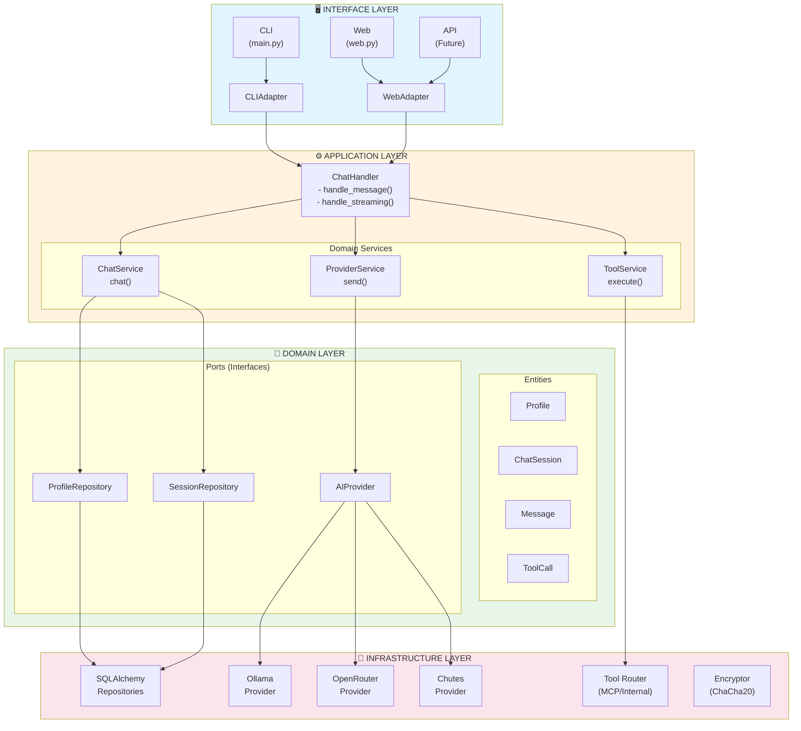
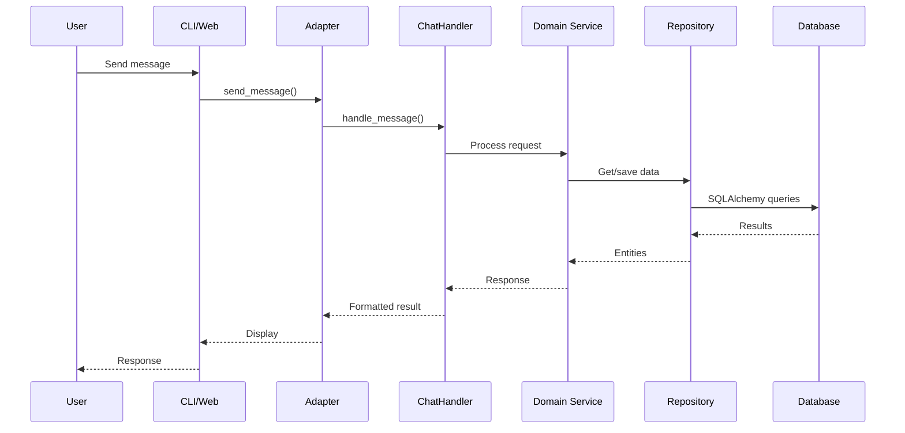
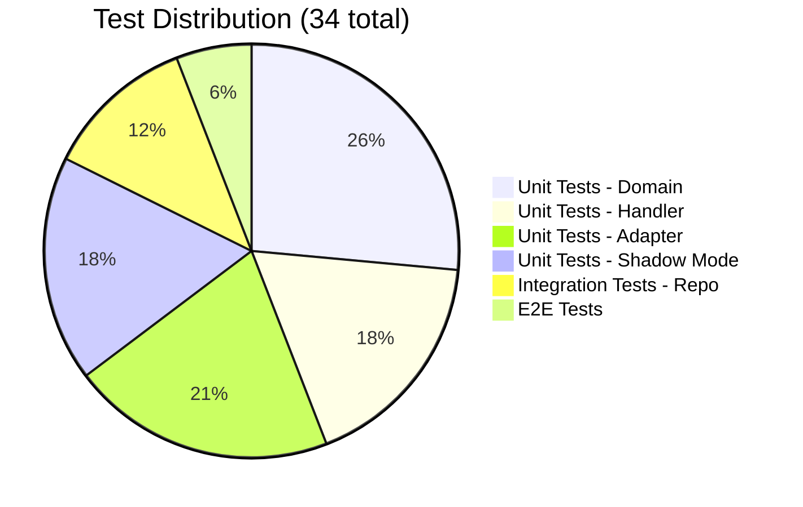
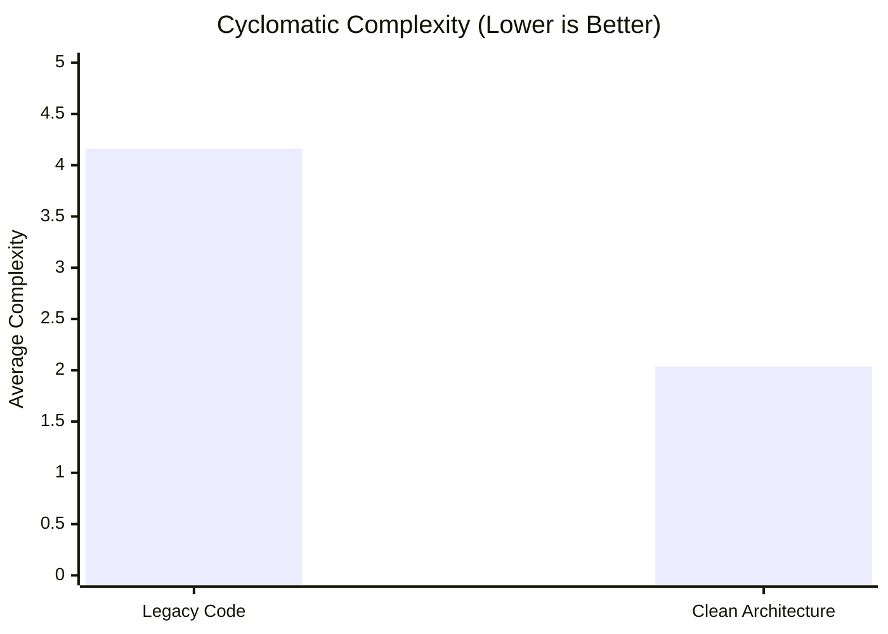

# 🍊 Yuzu-Companion v2 - Clean Architecture Guide

> **Live Documentation** - March 2026

---

## 🎯 Quick Navigation

| Layer | Path | Purpose |
|-------|------|---------|
| **Domain** | `src/yuzu/domain/` | Business logic, entities, rules |
| **Application** | `src/yuzu/application/` | Use cases, handlers, DTOs |
| **Infrastructure** | `src/yuzu/infrastructure/` | DB, AI providers, tools |
| **Interfaces** | `src/yuzu/interfaces/` | CLI, Web adapters |
| **Tests** | `tests/` | 34 passing tests |

---

## 📊 Architecture Diagram



---

## 📋 Layer Responsibilities

| Layer | Responsibility | Key Files |
|-------|---------------|-----------|
| **Interface** | User interaction | `main.py`, `web.py` |
| **Application** | Orchestration, use cases | `chat_handler.py`, adapters |
| **Domain** | Business rules, entities | Models, services, interfaces |
| **Infrastructure** | External concerns | DB, providers, tools |

---

## 🔄 Data Flow



---

## 🎛️ Feature Flags (Migration Control)

Set via environment variables:

| Flag | Purpose | Default |
|------|---------|---------|
| `YUZU_USE_NEW_CHAT_HANDLER` | Use new ChatHandler | `false` |
| `YUZU_USE_NEW_SESSION_REPO` | Use new SessionRepository | `false` |
| `YUZU_USE_NEW_PROFILE_REPO` | Use new ProfileRepository | `false` |
| `YUZU_USE_NEW_PROVIDERS` | Use new AI providers | `false` |
| `YUZU_USE_NEW_TOOLS` | Use new tool service | `false` |
| `YUZU_DEBUG` | Enable debug logging | `false` |

**Usage:**

```bash
# Enable all new features
export YUZU_USE_NEW_CHAT_HANDLER=true
export YUZU_USE_NEW_SESSION_REPO=true
export YUZU_USE_NEW_PROFILE_REPO=true

# Run application
python web.py
```

---

## 📁 Directory Structure

```mermaid
tree
    root["src/yuzu/"]
    domain["domain/"]
    interfaces["interfaces/"]
    application["application/"]
    infrastructure["infrastructure/"]
    
    root --> domain
    root --> interfaces
    root --> application
    root --> infrastructure
    
    domain --> domain_models["models/\n- Profile\n- ChatSession\n- Message"]
    domain --> domain_services["services/\n- ChatService\n- ToolService"]
    domain --> domain_interfaces["interfaces/\n- Repository ports\n- Provider ports"]
    
    interfaces --> cli["cli/\n- CLIAdapter"]
    interfaces --> web["web/\n- WebAdapter"]
    
    application --> handlers["handlers/\n- ChatHandler"]
    
    infrastructure --> db["db/\n- SQLAlchemy repos"]
    infrastructure --> ai["ai/\n- Provider implementations"]
    infrastructure --> tools["tools/\n- ToolRouter"]
    infrastructure --> monitoring["monitoring/\n- Shadow mode"]
```

---

## 🧪 Testing



**Run tests:**

```bash
# All tests
pytest tests/

# Unit tests only
pytest tests/unit/

# With coverage
pytest --cov=src/yuzu tests/
```

---

## 📊 Complexity Comparison



| Metric | Legacy | New | Change |
|--------|--------|-----|--------|
| Avg Complexity | 4.16 | 2.04 | ⬇️ -51% |
| High Complexity (C+) | 21% | 0% | ⬇️ -100% |
| Test Coverage | ~30% | 34 tests | ⬆️ Growing |

---

## 🔌 Dependency Direction

```mermaid
flowchart LR
    subgraph DependencyRule["Dependency Rule: Inward Only"]
        direction TB
        
        Interface["Interface"]
        Application["Application"]
        Domain["Domain"]
        Infrastructure["Infrastructure"]
        
        Interface --> Application
        Application --> Domain
        Infrastructure --> Domain
        
        note right of Interface "Depends on Application"
        note right of Application "Depends on Domain"
        note right of Infrastructure "Depends on Domain"
        note left of Domain "No external deps"
    end
```

---

## 🚀 Migration Strategy

```mermaid
gantt
    title Migration Timeline
    dateFormat X
    axisFormat %d
    
    section Phase 1
    Foundation        :done, p1, 0, 2
    
    section Phase 2
    Repositories      :done, p2, 2, 4
    
    section Phase 3
    Domain Services   :done, p3, 4, 6
    
    section Phase 4
    Adapters          :done, p4, 6, 8
    
    section Phase 5
    Shadow Mode       :done, p5, 8, 10
    
    section Phase 6
    Feature Migration :active, p6, 10, 12
    
    section Phase 7
    Legacy Removal    :p7, 12, 14
```



---

## 📚 Documentation

| Document | Location | Purpose |
|----------|----------|---------|
| **This Guide** | `ARCHITECTURE_GUIDE.md` | Architecture overview |
| **Phase Summaries** | `.agent/archive/` | Detailed phase notes |
| **API Docs** | `src/yuzu/` docstrings | Code documentation |
| **Tests** | `tests/` | Usage examples |

---

## 💡 Key Principles

1. **Interface Segregation**: Ports define contracts, adapters implement
2. **Dependency Inversion**: Domain has no external dependencies
3. **Single Responsibility**: Each class has one reason to change
4. **Open/Closed**: Extend via new implementations, don't modify core
5. **Testability**: 34 tests, 0 external deps in domain

---

*Generated: March 2026*  
*Status: v2 Clean Architecture - 5 Phases Complete*