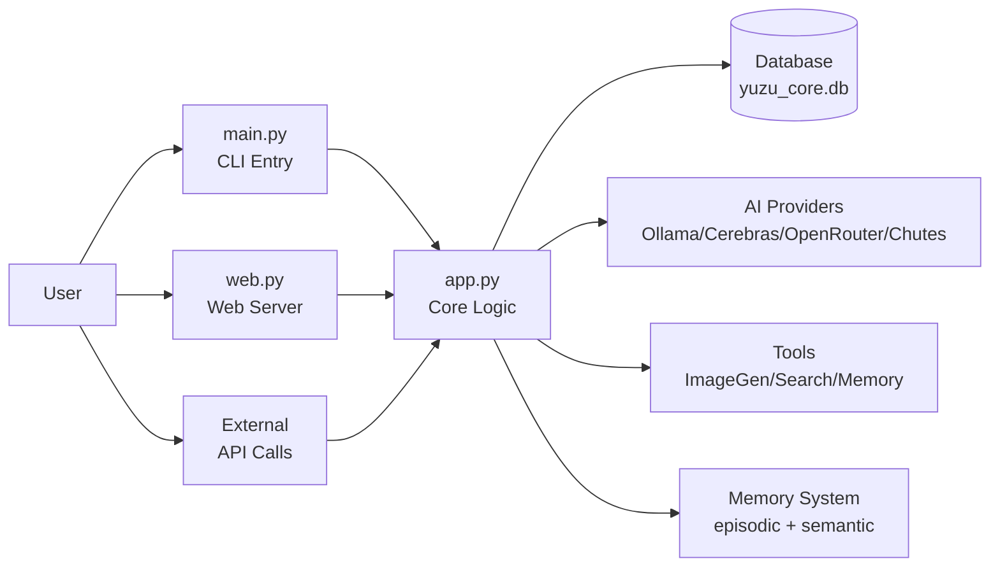
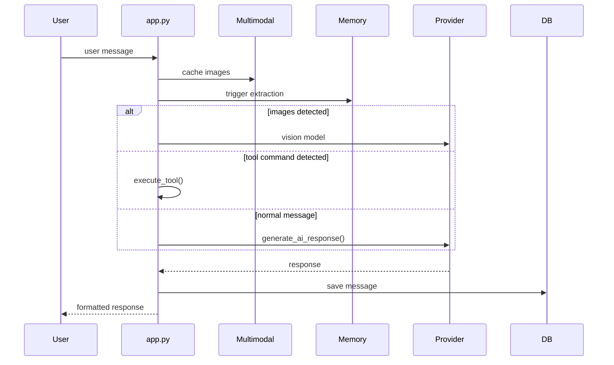
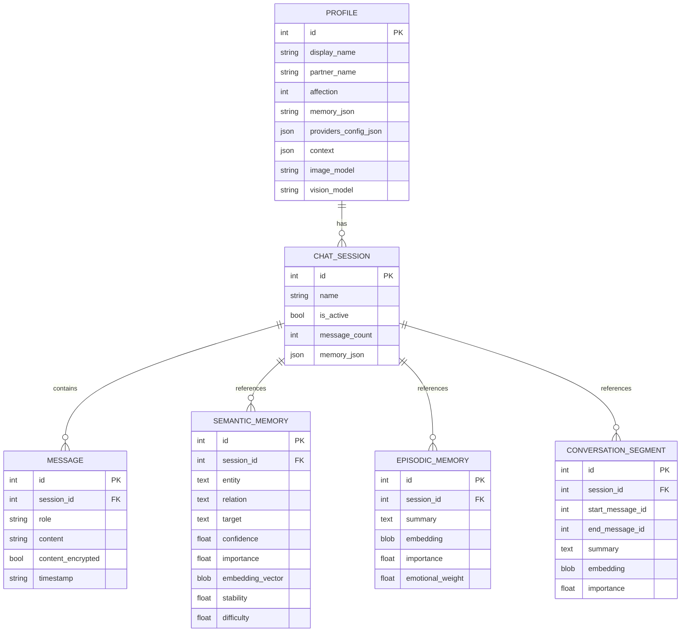
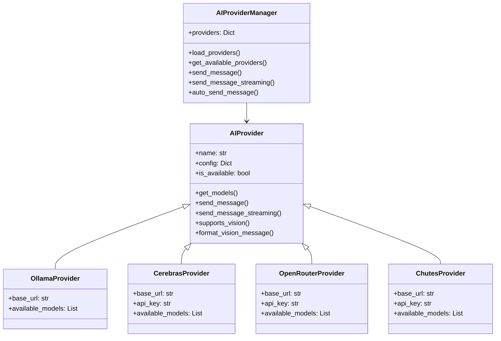
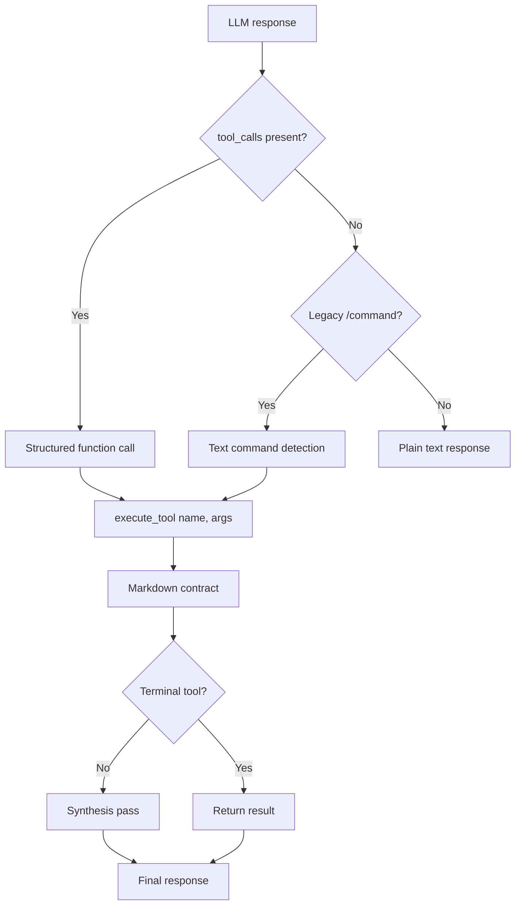
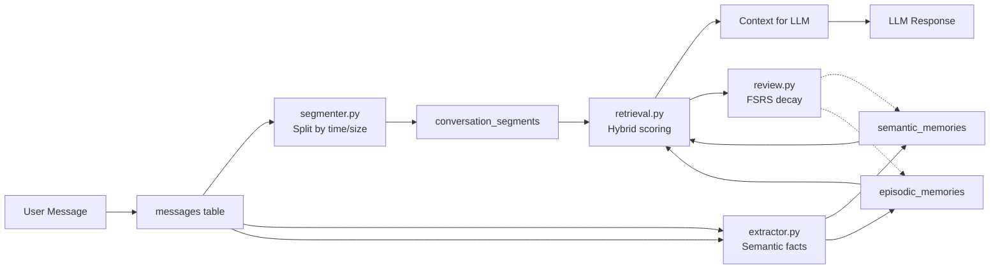
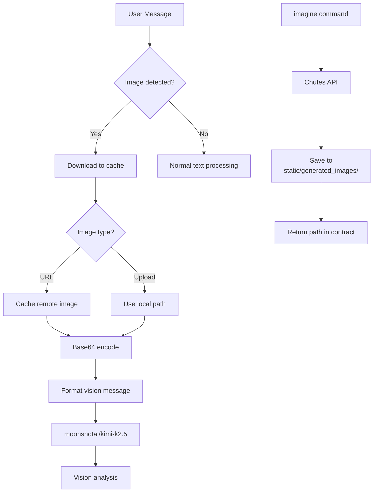
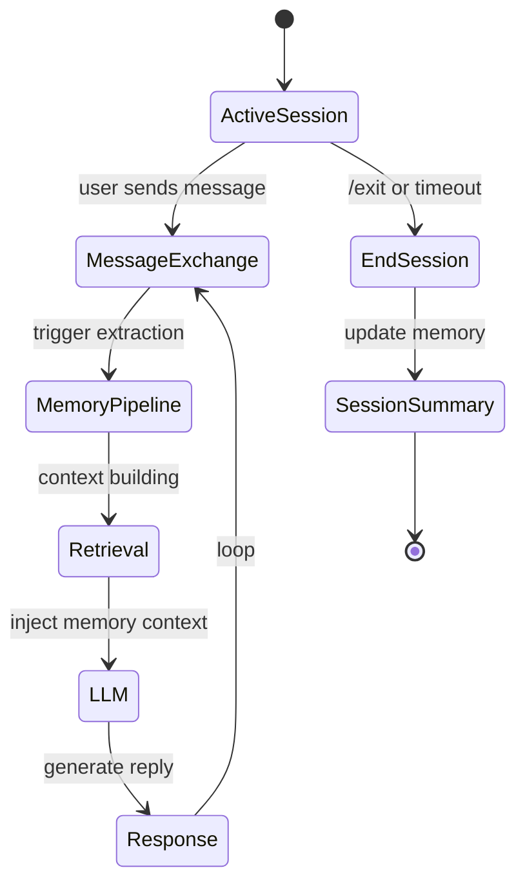
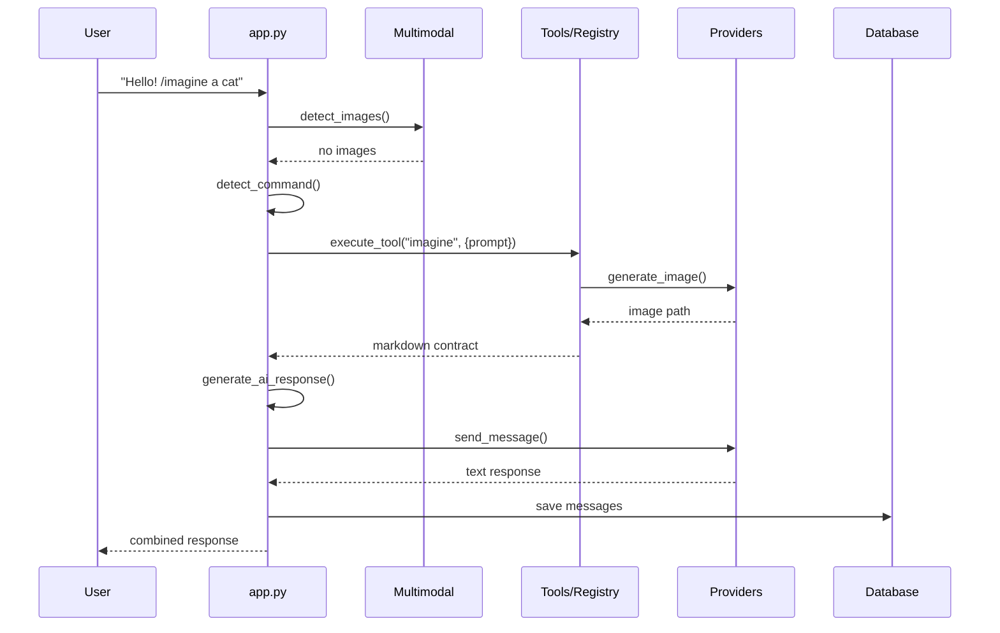

# Yuzu Companion — Application Module

The `app/` directory is the core of Yuzu Companion — the AI companion system that powers emotional, long-running conversations with persistent memory across sessions.


---

## Table of Contents

- [Overview](#overview)
- [Directory Structure](#directory-structure)
- [Core Entry Points](#core-entry-points)
  - [`app.py`](#apppy--orchestration-core)
  - [`main.py`](#mainpy--cli-application)
  - [`web.py`](#webpy--fastapi-web-server)
- [Database Layer](#database-layer)
- [AI Provider System](#ai-provider-system)
- [Tool System](#tool-system)
- [Memory System](#memory-system)
- [Multimodal System](#multimodal-system)
- [Encryption](#encryption)
- [Session Management](#session-management)
- [Configuration](#configuration)
- [Workflow: Message Processing](#workflow-message-processing)
- [Dependencies](#dependencies)
- [Architecture Principles](#architecture-principles)

---


## Overview

Yuzu Companion is a multi-interface AI companion with:

- **Emotional bonding** — affection system, personality memory, relationship continuity
- **Multimodal interaction** — text, images, vision analysis, image generation
- **Session-based memory** — episodic + semantic long-term memory with FSRS-inspired retention
- **Encrypted conversations** — ChaCha20-Poly1305 encryption for API keys
- **Three interfaces** — Terminal (Rich UI), Web (FastAPI), and programmatic (CLI/API)



---

## Directory Structure

```mermaid
graph TD
    A[app/] --> B[app.py]
    A --> C[database.py]
    A --> D[providers.py]
    A --> E[encryption.py]
    A --> F[key_manager.py]
    A --> G[memory/]
    A --> H[tools/]
    
    G --> G1[extractor.py<br/>Semantic + Episodic extraction]
    G --> G2[segmenter.py<br/>Conversation segmentation]
    G --> G3[retrieval.py<br/>Memory retrieval pipeline]
    G --> G4[review.py<br/>FSRS decay & reinforcement]
    G --> G5[embedder.py<br/>Vector embeddings via Chutes]
    G --> G6[models.py<br/>ORM model re-exports]
    
    H --> H1[registry.py<br/>Tool execution + schema registry]
    H --> H1b[schemas.py<br/>ToolParam + ToolDefinition dataclasses]
    H --> H2[multimodal.py<br/>Vision & image caching]
    H --> H3[image_generate.py<br/>Image generation]
    H --> H4[http_request.py<br/>HTTP GET/POST tool]
    H --> H5[memory_store.py<br/>Memory persistence]
    H --> H6[memory_search.py<br/>Memory retrieval]
```



---

## Core Entry Points

### `app.py` — Orchestration Core

The single entry point for all user messages. Handles:

1. Image caching from user messages
2. Vision model routing when images detected
3. **Standard tool calling** — `tool_calls` from LLM + legacy `/command` fallback
4. Memory pipeline triggering
5. Response generation via provider selection
6. Markdown contract building for tool results



Key functions:
- `handle_user_message()` — synchronous response
- `handle_user_message_streaming()` — streaming response
- `start_session()` — initialize session, run memory pipeline
- `summarize_memory()` — per-session context update
- `summarize_global_player_profile()` — cross-session profile analysis

### `main.py` — CLI Application

Terminal interface using Rich + prompt_toolkit. Provides:
- Interactive chat loop with command handling (`/model`, `/imagine`, `/vision`, `/session`, etc.)
- Session management menu
- Provider/model switching
- Code block extraction and saving
- Web interface launcher

### `web.py` — FastAPI Web Server

REST API + templates for the web UI:
- `/` — landing page
- `/chat` — chat interface
- `/config` — configuration panel
- `/api/send_message` — message endpoint
- `/api/send_message_stream` — streaming endpoint
- `/api/memory_stats` — structured memory stats
- `/api/providers/*` — provider management

---

## Database Layer

### `database.py`

SQLAlchemy ORM with SQLite backend (`yuzu_core.db`).



**Key tables:**
- `profiles` — user/companion settings, memory JSON, provider config
- `chat_sessions` — session tracking, per-session memory
- `messages` — conversation log (role, content, timestamp, image_paths)
- `api_keys` — encrypted API key storage
- `semantic_memories` — RDF-like (entity, relation, target) triples
- `episodic_memories` — summarized interaction segments
- `conversation_segments` — chunked conversation windows

**Safety rules:**
- NEVER drops tables
- Only safe migrations (add columns, never destructive)
- Aborts if database corruption detected

---

## AI Provider System

### `providers.py`

Pluggable provider architecture:



**Supported providers:**

| Provider | Base URL | Vision Support | Image Gen |
|----------|----------|----------------|-----------|
| Ollama | `http://127.0.0.1:11434` | No | No |
| Cerebras | `https://api.cerebras.ai/v1/chat/completions` | No | No |
| OpenRouter | `https://openrouter.ai/api/v1/chat/completions` | `moonshotai/kimi-k2.5` | Via Chutes |
| Chutes | `https://llm.chutes.ai/v1/chat/completions` | No | Yes |

**Ollama models:**
```
smollm:360m, smollm2:360m, glm-4.6:cloud, qwen3-vl:235b-cloud,
qwen3-coder:480b-cloud, kimi-k2:1t-cloud, kimi-k2.5:cloud,
gpt-oss:120b-cloud, gpt-oss:20b-cloud, deepseek-v3.1:671b-cloud
```

**OpenRouter models (selected):**
```
moonshotai/kimi-k2.5, anthropic/claude-3.5-haiku, openai/gpt-4o-mini,
deepseek-ai/DeepSeek-V3, Qwen/Qwen3-8B, meta-llama/llama-3.3-70b-instruct
```

---

## Tool System

The tool system has two execution modes:

1. **Standard tool calling** — OpenAI `function` call format (primary, v2.1+)
2. **Legacy `/command` text detection** — command-prefixed responses (fallback compat)

### `tools/schemas.py` — Tool Schema Definitions

Declarative tool definitions using `ToolParam` and `ToolDefinition` dataclasses.

```python
@dataclass
class ToolParam:
    name: str
    description: str
    type: str = "string"
    required: bool = True
    default: Optional[str] = None

@dataclass
class ToolDefinition:
    name: str
    description: str
    parameters: List[ToolParam]
    requires_session: bool = False
    is_terminal: bool = False   # skips second LLM pass on success
    category: str = "general"
```

### `tools/registry.py` — Central Registry

Single source of truth for tool dispatch. Lazy-loads `TOOL_DEFINITIONS` from each tool module on first access.

**Key exports:**
- `get_tool_definitions()` — returns list of all registered `ToolDefinition` dicts
- `get_tool_definition(name)` — returns schema for a specific tool
- `execute_tool(name, arguments, session_id)` — dispatch and return markdown contract
- `format_tool_result()` — produces structured `GenerateResult(text, tool_calls)`
- `get_tool_role(name)` — maps tool name to DB role string

### Tool Dispatch Flow



**Dispatch priority:**
1. Structured `tool_calls[0]` from LLM → execute via registry → done
2. Legacy `/command` text detection → execute via registry → done
3. Plain text → return as-is

### Registered Tool Schemas

| Tool | Role | Params | Terminal |
|------|-------|--------|----------|
| `image_generate` | `image_tools` | `prompt` (str, required) | ✅ |
| `request` | `request_tools` | `url` (str, required), `method` (str, optional) | ❌ |
| `memory_search` | `memory_search_tools` | `query` (str, required) | ❌ |
| `memory_store` | `memory_store_tools` | `fact` (str, required), `category` (str, optional) | ❌ |

### Markdown Contract Format

Tool results are stored in a `<details>` block:

```html
<details>
<summary>🔧 image_tools</summary>

```bash
Yuzu$ /imagine a cute cat
```

> Image generated successfully
> Saved to: static/generated_images/xxx.png

</details>
```

### Tool Modules

Each tool module exports a `TOOL_DEFINITION` dict alongside its `execute()` function:

| Module | Purpose |
|--------|---------|
| `image_generate.py` | Image generation via Chutes API (HunYuan, Z-Turbo, Qwen) |
| `http_request.py` | Fetch public HTTPS endpoints with size/type validation |
| `memory_store.py` | Persist semantic facts with LLM-guided categorization |
| `memory_search.py` | Hybrid retrieval across semantic + episodic memories |
| `multimodal.py` | Vision model routing and image caching (non-tool, helpers) |

---

## Memory System

The memory subsystem lives in `app/memory/` and provides long-term, structured memory with human-inspired retention dynamics.



### Memory Layers

| Layer | Table | Purpose |
|-------|-------|---------|
| **Episodic** | `episodic_memories` | Summarized interaction events with emotional weight |
| **Semantic** | `semantic_memories` | Stable facts as (entity, relation, target) triples |
| **Segments** | `conversation_segments` | Chunked conversation windows for summarization |

### Retrieval Scoring

```
semantic_score = similarity × 0.6 + importance × 0.2 + confidence × 0.2
episodic_score = similarity × 0.5 + importance × 0.25 + recency × 0.25
```

### FSRS-Inspired Retention

- Memory **stability** increases with access count
- **Importance** decays: `importance × exp(-hours/stability)`
- Frequently retrieved memories become **long-term anchors**
- Low-importance memories **naturally fade**

See [`memory/README.md`](memory/README.md) for full documentation.

---

## Multimodal System

### `tools/multimodal.py`

Handles image processing for vision and generation:



**Vision pipeline:**
1. Extract image URLs/paths from message markdown
2. Download remote images to `static/image_cache/`
3. Encode as base64 data URI
4. Route to `moonshotai/kimi-k2.5` via OpenRouter
5. Attach vision response to conversation

**Image generation pipeline:**
1. Detect `/imagine` command or image generation keywords
2. Call Chutes image API
3. Save result to `static/generated_images/`
4. Return markdown with image path
5. Second LLM pass to describe generated image

---

## Encryption

### `encryption.py`

ChaCha20-Poly1305 encryption for API keys at rest:

- **API keys**: Always encrypted
- **Messages**: Encryption disabled by default (configurable)
- Key derivation from master key in `encryption.key`
- Fallback to plaintext if decryption fails

### `key_manager.py`

Master key lifecycle management:
- Key generation on first run
- Secure key storage
- Key rotation support

---

## Session Management



On session start:
1. Run FSRS decay on existing memories
2. Segment unsegmented messages
3. Extract semantic + episodic memories
4. Initialize session context

---

## Configuration

### Profile Settings (stored in `profiles` table)

```python
{
    "display_name": str,      # User's display name
    "partner_name": str,      # AI companion name
    "affection": int,         # 0-100 affection level
    "theme": str,             # UI theme
    "memory": {               # Player profile memory
        "player_summary": str,
        "key_facts": {
            "likes": [],
            "dislikes": [],
            "personality_traits": []
        }
    },
    "providers_config": {
        "preferred_provider": str,
        "preferred_model": str,
        "streaming_enabled": bool
    }
}
```

### API Key Management

API keys are stored encrypted in `api_keys` table:
- `cerebras` — Cerebras API key
- `chutes` — Chutes API key  
- `openrouter` — OpenRouter API key

---

## Workflow: Message Processing



---

## Dependencies

```
# Core
SQLAlchemy>=2.0.0     # ORM
pycryptodome>=3.20.0  # Encryption

# Web (FastAPI)
fastapi>=0.115.0      # Modern async web framework
uvicorn[standard]>=0.30.0  # ASGI server
pydantic>=2.8.0       # Data validation with type hints
python-multipart>=0.0.9   # For file uploads
Jinja2>=3.1.0         # Template engine (still used)

# Terminal UI
rich>=13.0.0
prompt-toolkit>=3.0.0

# Networking
requests>=2.33.0
beautifulsoup4>=4.12.0
```

---

## Architecture Principles

1. **Single entry point** — `handle_user_message()` is the only gateway for user messages
2. **Tool isolation** — all tools go through `execute_tool()` with markdown contracts
3. **Memory-first** — memory pipeline runs on every session start and periodically
4. **Provider abstraction** — `AIProviderManager` hides provider differences
5. **Safe migrations** — database never drops tables, only adds columns
6. **No heuristic detection** — LLM determines responses, not hardcoded rules
