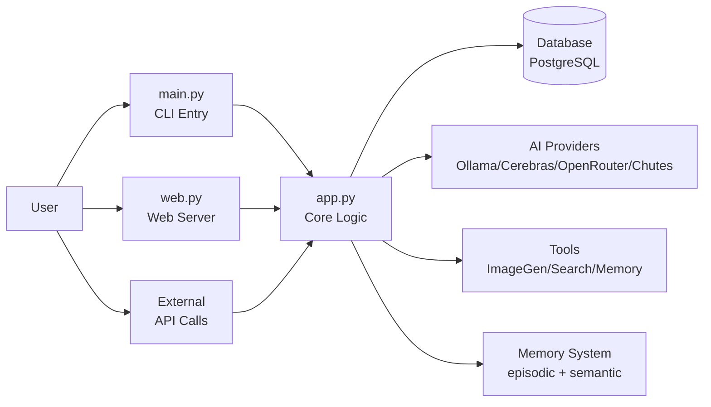
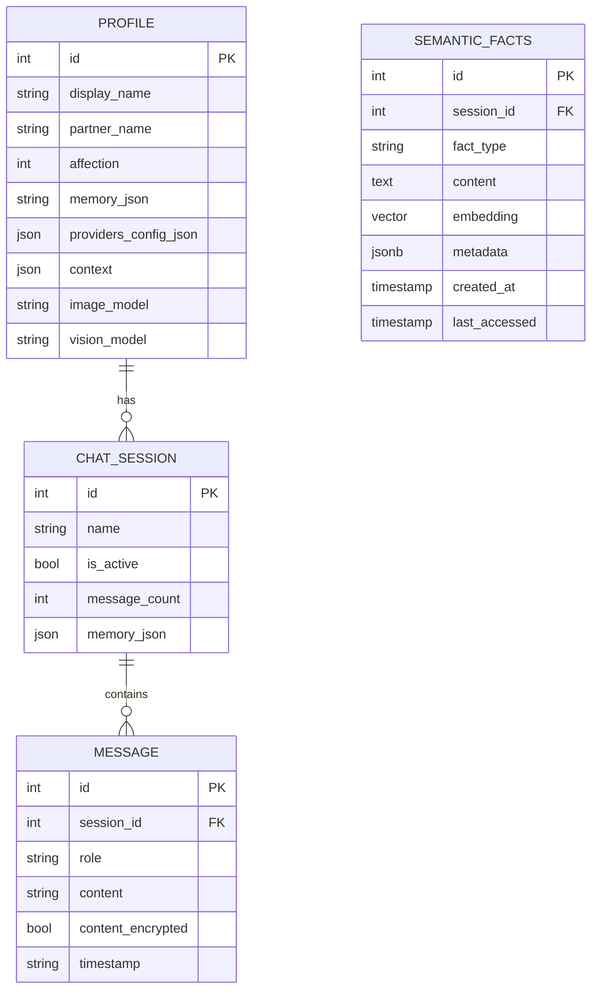
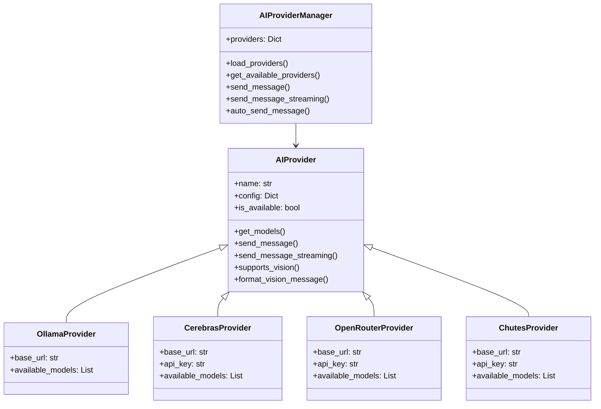
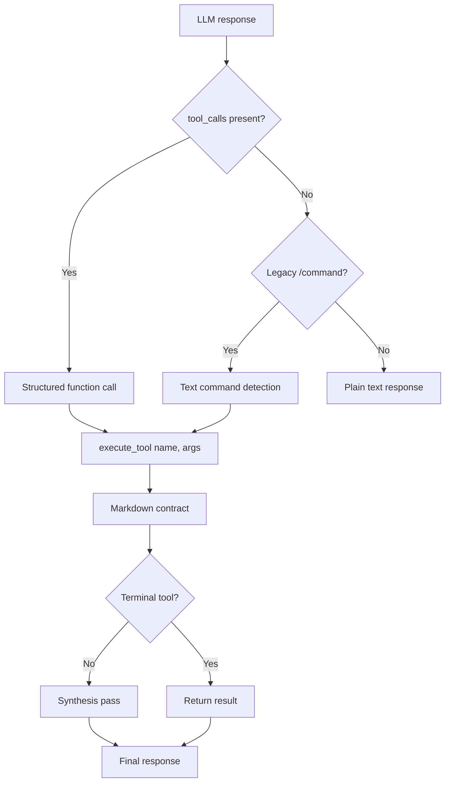
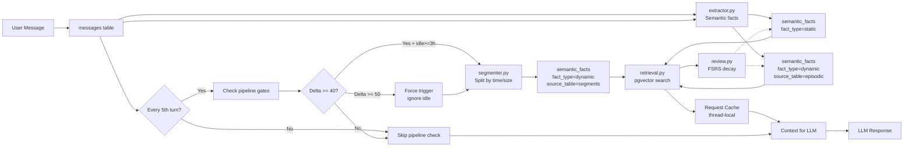
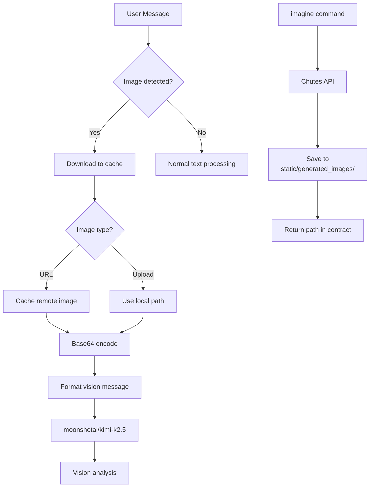
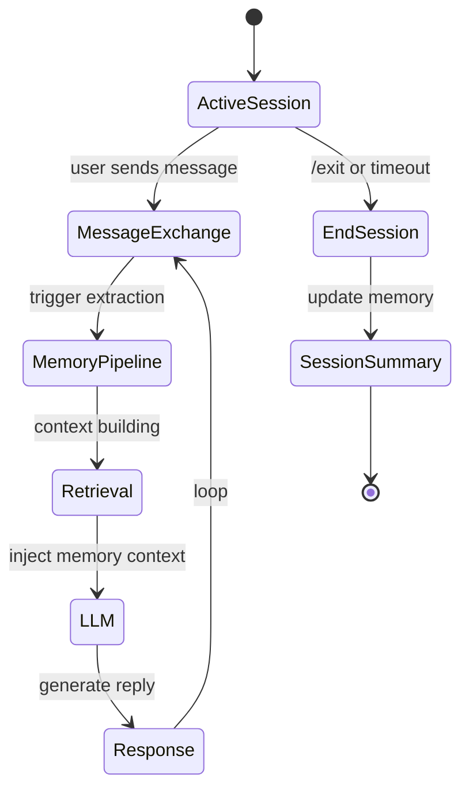
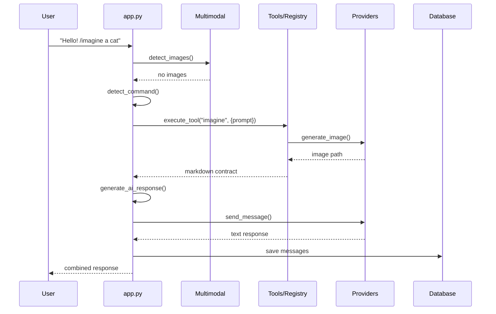

# Yuzu Companion — Application Module

The `app/` directory is the core of Yuzu Companion — the AI companion system that powers emotional, long-running conversations with persistent memory across sessions.


---

## Table of Contents

- [Overview](#overview)
- [Directory Structure](#directory-structure)
- [Core Entry Points](#core-entry-points)
  - [`file app.py`](#apppy--orchestration-core)
  - [`file main.py`](#mainpy--cli-application)
  - [`file web.py`](#webpy--fastapi-web-server)
- Database Layer
- [AI Provider System](#ai-provider-system)
- [Tool System](#tool-system)
- [Memory System](#memory-system)
- [Multimodal System](#multimodal-system)
- [Encryption](#encryption)
- [Session Management](#session-management)
- [Configuration](#configuration)
- [Workflow: Message Processing](#workflow-message-processing)
- [Dependencies](#dependencies)
- [Architecture Principles](#architecture-principles)

---


## Overview

Yuzu Companion is a multi-interface AI companion with:

- **Emotional bonding** — affection system, personality memory, relationship continuity
- **Multimodal interaction** — text, images, vision analysis, image generation
- **Session-based memory** — episodic + semantic long-term memory with FSRS-inspired retention
- **Encrypted conversations** — ChaCha20-Poly1305 encryption for API keys
- **Three interfaces** — Terminal (Rich UI), Web (FastAPI), and programmatic (CLI/API)



---

## Directory Structure

```
app/
├── api/
│   ├── __init__.py           # Package init
│   └── routes.py             # All /api/* endpoints
├── memory/
│   ├── db_memory.py          # Unified PostgreSQL CRUD
│   ├── db_memory_queries.py  # SQL constants + builders
│   ├── embedder.py           # Vector embeddings via Chutes
│   ├── extractor.py          # Semantic + Episodic extraction
│   ├── memory.py             # Background pipeline + segmentation
│   ├── memory_review.py      # LLM-based memory review
│   ├── pcl.py                # Predict-Calibrate Learning
│   ├── retrieval.py          # Memory retrieval pipeline
│   └── review.py             # FSRS decay & reinforcement
├── tools/
│   ├── http_request.py       # HTTP GET/POST tool
│   ├── image_generate.py     # Image generation
│   ├── memory_search.py      # Memory retrieval
│   ├── memory_store.py       # Memory persistence
│   ├── multimodal.py         # Vision & image caching
│   ├── registry.py           # Tool execution + schema registry
│   └── schemas.py            # ToolParam + ToolDefinition dataclasses
├── app.py
├── commands.py
├── db_pg.py
├── db_pg_models.py
├── db_queries.py
├── encryption.py
├── key_manager.py
├── llm_client.py
├── logging_config.py         # Centralized logging, get_logger()
├── orchestrator.py
├── profile_analysis.py
├── prompts.py
├── providers.py
├── stream_manager.py         # Background stream buffers and reconnect state
└── visual_context.py
```

**Removed/Deprecated:**

- `file database.py` — deleted (use `file db_pg_models.py` directly)
- `file memory/models.py` — deleted (no ORM layer)
- `file memory/segmenter.py` — merged into `file memory.py`
- `file memory/vector_store.py` — deprecated stub

---

## Core Entry Points

### `file orchestrator.py` — Message Orchestration

The single entry point for handling user messages. Coordinates:

1. Image caching from user messages
2. Vision model routing when images detected
3. **Standard tool calling** — `tool_calls` from LLM + legacy `/command` fallback
4. Memory pipeline triggering
5. Response generation via provider selection

Streaming execution now runs in a background worker thread, with cooperative cancellation via `abort_check` and a 30-iteration orchestration ceiling.

### `file app.py` — Core Application Facade

Simplified facade that delegates to `file orchestrator.py` for backward compatibility.\
Key functions:

- `handle_user_message()` — synchronous response
- `handle_user_message_streaming()` — streaming response
- `start_session()` — initialize session, run memory pipeline
- `summarize_memory()` — per-session context update
- `summarize_global_player_profile()` — cross-session profile analysis

### `file main.py` — CLI Application

Terminal interface using Rich + prompt_toolkit. Provides:

- Interactive chat loop with command handling (`/model`, `/imagine`, `/vision`, `/session`, etc.)
- Session management menu
- Provider/model switching
- Code block extraction and saving
- Web interface launcher

### `file web.py` — FastAPI Entry Point

Minimal entry point that sets up the web server:

- Static mounts (`/static`, `/uploads`, `/generated_images`)
- HTML page routes (`/`, `/chat`, `/config`, `/about`)
- Registers `api_router` from `file app/api/routes.py`
- **Lifespan management** for DB pool initialization (v4.0.0+)

All API endpoints are defined in `file app/api/routes.py`.

### `file stream_manager.py` — Streaming State Coordinator

`StreamManager` owns in-flight stream buffers outside the request thread. It accumulates chunks, replays buffered output to reconnecting clients, and retires stale buffers after a fixed TTL. The API layer reads from it during reconnect and profile reload paths, while the orchestrator worker thread writes into it as generation advances.

---

## API Routing

### `file api/__init__.py`

Package init that exposes `api_router` for registration in `file web.py`.

### `file api/routes.py`

All `/api/*` endpoints (\~700 lines):

| Endpoint | Method | Purpose |
| --- | --- | --- |
| `/api/config` | GET | Frontend SSOT for vision models |
| `/api/send_message` | POST | Synchronous message handling |
| `/api/send_message_stream` | POST | Streaming message handling with state reattachment |
| `/api/get_profile` | GET | Profile data with active stream recovery |
| `/api/providers/*` | \* | Provider management |
| `/api/sessions/*` | \* | Session CRUD |
| `/api/memory_stats` | GET | Memory statistics |

**Key endpoint:** `/api/config`

Returns dynamic configuration for the frontend:

```json
{
  "status": "success",
  "vision": {
    "models_by_provider": {
      "chutes": ["Qwen/Qwen3.5-397B-A17B-TEE", ...],
      "openrouter": ["moonshotai/kimi-k2.5"]
    },
    "current_provider": "chutes",
    "current_model": "Qwen/Qwen3.5-397B-A17B-TEE"
  }
}
```

This eliminates hardcoded vision model lists in `file static/js/config.js`.

The streaming endpoints support state reattachment. When a background stream is still active, `/api/send_message_stream` and `/api/get_profile` can surface the live buffer content so the UI can recover after a disconnect or reload without losing the partial assistant response.

---

## Database Layer

### `file db_pg.py` — Connection Pool

PostgreSQL connection management using `ThreadedConnectionPool` with context managers:

- `PgSession` — sync context manager for database operations
- `AsyncPgSession` — async context manager for FastAPI routes
- `pg_fetchone`, `pg_fetchall`, `pg_execute` — convenience functions

### `file db_pg_models.py` — CRUD Operations

Direct PostgreSQL CRUD operations using raw psycopg2. All data in PostgreSQL (`yuzuki`).



**Key tables:**

- `profiles` — user/companion settings, memory JSON, provider config
- `chat_sessions` — session tracking, per-session memory
- `messages` — conversation log (role, content, timestamp, image_paths)
- `api_keys` — encrypted API key storage
- `semantic_facts` — unified memory table with pgvector embeddings
  - `fact_type='static'` — semantic memories (stable facts)
  - `fact_type='dynamic'` — episodic memories and segments (decayable)

### `file db_queries.py` — SQL Constants

Single source of truth for SQL strings, schema DDL, and row parsers. Used by both sync and async repository layers.

**Safety rules:**

- NEVER drops tables
- Only safe migrations (add columns, never destructive)
- Aborts if database corruption detected

---

## AI Provider System

### `file providers.py`

Pluggable provider architecture:



**Supported providers:**

| Provider | Base URL | Vision Support | Image Gen |
| --- | --- | --- | --- |
| Ollama | `http://127.0.0.1:11434` | No | No |
| Cerebras | `https://api.cerebras.ai/v1/chat/completions` | No | No |
| OpenRouter | `https://openrouter.ai/api/v1/chat/completions` | `moonshotai/kimi-k2.5` | Via Chutes |
| Chutes | `https://llm.chutes.ai/v1/chat/completions` | No | Yes |

**Ollama models:**

```markdown
smollm:360m, smollm2:360m, glm-4.6:cloud, qwen3-vl:235b-cloud,
qwen3-coder:480b-cloud, kimi-k2:1t-cloud, kimi-k2.5:cloud,
gpt-oss:120b-cloud, gpt-oss:20b-cloud, deepseek-v3.1:671b-cloud
```

**OpenRouter models (selected):**

```markdown
moonshotai/kimi-k2.5, anthropic/claude-3.5-haiku, openai/gpt-4o-mini,
deepseek-ai/DeepSeek-V3, Qwen/Qwen3-8B, meta-llama/llama-3.3-70b-instruct
```

---

## Tool System

The tool system has two execution modes:

1. **Standard tool calling** — OpenAI `function` call format (primary, v2.1+)
2. **Legacy** `/command` **text detection** — command-prefixed responses (fallback compat)

### `file tools/schemas.py` — Tool Schema Definitions

Declarative tool definitions using `ToolParam` and `ToolDefinition` dataclasses.

```python
@dataclass
class ToolParam:
    name: str
    description: str
    type: str = "string"
    required: bool = True
    default: Optional[str] = None

@dataclass
class ToolDefinition:
    name: str
    description: str
    parameters: List[ToolParam]
    requires_session: bool = False
    is_terminal: bool = False   # skips second LLM pass on success
    category: str = "general"
```

### `file tools/registry.py` — Central Registry

Single source of truth for tool dispatch. Lazy-loads `TOOL_DEFINITIONS` from each tool module on first access.

**Key exports:**

- `get_tool_definitions()` — returns list of all registered `ToolDefinition` dicts
- `get_tool_definition(name)` — returns schema for a specific tool
- `execute_tool(name, arguments, session_id)` — dispatch and return markdown contract
- `format_tool_result()` — produces structured `GenerateResult(text, tool_calls)`
- `get_tool_role(name)` — maps tool name to DB role string

### Tool Dispatch Flow



**Dispatch priority:**

1. Structured `tool_calls[0]` from LLM → execute via registry → done
2. Legacy `/command` text detection → execute via registry → done
3. Plain text → return as-is

### Registered Tool Schemas

| Tool | Role | Params | Terminal |
| --- | --- | --- | --- |
| `image_generate` | `image_tools` | `prompt` (str, required) | ✅ |
| `request` | `request_tools` | `url` (str, required), `method` (str, optional) | ❌ |
| `memory_search` | `memory_search_tools` | `query` (str, required) | ❌ |
| `memory_store` | `memory_store_tools` | `fact` (str, required), `category` (str, optional) | ❌ |

### Markdown Contract Format

Tool results are stored in a \`\`\`\`html-details\
\` block:

```html
<details>
<summary>🔧 image_tools</summary>

```bash
Yuzu$ /imagine a cute cat
```

> Image generated successfully\
> Saved to: static/generated_images/xxx.png

```markdown
```

### Tool Modules

Each tool module exports a `TOOL_DEFINITION` dict alongside its `execute()` function:

| Module | Purpose |
| --- | --- |
|  | Image generation via Chutes API (HunYuan, Z-Turbo, Qwen) |
|  | Fetch public HTTPS endpoints with size/type validation |
|  | Persist semantic facts with LLM-guided categorization |
|  | Hybrid retrieval across semantic + episodic memories |
|  | Vision model routing and image caching (non-tool, helpers) |

---

## Memory System

The memory subsystem lives in `app/memory/` and provides long-term, structured memory with human-inspired retention dynamics.

**Performance Optimizations:**
- Request-scoped caching for memory state and embeddings
- Throttled pipeline checks (every 5th turn, not every turn)
- Combined retrieval (single embedding for static + dynamic)
- Short query skip (< 4 chars → no embedding)



### Memory Layers

| Layer | `fact_type` | `metadata.source_table` | Purpose |
| --- | --- | --- | --- |
| **Semantic** | `static` | — | Stable facts as (entity, relation, target) triples |
| **Episodic** | `dynamic` | `episodic_memories` | Summarized interaction events with emotional weight |
| **Segments** | `dynamic` | `conversation_segments` | Chunked conversation windows for summarization |

### Pipeline Triggers

| Condition | Threshold | Behavior |
| --- | --- | --- |
| **Throttle** | Every 5th turn | Skip pipeline check 80% of turns |
| **Base trigger** | Delta >= 40 messages + idle >= 3 hours | Normal trigger |
| **Force trigger** | Delta >= 50 messages | Trigger regardless of idle |
| **Fence TTL** | 120 minutes | Stale job cleanup |

### Request Caching

Two thread-local caches reduce per-turn overhead:

| Cache | Location | What it Caches |
| --- | --- | --- |
| **Memory state** | `memory.py` | `get_memory_state()` results |
| **Embedding** | `retrieval.py` | Query embeddings for combined retrieval |

Both cleared at end of each turn via `_clear_request_cache()`.

### Unified `semantic_facts` Table

All memory types stored in a single PostgreSQL table with pgvector:

```sql
CREATE TABLE semantic_facts (
    id SERIAL PRIMARY KEY,
    session_id INTEGER,
    fact_type VARCHAR(20),  -- 'static' | 'dynamic'
    content TEXT,
    embedding VECTOR(1024),   -- Qwen3-Embedding-0.6B
    metadata JSONB,           -- confidence, importance, source_table, etc.
    valid_at TIMESTAMP,       -- When fact became true
    created_at TIMESTAMP,
    last_accessed TIMESTAMP,
    invalid_at TIMESTAMP      -- Soft delete (NULL = active)
);
```

### Retrieval Scoring (pgvector)

```sql
-- Hybrid search: vector distance + metadata scores
SELECT *, 
  (embedding <=> query_vector) * 0.6 + 
  (metadata->>'importance')::float * 0.2 + 
  (metadata->>'confidence')::float * 0.2 AS score
FROM semantic_facts
WHERE fact_type = 'static'
ORDER BY embedding <=> query_vector
LIMIT 15;
```

### FSRS-Inspired Retention

- Memory **stability** increases with access count
- **Importance** decays: `importance × exp(-hours/stability)`
- Frequently retrieved memories become **long-term anchors**
- Low-importance memories **naturally fade**

### Key Modules

| Module | Purpose | Key Exports |
| --- | --- | --- |
| `db_memory.py` | Unified CRUD over `semantic_facts` with pgvector search | `save_fact()`, `search_similar()`, `invalidate_fact()` |
| `db_memory_queries.py` | SQL constants + query builders | `FACT_TYPE_STATIC`, `FACT_TYPE_DYNAMIC` |
| `retrieval.py` | Hybrid scoring retrieval pipeline | `retrieve_memories_combined()`, `_clear_embedding_cache()` |
| `extractor.py` | LLM-based semantic + episodic extraction | `upsert_semantic_memory()` |
| `memory.py` | Background pipeline + batch segmentation | `trigger_memory_pipeline_async()`, `_clear_request_cache()` |
| `review.py` | FSRS-style decay and reinforcement | `run_decay()`, `reinforce_memory()` |
| `embedder.py` | Chutes API embedding client | `embed_text()`, `EMBEDDING_DIM=1024` |

See `file memory/docs/architecture.md` for full documentation.

---

## Multimodal System

### `file tools/multimodal.py`

Handles image processing for vision and generation:



**Vision pipeline:**

1. Extract image URLs/paths from message markdown
2. Download remote images to `static/image_cache/`
3. Encode as base64 data URI
4. Route to `moonshotai/kimi-k2.5` via OpenRouter
5. Attach vision response to conversation

**Image generation pipeline:**

1. Detect `/imagine` command or image generation keywords
2. Call Chutes image API
3. Save result to `static/generated_images/`
4. Return markdown with image path
5. Second LLM pass to describe generated image

---

## Encryption

### `file encryption.py`

ChaCha20-Poly1305 encryption for API keys at rest:

- **API keys**: Always encrypted
- **Messages**: Encryption disabled by default (configurable)
- Key derivation from master key in `encryption.key`
- Fallback to plaintext if decryption fails

### `file key_manager.py`

Master key lifecycle management:

- Key generation on first run
- Secure key storage
- Key rotation support

---

## Session Management



On session start:

1. Run FSRS decay on existing memories
2. Segment unsegmented messages
3. Extract semantic + episodic memories
4. Initialize session context

---

## Configuration

### Profile Settings (stored in `profiles` table)

```python
{
    "display_name": str,      # User's display name
    "partner_name": str,      # AI companion name
    "affection": int,         # 0-100 affection level
    "theme": str,             # UI theme
    "memory": {               # Player profile memory
        "player_summary": str,
        "key_facts": {
            "likes": [],
            "dislikes": [],
            "personality_traits": []
        }
    },
    "providers_config": {
        "preferred_provider": str,
        "preferred_model": str,
        "streaming_enabled": bool
    }
}
```

### API Key Management

API keys are stored encrypted in `api_keys` table:

- `cerebras` — Cerebras API key
- `chutes` — Chutes API key
- `openrouter` — OpenRouter API key

---

## Workflow: Message Processing



---

## Dependencies

```markdown
# Core
pycryptodome>=3.20.0  # ChaCha20-Poly1305 encryption
python-dotenv>=1.0.0  # .env loading

# Database
psycopg[binary,pool]>=3.1  # PostgreSQL adapter (psycopg v3)

# Web (FastAPI)
fastapi>=0.115.0           # Modern async web framework
uvicorn[standard]>=0.30.0  # ASGI server
pydantic>=2.8.0            # Data validation with type hints
python-multipart>=0.0.9    # For file uploads
Jinja2>=3.1.0              # Template engine

# Terminal UI
rich>=13.0.0
prompt-toolkit>=3.0.0

# Networking
requests>=2.33.0  # HTTP client for AI providers

# Development (optional)
pytest>=7.0.0     # Testing framework
mypy>=1.0.0       # Type checking
```

---

## Architecture Principles

1. **Single entry point** — `handle_user_message()` is the only gateway for user messages
2. **Tool isolation** — all tools go through `execute_tool()` with markdown contracts
3. **Memory-first** — memory pipeline runs on every session start and periodically
4. **Provider abstraction** — `AIProviderManager` hides provider differences
5. **Safe migrations** — database never drops tables, only adds columns
6. **No heuristic detection** — LLM determines responses, not hardcoded rules
7. **Request-scoped caching** — memory state and embeddings cached per-turn, cleared at turn end to minimize API calls
