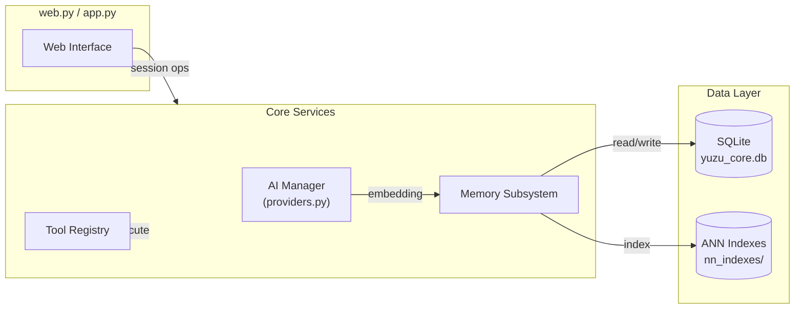
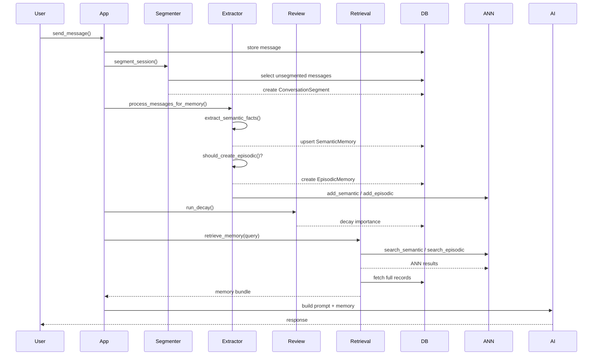
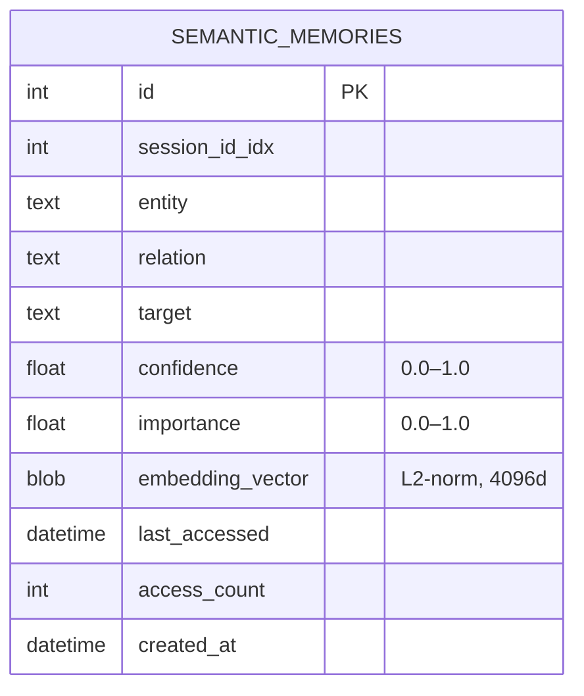
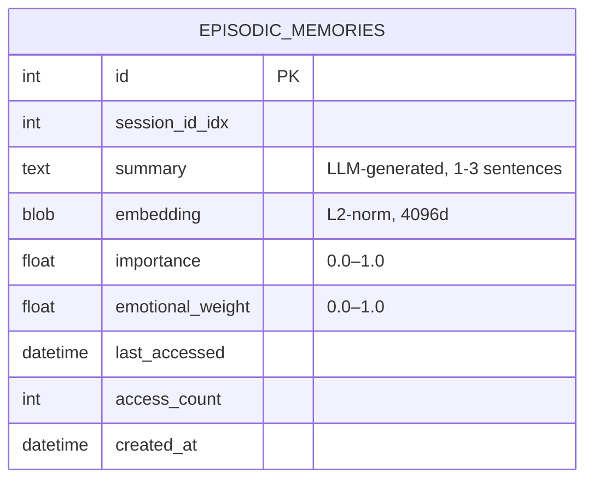
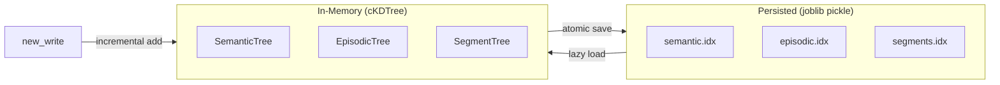
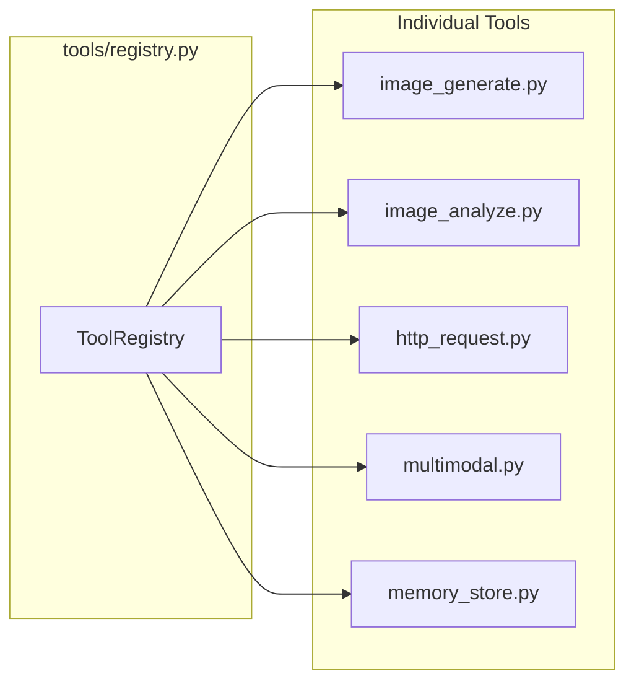
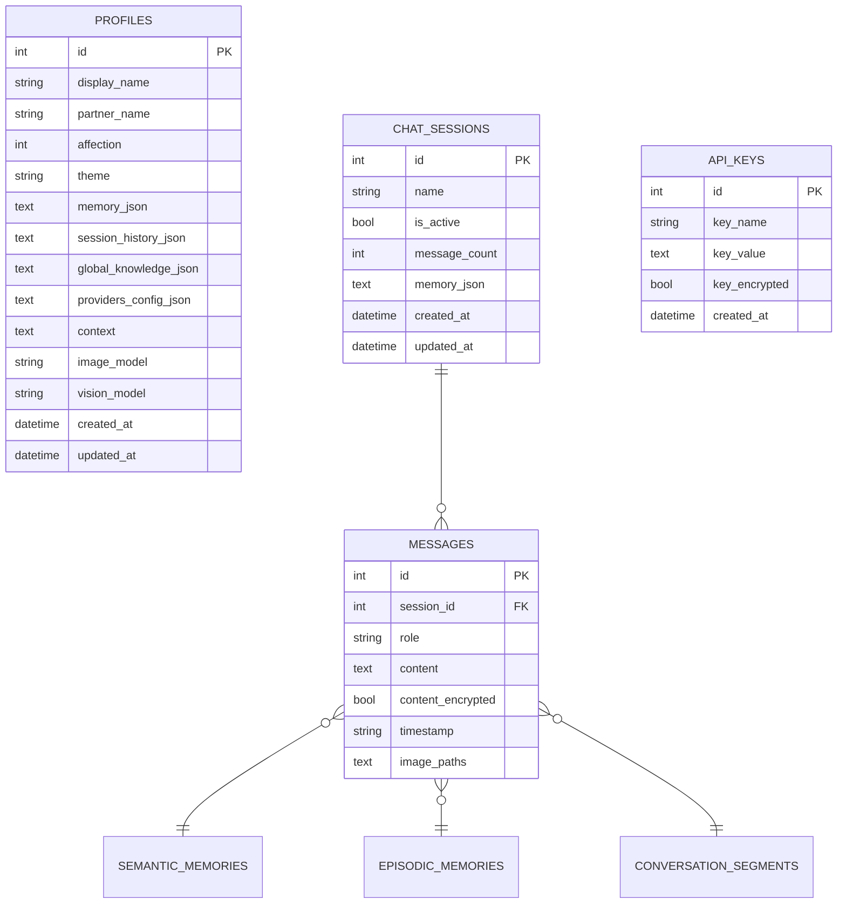

# Yuzu Companion — App Reference

## Architecture Overview

The app layer sits between the web/CLI interface and the database. It handles AI routing, memory processing, tool execution, and context assembly.



---

## Module Map

| File | Responsibility |
|---|---|
| `app.py` | Chat loop, session management, context builder |
| `providers.py` | AI provider abstraction (OpenRouter, Chutes, Ollama) |
| `database.py` | SQLAlchemy ORM, all table definitions, CRUD |
| `encryption.py` | Fernet encryption for messages and API keys |
| `key_manager.py` | API key lifecycle management |
| `memory/` | Full memory subsystem (see below) |
| `tools/` | Tool registry and individual tool implementations |

---

## Memory Subsystem

### Data Flow



### Memory Layers

| Layer | Table | What it stores | Retention |
|---|---|---|---|
| **Semantic** | `semantic_memories` | Stable facts as `(entity, relation, target)` triples | Decays slowly; reinforced on access |
| **Episodic** | `episodic_memories` | LLM summaries of interaction episodes | FSRS-style decay; emotional weighting |
| **Segments** | `conversation_segments` | Raw message windows with summaries | Bounded by time (15 min) and size (20 msgs) |
| **Working** | `messages` | Raw conversation log | Ephemeral; pruned on context overflow |

### Semantic Memory Model



**Scoring:** `score = cosine_sim × 0.6 + importance × 0.2 + confidence × 0.2`

**Confidence levels:**

| Range | Meaning |
|---|---|
| 0.0–0.3 | Weak signal |
| 0.3–0.6 | Probable pattern |
| 0.6–0.85 | Strong preference |
| 0.85–1.0 | Stable long-term fact |

### Episodic Memory Model



**Scoring:** `score = cosine_sim × 0.5 + importance × 0.25 + recency × 0.25`

**Triggers for creation:**
- Emotional weight ≥ 0.3
- Message count ≥ 10
- Affection delta ≥ 20

### Segmentation Rules

| Rule | Threshold |
|---|---|
| Time gap | > 15 minutes between messages |
| Max size | 20 messages per segment |
| Min size | 5 messages (discarded if smaller) |

### Retrieval Pipeline

```mermaid
flowchart TD
    Q[Query String] --> EMB[embed_text → 4096d vector]
    EMB --> ANN[ANN Search\ncKDTree]
    ANN --> RR[Re-rank with hybrid score]
    RR --> SF[Semantic Facts\ntop 15]
    RR --> EM[Episodic Memories\ntop 5]
    RR --> SEG[Segments\ntop 5]
    Q --> TEMP[Temporal Cue Detection]
    TEMP --> TMS[Temporal Message Scan]
    SF --> CTX[Context Bundle]
    EM --> CTX
    SEG --> CTX
    TMS --> CTX
    CTX --> FMT[format_memory]\n    FMT --> PROMPT[System Prompt Injection]
```

**Temporal cue support:** Indonesian (`kemarin`, `minggu lalu`, `tadi`) and English (`yesterday`, `last week`, `last month`).

### FSRS-Inspired Decay

**Decay formula:**
```
importance = importance × exp(-hours_since_last_access / stability)
```

**Stability derivation:**
- Semantic: `stability = max(24 × (1 + access_count × 0.5), 24h)`
- Episodic: `stability = max(48 × (1 + access_count × 0.3), 48h)`

**Reinforcement on retrieval:** `importance += 0.05` (capped at 1.0)

**Decay runs:** On session start, with a 6-hour cooldown unless forced.

### ANN Index Architecture



- Vectors are **L2-normalized** before insertion — Euclidean distance on normalized vectors equals cosine distance
- Index is loaded lazily on first search; rebuilt automatically if corrupted or stale
- Incremental add updates the live tree and persists immediately

---

## Tool System



Tools are discovered via `tools/registry.py` and executed within the chat loop. Each tool follows a markdown contract format for results.

---

## Database Schema (Core Tables)



---

## Key Constants

| Constant | Value | Location |
|---|---|---|
| Embedding model | `Qwen/Qwen3-Embedding-8B` | `memory/embedder.py` |
| Embedding dim | 4096 | `memory/index_store.py` |
| Semantic ANN limit | 15 | `memory/retrieval.py` |
| Episodic ANN limit | 5 | `memory/retrieval.py` |
| Segment time gap | 15 min | `memory/segmenter.py` |
| Segment max size | 20 msgs | `memory/segmenter.py` |
| Segment min size | 5 msgs | `memory/segmenter.py` |
| Decay interval | 6 hours | `memory/review.py` |
| Semantic half-life | 24h base | `memory/review.py` |
| Episodic half-life | 48h base | `memory/review.py` |

---

## Context Assembly Order

When building a prompt for the AI:

1. **System message** — personality, role, instructions
2. **Semantic memory** — stable facts about the user (`format_memory` → known preferences section)
3. **Episodic memory** — recent important events
4. **Conversation segments** — relevant past context
5. **Recent messages** — last 10–20 raw messages for continuity
6. **Working memory** — latest user query

---

## File Index

```
app/
├── __init__.py          # Package init, get_ai_manager export
├── app.py               # Chat session loop, context assembly
├── database.py          # SQLAlchemy models + Database class
├── encryption.py        # Fernet encrypt/decrypt
├── key_manager.py       # API key file migration
├── providers.py         # Multi-provider AI abstraction
├── memory/
│   ├── __init__.py
│   ├── embedder.py      # Chutes API client, vec↔blob, cosine
│   ├── extractor.py     # Semantic + episodic extraction
│   ├── index_store.py   # cKDTree ANN index management
│   ├── models.py        # Re-exports ORM models
│   ├── retrieval.py      # Cosine + hybrid scoring retrieval
│   ├── review.py         # FSRS-style decay
│   ├── segmenter.py      # Message window segmentation
│   ├── docs/
│   │   ├── architecture.md
│   │   ├── fsrs.md
│   │   ├── retrieval.md
│   │   ├── segmentation.md
│   │   └── semantic_memory.md
│   └── migrations/
│       ├── batch_migrate.py
│       ├── episodic_migrate.py
│       ├── migrate_history.py
│       └── quality_migrate.py
└── tools/
    ├── __init__.py
    ├── http_request.py
    ├── image_analyze.py
    ├── image_generate.py
    ├── memory_store.py
    ├── multimodal.py
    └── registry.py
```
