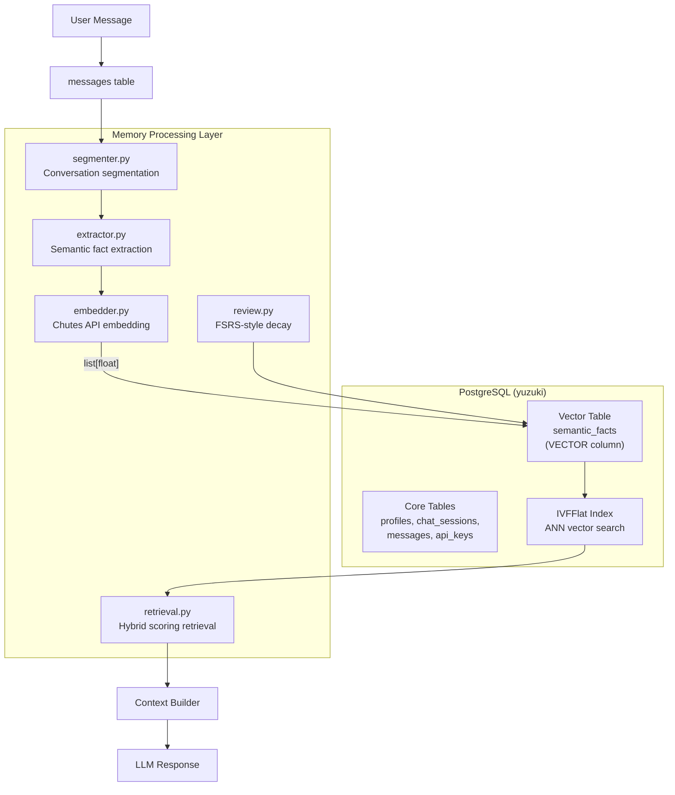
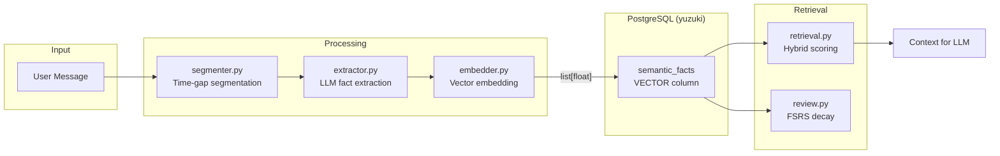
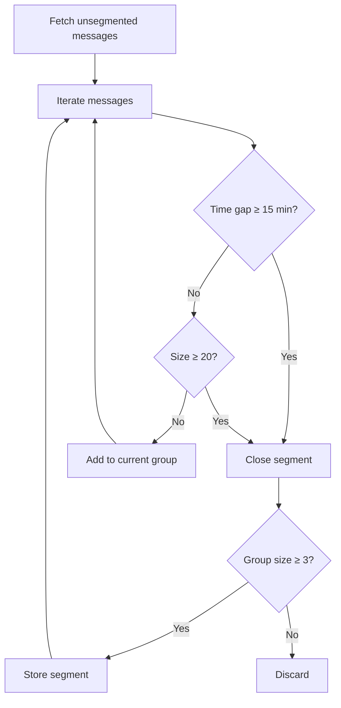
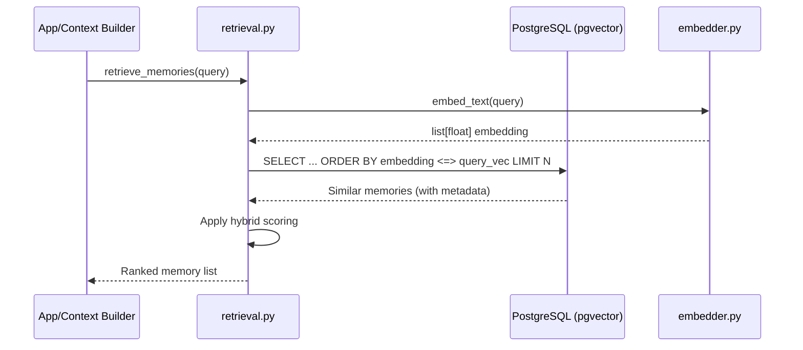
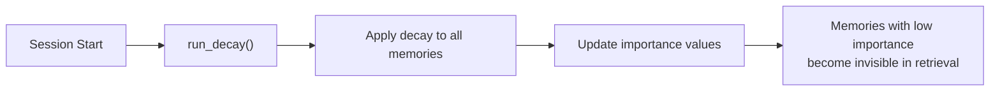

# Memory Architecture — PostgreSQL + pgvector

This document defines the structure, database schema, and data flow of the long-term memory system used by the Yuzu companion.

The memory subsystem transforms raw chat logs into structured, retrievable, vector-searchable memory layers — all stored in PostgreSQL with pgvector extension.

---

## Architecture Overview



---

## Database Layer

### PostgreSQL + pgvector

All data lives in a single PostgreSQL database (`yuzuki`) with the pgvector extension for vector similarity search.

**Key Design:**
- No SQLite. No FAISS. No BLOB serialization.
- Embeddings stored as native `VECTOR(1536)` columns.
- psycopg2 handles `list[float]` ↔ PostgreSQL vector natively.

### Core Tables (db_pg_models.py)

| Table | Purpose |
|-------|---------|
| `profiles` | User profile, settings, context |
| `chat_sessions` | Chat session metadata |
| `messages` | Raw conversation log |
| `api_keys` | Encrypted API keys |

### Unified Memory Table (db_memory.py)

**`semantic_facts`** — All memory types in a single table with pgvector.

| Column | Type | Description |
|--------|------|-------------|
| `id` | SERIAL PK | Auto-increment ID |
| `fact_type` | VARCHAR | Memory type: `static`, `dynamic`, `episodic`, `segment` |
| `content` | TEXT | The actual memory content |
| `embedding` | VECTOR(1536) | pgvector embedding (native, no serialization) |
| `metadata` | JSONB | Flexible metadata (session_id, importance, confidence, etc.) |
| `created_at` | TIMESTAMP | Creation timestamp |
| `last_accessed` | TIMESTAMP | Last retrieval time |

**Index:** IVFFlat on `embedding` for approximate nearest neighbor (ANN) search.

**Memory Types:**

| `fact_type` | Purpose | Example |
|-------------|---------|---------|
| `static` | Stable semantic facts | "User prefers concise answers" |
| `dynamic` | Decayable memories | "User was frustrated yesterday" |
| `episodic` | Event summaries | "User completed a major refactor last week" |
| `segment` | Conversation chunks | Raw message window for context |

---

## Memory Data Flow



---

## Segmentation System

Segmentation converts raw message streams into structured memory units.

### Segmentation Rules

| Rule | Threshold | Purpose |
|------|-----------|---------|
| **Time Gap** | ≥ 15 minutes | Natural conversation break |
| **Max Size** | 20 messages | Prevent oversized segments |
| **Min Size** | 3 messages | Discard noise |

### Segmentation Algorithm



### Module: `segmenter.py`

```python
# Constants
MAX_MESSAGES_PER_SEGMENT = 20
TIME_GAP_MINUTES = 15
MIN_MESSAGES_PER_SEGMENT = 3

# Key functions
detect_boundaries(messages)  # Apply time/size rules
segment_session(session_id)  # Main entry, returns segments created
```

---

## Semantic Extraction

Semantic memory stores long-term, generalized knowledge as RDF-like triples.

### Triple Format

```
(entity, relation, target)
```

**Examples:**
- `User — Prefers — concise answers`
- `User — Uses — dark mode`
- `User — Often works — at night`

### Confidence Model

| Range | Meaning |
|-------|---------|
| 0.0–0.3 | Weak signal |
| 0.3–0.6 | Probable pattern |
| 0.6–0.85 | Strong preference |
| 0.85–1.0 | Stable long-term fact |

### Module: `extractor.py`

```python
extract_semantic_facts(messages)      # LLM extraction of triples
calculate_emotional_weight(messages)  # Keyword intensity scoring
should_create_episodic(messages)      # Trigger episodic creation
process_messages_for_memory(...)      # Main pipeline entry
```

---

## Retrieval System

### Hybrid Scoring Formula

```
score = similarity × 0.6 + importance × 0.2 + confidence × 0.2
```

When no query embedding available:
```
score = importance × confidence
```

### Vector Search Query

```sql
SELECT id, fact_type, content, metadata,
       1 - (embedding <=> %s::vector) as similarity
FROM semantic_facts
ORDER BY embedding <=> %s::vector
LIMIT %s;
```

The `<=>` operator is pgvector's cosine distance operator.

### Retrieval Pipeline



### Context Assembly Order

1. System message
2. Semantic memory (facts)
3. Episodic memory (events)
4. Conversation segments
5. Recent raw messages

### Module: `retrieval.py`

```python
retrieve_memories(session_id, query, limit)  # Vector search + scoring
format_memory(memory_bundle)                 # Format for LLM injection
```

---

## FSRS-Inspired Retention

Memory importance decays over time, simulating natural forgetting. Based on Free Spaced Repetition Scheduler (FSRS) principles.

### Core Variables

| Variable | Description | Effect |
|----------|-------------|--------|
| `importance` | Primary score | Decays: `imp × exp(-hours/stability)` |
| `stability` | Resistance to decay | Derived from `access_count` |
| `access_count` | Times retrieved | More access → higher stability |
| `last_accessed` | Last retrieval | Used for recency factor |

### Decay Formula

```
importance = importance × exp(-hours_since_last_access / stability)
```

**Stability derivation:**
```
stability = max(24 × (1 + access_count × 0.5), 24h)
```

**Minimum importance:** 0.01 (memories never fully vanish, just become invisible in retrieval).

### Reinforcement

When a memory is retrieved:

1. `access_count` increments
2. `last_accessed` updates to now
3. `importance` bumps by +0.05 (capped at 1.0)

### Recency Factor

Used in retrieval scoring:

```
recency = exp(-hours_since_last_access / 24.0)
```

| Time | Recency |
|------|---------|
| 0 hours | 1.0 |
| 24 hours | 0.37 |
| 48 hours | 0.14 |
| 7 days | 0.04 |

### Decay Cycle



### Module: `review.py`

```python
decay_memories()              # Apply FSRS decay to all memories
reinforce_memory(memory_id)   # Boost importance on retrieval
run_decay()                   # Full decay cycle (call on session start)
```

---

## Core Modules Summary

| Module | Purpose | Key Functions |
|--------|---------|---------------|
| `db_memory.py` | Unified CRUD over `semantic_facts` | `store_memory()`, `search_memories()` |
| `embedder.py` | Chutes API embedding client | `embed_text()`, `embed_texts()` |
| `extractor.py` | LLM-based fact extraction | `extract_semantic_facts()`, `process_messages_for_memory()` |
| `segmenter.py` | Conversation chunking | `detect_boundaries()`, `segment_session()` |
| `retrieval.py` | Hybrid scoring retrieval | `retrieve_memories()`, `format_memory()` |
| `review.py` | FSRS-style decay & reinforcement | `decay_memories()`, `reinforce_memory()`, `run_decay()` |

**Deprecated:** `vector_store.py` — stub redirecting to `db_memory.py`

---

## Directory Structure

```
app/memory/
├── __init__.py
├── db_memory.py      # Unified memory CRUD (PostgreSQL + pgvector)
├── embedder.py       # Chutes API embedding client
├── extractor.py      # Semantic fact extraction (LLM)
├── segmenter.py      # Message window segmentation
├── retrieval.py      # Hybrid scoring retrieval
├── review.py         # FSRS-style decay & reinforcement
├── models.py         # Data models / type definitions
├── vector_store.py   # DEPRECATED: stub redirecting to db_memory
└── docs/
    └── architecture.md  # This file (single source of truth)
```

---

## Integration Points

### app.py / web.py

```python
from app.memory.segmenter import segment_session
from app.memory.review import run_decay
from app.memory.extractor import process_messages_for_memory
from app.memory.retrieval import retrieve_memories, format_memory

# On session start
segment_session(session_id)
run_decay(session_id)

# On new messages
process_messages_for_memory(session_id, recent_messages)

# Context building
memories = retrieve_memories(session_id, query)
context = format_memory(memories)
```

---

## Migration History

| Phase | Status | Description |
|-------|--------|-------------|
| 1-5 | ✅ Done | Original SQLite + FAISS implementation |
| 6 | ✅ Done | PostgreSQL migration with pgvector |
| 7 | ✅ Done | Unified memory table (`semantic_facts`) |
| 8 | ✅ Done | Cleanup: removed SQLite, FAISS, vec_to_blob |
| 9 | ✅ Done | Documentation consolidation |

**Removed Files:**
- `quality_migrate.py`, `batch_migrate.py`, `episodic_migrate.py` — SQLite migration scripts
- `fsrs.md`, `retrieval.md`, `segmentation.md`, `semantic_memory.md` — Consolidated into this file
- `migrate_from_sqlite()` function in `db_pg_models.py`

**Removed Patterns:**
- SQLite BLOB serialization (`vec_to_blob`, `blob_to_vec`)
- FAISS index files
- `yuzu_core.db` SQLite database

---

## Key Design Decisions

1. **Native Vector Storage**: pgvector stores `VECTOR(1536)` natively. No BLOB serialization.
2. **Unified Memory Table**: All memory types in `semantic_facts`, differentiated by `fact_type` and `metadata`.
3. **Raw psycopg2 for Vectors**: No ORM overhead for vector operations. psycopg2 handles `list[float]` directly.
4. **IVFFlat Index**: Approximate nearest neighbor for fast similarity search at scale.
5. **Hybrid Scoring**: Combine vector similarity with importance/confidence scores.
6. **FSRS Decay**: Memory importance decays over time, reinforced on retrieval.
7. **Single Source of Truth**: This document is the only memory architecture reference.