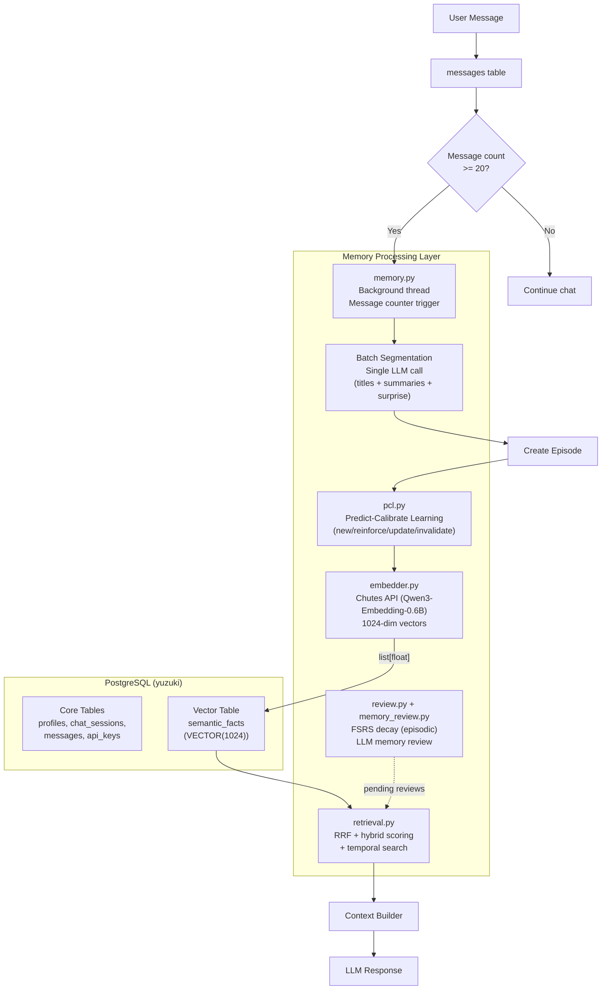
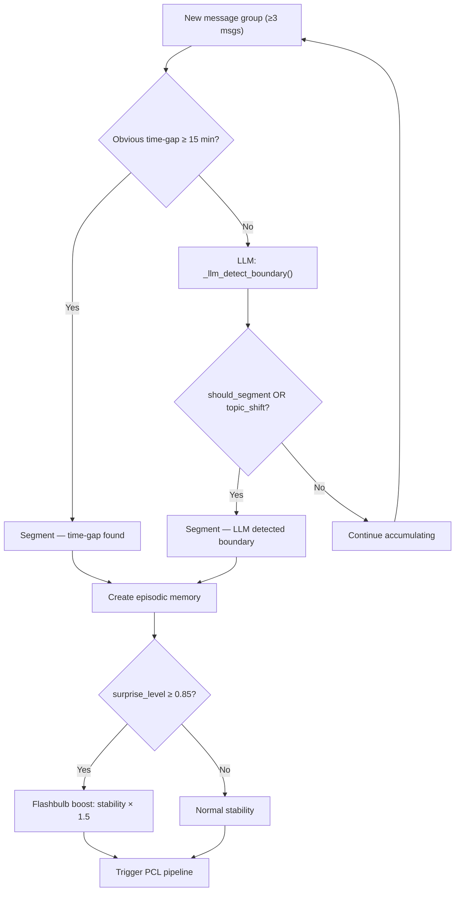
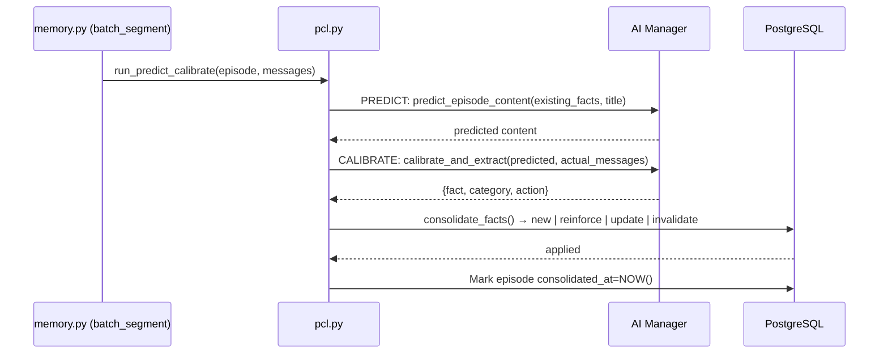
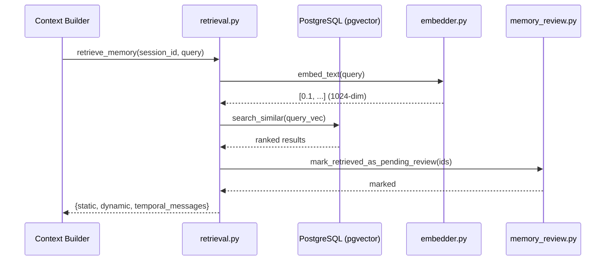

# Memory Architecture — PostgreSQL + pgvector

This document defines the structure, database schema, and data flow of the long-term memory system used by the Yuzu companion.

The memory subsystem transforms raw chat logs into structured, retrievable, vector-searchable memory layers — all stored in PostgreSQL with pgvector extension.

Aligned with [plast-mem](https://github.com/icedeyes12/plast-mem) patterns for temporal validity and FSRS scope.

---

## Architecture Overview



---

## Database Layer

### PostgreSQL + pgvector

All data lives in a single PostgreSQL database (`yuzuki`) with the pgvector extension for vector similarity search.

**Key Design:**
- No SQLite. No FAISS. No BLOB serialization.
- Embeddings stored as native `VECTOR(1024)` columns.
- psycopg2 handles `list[float]` directly via string interpolation of float lists.

### Unified Memory Table (`semantic_facts`)

| Column | Type | Description |
|--------|------|-------------|
| `id` | SERIAL PK | Auto-increment ID |
| `fact_type` | VARCHAR(20) | `static` (semantic) or `dynamic` (episodic/segment) |
| `content` | TEXT | The memory content |
| `embedding` | VECTOR(1024) | pgvector embedding (native, no serialization) |
| `metadata` | JSONB | Flexible per-type fields |
| `created_at` | TIMESTAMP | Creation timestamp |
| `last_accessed` | TIMESTAMP | Last retrieval timestamp |
| `invalid_at` | TIMESTAMP | Soft delete — `NULL` = active, set = invalidated |

**Index:** IVFFlat on `embedding` for approximate nearest neighbor (ANN) search.

---

## Memory Types

| fact_type | Scope | Decay? | Description |
|-----------|-------|--------|-------------|
| `static` | Global (no session filter) | NO — uses `invalid_at` | Semantic facts (preferences, identity, etc.) |
| `dynamic` | Per-session | YES — FSRS-style | Episodic memories + conversation segments |

### Metadata per Type

**static (semantic):**
```json
{
  "category": "Preference",
  "entity": "User",
  "relation": "Preference",
  "target": "...fact...",
  "confidence": 0.7,
  "importance": 0.7,
  "source_table": "semantic_memories",
  "source_episodic_ids": [1, 2, 3],
  "stability": 1.0,
  "difficulty": 1.0,
  "pending_review": false,
  "last_reviewed_at": null
}
```

**dynamic (episodic):**
```json
{
  "importance": 0.6,
  "emotional_weight": 0.4,
  "summary": "User discussed their coding project",
  "source_table": "episodic_memories",
  "consolidated_at": "2026-04-05T10:00:00",
  "stability": 1.5,
  "surprise_level": 0.2
}
```

**dynamic (segment):**
```json
{
  "start_message_id": 42,
  "end_message_id": 61,
  "importance": 0.5,
  "source_table": "conversation_segments"
}
```

---

## Segmentation System

Segmentation converts raw message streams into structured memory units. Dual-channel: time-gap rules (fast-path) + LLM boundary detection (refinement).

### Segmentation Rules

| Rule | Threshold | Channel |
|------|-----------|---------|
| **Time Gap** | ≥ 15 minutes | Fast-path (no LLM) |
| **Max Size** | 20 messages | Always enforced |
| **LLM Detection** | topic shift OR surprise | LLM channel |
| **Flashbulb** | surprise ≥ 0.85 | Stability boost |

### Dual-Channel Algorithm




---

## Semantic Extraction + PCL Pipeline

Semantic facts are extracted via the Predict-Calibrate Learning (PCL) pipeline, triggered after episodic memory creation.

### PCL Flow



### Consolidation Actions

| Action | When | Behavior |
|--------|------|----------|
| `new` | No duplicate found | Insert with embedding + source_episodic_ids |
| `reinforce` | Duplicate (cosine < 0.05) | Append to source_episodic_ids, bump confidence |
| `update` | Same fact, new nuance | Invalidate old, insert new version |
| `invalidate` | Contradicted | Set invalid_at=NOW() on old fact |

### 8-Category Taxonomy

Every semantic fact is assigned exactly one category:

| Category | Captures |
|---------|----------|
| `Identity` | name, profession, location, company, education |
| `Preference` | likes, dislikes, favorites, stylistic choices |
| `Interest` | topics, hobbies, domains engaged with |
| `Personality` | communication style, emotional tendencies |
| `Relationship` | dynamics, shared routines, inside jokes |
| `Experience` | skills, past events, professional background |
| `Goal` | plans, aspirations, things being worked toward |
| `Guideline` | how the assistant should behave |

### Module: `pcl.py`

```python
run_predict_calibrate(episode_id, messages, session_id)   # Main entry
load_relevant_semantic_facts(session_id, limit=10)       # Fetch top facts
predict_episode_content(existing_facts, episode_title)   # PREDICT phase
calibrate_and_extract(predicted_content, actual_messages) # CALIBRATE phase
consolidate_facts(extracted, session_id)                 # CONSOLIDATE phase
```

---

## Retrieval System

### Hybrid Scoring Formula

```
score = similarity × 0.6 + importance × 0.2 + confidence × 0.2
```

### RRF Merge

When both static and dynamic results are available, Reciprocal Rank Fusion merges them:

```
RRF_score = Σ 1.0 / (k + rank)  per list, k=60
```

Tie-breaking: higher individual score first, then lower ID.

### Retrieval Pipeline



### Context Assembly Order

1. System message
2. Static memories (global semantic facts)
3. Dynamic memories (episodic memories)
4. Temporal messages (time-window filtered)
5. Recent raw messages

### Modules

| Module | Key Functions |
|--------|--------------|
| `retrieval.py` | `retrieve_memory()`, `retrieve_static_memories()`, `retrieve_dynamic_memories()`, `retrieve_segments()`, `format_memory()` |
| `memory_review.py` | `review_memory()`, `mark_retrieved_as_pending_review()` |

---

## FSRS-Inspired Retention

### Scope: Episodic Only

**Semantic (static) facts do NOT decay.** They use temporal validity (`invalid_at`) instead.

**Episodic (dynamic) facts decay via FSRS.**

### Core Variables

| Variable | Applies To | Description |
|---------|-----------|-------------|
| `importance` | Both | Primary relevance score |
| `stability` | Episodic | Resistance to decay |
| `difficulty` | Episodic | How hard to memorize |
| `access_count` | Both | Times retrieved |

### Decay Formula

```
importance = importance × exp(-hours_since_last_access / stability)
stability = 24 × (1 + access_count × 0.5)
```

### Memory Review (LLM-based)

After retrieval, facts are marked pending review. When `review_memory()` is called:

| Rating | Stability | Difficulty | Effect |
|--------|-----------|------------|--------|
| `again` | × 0.5 | +0.15 | Memory was noise |
| `hard` | × 0.9 | +0.05 | Weak connection |
| `good` | × 1.2 | −0.05 | Directly relevant |
| `easy` | × 1.5 | −0.10 | Core pillar |

### Modules

| Module | Key Functions |
|--------|--------------|
| `review.py` | `run_decay()`, `reinforce_memory()` |
| `memory_review.py` | `review_memory()`, `mark_retrieved_as_pending_review()` |

---

## Core Modules Summary

| Module | Purpose | Key Functions |
|--------|---------|---------------|
| `memory.py` | Background memory pipeline runner (now: memory.py) | `run_memory_pipeline()`, `batch_segment()`, `create_episode_and_pcl()`, `trigger_memory_pipeline_async()` |
| `db_memory.py` | Unified CRUD over `semantic_facts` | `save_fact()`, `search_similar()`, `invalidate_fact()`, `increment_importance()`, `decay_facts()` |
| `embedder.py` | Chutes API embedding client | `embed_text()`, `embed_texts()`, `EMBEDDING_DIM=1024` |
| `extractor.py` | Semantic fact extraction + PCL wiring | `extract_semantic_facts()`, `upsert_semantic_memory()`, `create_episodic_memory()` |
| `retrieval.py` | Hybrid scoring + RRF retrieval | `retrieve_memory()`, `retrieve_static_memories()`, `retrieve_segments()`, `format_memory()` |
| `review.py` | FSRS decay for episodic memories | `run_decay()`, `reinforce_memory()` |
| `memory_review.py` | LLM-based memory review | `review_memory()`, `mark_retrieved_as_pending_review()` |
| `pcl.py` | Predict-Calibrate Learning pipeline | `run_predict_calibrate()`, `consolidate_facts()` |

**Removed:** `memory.py (batch_segment)` and `vector_store.py` — replaced by `batch_segment()` and `db_memory.py`

---

## Directory Structure

```
app/memory/
├── __init__.py
├── memory.py          # Background memory pipeline (same file)
├── db_memory.py         # Unified memory CRUD (PostgreSQL + pgvector)
├── embedder.py           # Chutes API embedding client (1024-dim)
├── extractor.py           # Semantic fact extraction + PCL wiring
├── retrieval.py           # RRF + hybrid scoring retrieval
├── review.py             # FSRS-style decay (episodic only)
├── memory_review.py      # LLM-based memory review + FSRS updates
├── pcl.py                # Predict-Calibrate Learning pipeline
└── docs/
    └── architecture.md    # This file (single source of truth)
```

---

## Integration Points

### app.py / web.py

```python
from app.memory.memory import trigger_memory_pipeline_async, enqueue_memory_pipeline
from app.memory.review import run_decay
from app.memory.retrieval import retrieve_memory, format_memory

# On session start — queue background pipeline
run_decay(session_id)
enqueue_memory_pipeline(session_id)

# After each turn — trigger if message count threshold met
trigger_memory_pipeline_async(session_id, current_count)

# Context building
memories = retrieve_memory(session_id, query)
context = format_memory(memories)
```

---

## Key Design Decisions

1. **1024-dim Embeddings**: Qwen3-Embedding-0.6B via Chutes API — smaller, faster, still high quality.
2. **Soft Delete**: Facts never hard-deleted. `invalid_at` preserves history and enables temporal queries.
3. **PCL Pipeline**: Predict-Calibrate Learning extracts durable knowledge from episodic episodes — closes the complementary learning systems loop.
4. **Batch Segmentation**: Single LLM call generates all segment titles, summaries, and surprise levels at once — amortizes cost.
5. **Background Thread**: Memory pipeline runs in daemon thread — non-blocking, chat responses return immediately.
6. **Message Counter Trigger**: Pipeline triggers every 20 messages, force at 40 — aligned with plast-mem thresholds.
7. **RRF Merge**: Combines static and dynamic retrieval rankings without BM25 (unavailable on Termux).
8. **FSRS Scope Restriction**: Semantic facts don't decay — they use `invalid_at` for temporal validity.
9. **Vector Literal Interpolation**: psycopg2 cannot adapt Vector objects over the wire protocol — vectors are interpolated as string literals directly in SQL.
