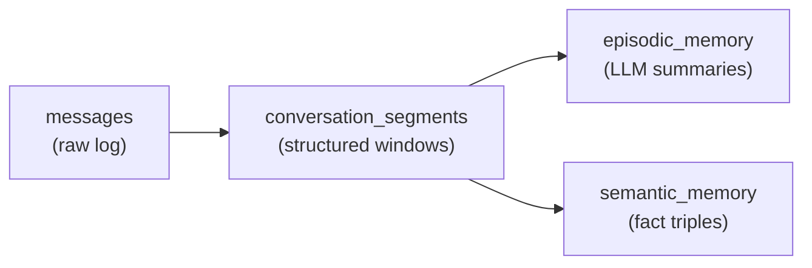
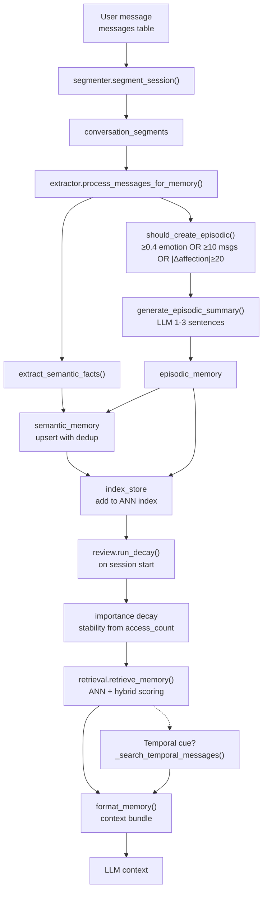

# Memory Architecture

This document defines the structure, database schema, and processing
pipeline of the long-term memory system used by the Yuzu companion.

The memory subsystem transforms raw chat logs into structured, retrievable,
and scalable memory layers.

---

## Memory Layers

The system is divided into three main layers:



1. **Raw message log** (`messages` table) — source-of-truth conversation
2. **Episodic memory** (`episodic_memory` table) — LLM-generated summaries of conversation windows
3. **Semantic memory** (`semantic_memory` table) — extracted user/relationship facts as RDF-like triples

---

## Database Schema

### `messages`

Source-of-truth conversation log. No memory-specific changes required.

| Column | Type | Description |
|---|---|---|
| `id` | INTEGER PK | |
| `session_id` | INTEGER | |
| `role` | TEXT | user, assistant, system, tool role |
| `content` | TEXT | message content |
| `content_encrypted` | BOOLEAN | legacy encryption flag |
| `timestamp` | TEXT | |
| `image_paths` | TEXT | JSON list of cached image paths |

### `episodic_memory`

LLM-generated summaries of conversation windows. One episodic ≈ one meaningful conversation event.

| Column | Type | Description |
|---|---|---|
| `id` | INTEGER PK | |
| `session_id` | INTEGER | |
| `summary` | TEXT | LLM-generated 1–3 sentence summary |
| `embedding` | BLOB | vector of the summary (cosine similarity search) |
| `importance` | REAL | 0.0–1.0, decays over time |
| `emotional_weight` | REAL | 0.0–1.0, emotional intensity at time of creation |
| `access_count` | INTEGER | increments each retrieval |
| `last_accessed` | DATETIME | |
| `created_at` | DATETIME | |

### `semantic_memory`

RDF-like triples extracted from user messages. Stable long-term facts.

| Column | Type | Description |
|---|---|---|
| `id` | INTEGER PK | |
| `session_id` | INTEGER | |
| `entity` | TEXT | always "User" |
| `relation` | TEXT | Preference, Identity, Interest, Guideline, Goal, Relationship, Experience, Personality |
| `target` | TEXT | max 200 chars |
| `confidence` | REAL | 0.0–1.0, increases on duplicate facts |
| `importance` | REAL | 0.0–1.0, decays over time |
| `source_episodic_ids` | TEXT | JSON array of episodic memory IDs this was derived from |
| `embedding_vector` | BLOB | vector of "entity relation target" text |
| `access_count` | INTEGER | |
| `last_accessed` | DATETIME | |
| `created_at` | DATETIME | |

### `conversation_segments`

Structured message windows from the segmentation engine. Raw material before LLM summarization.

| Column | Type | Description |
|---|---|---|
| `id` | INTEGER PK | |
| `session_id` | INTEGER | |
| `start_message_id` | INTEGER | |
| `end_message_id` | INTEGER | |
| `summary` | TEXT | LLM-generated summary |
| `embedding` | BLOB | vector of the summary |
| `importance` | REAL | 0.0–1.0 |
| `created_at` | DATETIME | |

---

## Directory Structure

```
memory/
├── __init__.py
├── embedder.py        # Chutes API client, vec↔blob, cosine similarity
├── index_store.py     # ANN index (cKDTree) per session
├── extractor.py       # LLM-powered fact extraction + episodic creation
├── segmenter.py       # Message window segmentation → conversation_segments
├── retrieval.py        # ANN + hybrid scoring retrieval, temporal cue search
├── review.py          # FSRS-style decay & reinforcement
└── docs/
    ├── architecture.md
    ├── retrieval.md
    ├── segmentation.md
    ├── fsrs.md
    └── semantic_memory.md
```

---

## Core Modules

### `embedder.py`
Chutes API embedding client. Handles:
- `embed_text(text)` → single embedding (None on failure)
- `embed_texts(texts)` → batch embeddings
- `get_embed_dim()` → lazily probes Chutes API on first call, defaults to 4096
- `cosine_similarity(a, b)`
- `vec_to_blob(v)` / `blob_to_vec(b)` — SQLite BLOB serialization (struct.pack float32)

### `index_store.py`
ANN index per session using cKDTree. Provides:
- `add_semantic(id, vector)`, `search_semantic(query_vec, k)` — semantic memory ANN
- `add_episodic(id, vector)`, `search_episodic(query_vec, k)` — episodic ANN
- `add_segment(id, vector)`, `search_segments(query_vec, k)` — segment ANN
- Falls back to DB query if index is unavailable or corrupted

### `extractor.py`
LLM-powered extraction layer. Handles:
- `extract_semantic_facts(messages)` — **LLM-only**, no regex. Returns list of `{entity, relation, target, importance}`
- `calculate_emotional_weight(messages)` — **LLM-only**, returns 0.0–1.0
- `should_create_episodic(messages, affection_delta)` — emotional_weight ≥ 0.4 OR len ≥ 10 OR |affection_delta| ≥ 20
- `generate_episodic_summary(messages)` — LLM summarization into 1–3 sentences
- `upsert_semantic_memory(...)` — insert or reinforce semantic triples with dedup (cosine sim > 0.95 threshold)
- `create_episodic_memory(...)` — store episodic with embedding
- `process_messages_for_memory(...)` — main pipeline entry; deduplicates by message hash

### `segmenter.py`
Conversation segmentation engine. Handles:
- `_get_unsegmented_messages(session_id)` — fetch messages not yet in any segment
- `_detect_boundaries(messages)` — split by time gap (15 min) or size (20 msgs), discard groups < 5
- `_create_segment(session_id, group)` — store `ConversationSegment`, embed summary
- `segment_session(session_id)` — main entry, returns count created

### `retrieval.py`
ANN + hybrid scoring retrieval with temporal cue search. Handles:
- `_recency_factor(last_accessed)` — half-life 24h exponential decay
- `_detect_time_window(query)` — parses temporal cues (kemarin, last week, bulan lalu, etc.)
- `_search_temporal_messages(session_id, start, end)` — direct DB scan for time-gated queries
- `_embed_query(text)` — cached query embedding via Chutes
- `retrieve_semantic_memories(session_id, query, limit)` — ANN first, DB fallback
- `retrieve_episodic_memories(session_id, query, limit)` — ANN first, DB fallback
- `retrieve_segments(session_id, query, limit)`
- `retrieve_memory(session_id, query)` — main entry; returns `{semantic, episodic, segments, temporal_messages}`
- `format_memory(memory_bundle)` — formats for system message injection

### `review.py`
FSRS-inspired retention model. Handles:
- `_hours_since(dt)` — time delta calculation, defaults to 720h if never accessed
- `decay_semantic_memories(session_id)` — importance × exp(−hours/stability), stability = max(24 × (1 + access_count × 0.5), 24)
- `decay_episodic_memories(session_id)` — importance × exp(−hours/stability), stability = max(48 × (1 + access_count × 0.3), 48)
- `reinforce_memory(memory_id, memory_type)` — importance += 0.05, capped at 1.0
- `run_decay(session_id, force)` — full decay cycle, skips if run within last 6 hours unless force=True

---

## High-Level Flow



---

## Integration Points

### `app.py` / `web.py`

On session start:
```python
from app.memory.segmenter import segment_session
from app.memory.review import run_decay
from app.memory.extractor import process_messages_for_memory

segment_session(session_id)
run_decay(session_id)
process_messages_for_memory(session_id, recent_messages)
```

On context building:
```python
from app.memory.retrieval import retrieve_memory, format_memory

bundle = retrieve_memory(session_id, query=user_message)
context = format_memory(bundle)
```

---

## Implementation Phases

| Phase | Status | Description |
|---|---|---|
| 1 | ✅ | Database & episodic layer — segmentation + LLM summaries |
| 2 | ✅ | Semantic layer — LLM fact extraction, upsert with dedup |
| 3 | ✅ | Retrieval integration — ANN + hybrid scoring, temporal cue search |
| 4 | ✅ | Retention model — FSRS decay, reinforcement on retrieval |
| 5 | ✅ | Background processing — segment + decay + extract on session start |
| 6 | 📋 | Optional PostgreSQL migration — JSONB indexing for `source_episodic_ids` |
