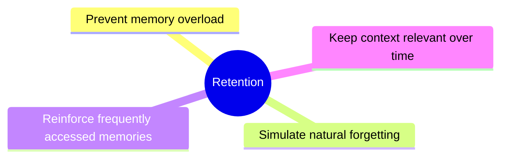
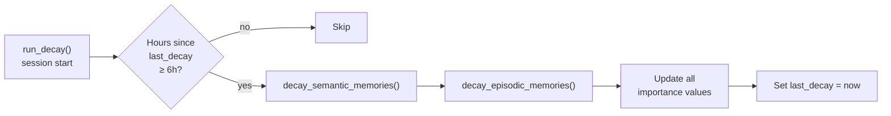
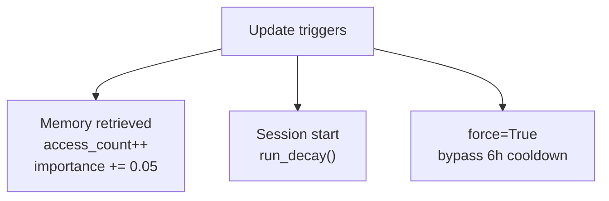

# FSRS-Based Retention Model

This document describes how episodic and semantic memories decay and are
reinforced over time using an FSRS-inspired model.

FSRS: Free Spaced Repetition Scheduler — originally used in flashcard systems
to model memory retention.

---

## Purpose



---

## Core Variables

| Variable | Semantic | Episodic | Description |
|---|---|---|---|
| `importance` | ✅ decays | ✅ decays | Primary score, × exp decay |
| `access_count` | ✅ | ✅ | More access → higher stability |
| `stability` | ✅ derived | ✅ derived | How resistant to decay |
| `emotional_weight` | — | ✅ | Triggers episodic creation |
| `last_accessed` | ✅ | ✅ | Used for recency factor |

> **Note:** The `difficulty` and `retrieval_count` columns described in older
> documentation no longer exist in the schema. Stability is derived
> dynamically from `access_count` rather than stored as a separate field.

---

## Decay Model



**Formula:**
```
importance = importance × exp(-hours_since_last_access / stability)
```

Stability is derived from access count:

| Layer | Stability formula | Minimum |
|---|---|---|
| Semantic | `max(24 × (1 + access_count × 0.5), 24h)` | 24h |
| Episodic | `max(48 × (1 + access_count × 0.3), 48h)` | 48h |

- A never-accessed memory (access_count = 0): stability = 24h / 48h → decays quickly
- A heavily accessed memory (access_count = 10): stability = 144h / 96h → much more resistant

Minimum importance clamped to **0.01** — memories never fully vanish.

---

## Reinforcement

When a memory is retrieved (in `retrieval.py`):

1. `access_count` increments
2. `last_accessed` updates to now
3. `importance` bumps by **+0.05** (capped at **1.0**)

This means frequently retrieved memories become harder to forget.

---

## Recency Factor

Used in episodic retrieval scoring:

```
recency = exp(-hours_since_last_access / 24.0)
```

| Hours since access | Recency |
|---|---|
| 0 | 1.00 |
| 24 | 0.37 |
| 48 | 0.14 |
| 168 (7 days) | 0.04 |

---

## Forgetting

Memories with very low importance (approaching 0.01) become effectively
invisible in retrieval — they sort to the bottom due to low importance scores.
**No automatic deletion occurs**; full retention is preserved.

---

## Update Triggers



1. **On retrieval** — `access_count` increments, importance bumps, recency resets
2. **On session start** — `review.run_decay()` applies decay to all memories
3. **6-hour cooldown** — decay skips if run within last 6 hours unless `force=True`

---

## Decay State

Decay state is persisted to `memory/.decay_state.json`:
```json
{"last_decay": "2026-03-25T14:30:00.000000"}
```

This file is checked on every `run_decay()` call to enforce the 6-hour cooldown.

---

## Module Responsibilities

**File:** `app/memory/review.py`

| Function | Description |
|---|---|
| `_hours_since(dt)` | Hours since a datetime, defaults to 720.0 if None |
| `decay_semantic_memories(session_id)` | Semantic decay, stability = max(24 × (1 + access_count × 0.5), 24) |
| `decay_episodic_memories(session_id)` | Episodic decay, stability = max(48 × (1 + access_count × 0.3), 48) |
| `reinforce_memory(memory_id, memory_type)` | importance += 0.05, capped at 1.0 |
| `run_decay(session_id, force)` | Full decay cycle; skips if < 6h since last run unless force=True |
