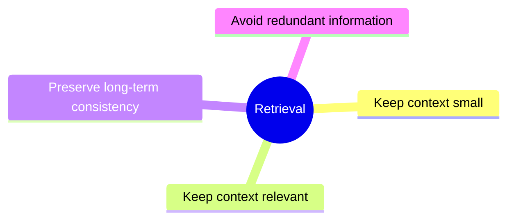
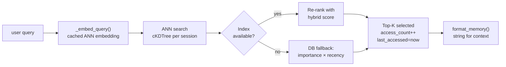
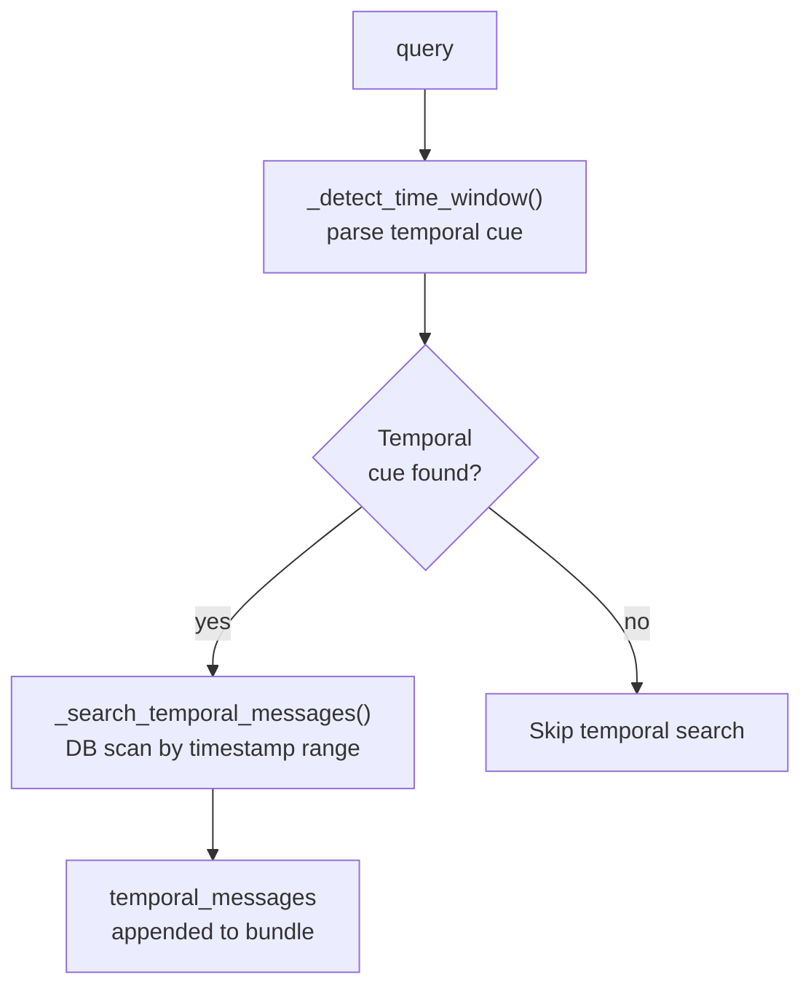

# Memory Retrieval

This document describes how memories are selected and injected into
the LLM context.

---

## Retrieval Goals



---

## Retrieval Pipeline



---

## Retrieval Layers

Context is assembled in this order:
1. System message
2. Semantic memory
3. Episodic memory
4. Conversation segments
5. Temporal messages (only when query contains temporal cues)

---

## Semantic Retrieval

**Primary path — ANN search + hybrid score:**
```
score = cosine_sim × 0.6 + importance × 0.2 + confidence × 0.2
```

**Fallback path — no query embedding or ANN unavailable:**
```
score = importance × confidence
```

**Selection rules:**
1. Sort by score (descending)
2. Limit: top 15 results

**On retrieval:**
- `access_count` increments
- `last_accessed` updates to now
- `importance` bumps +0.05 (capped at 1.0) via `review.reinforce_memory()`

---

## Episodic Retrieval

**Primary path — ANN search + hybrid score:**
```
score = cosine_sim × 0.5 + importance × 0.25 + recency × 0.25
```

Recency factor (half-life 24h):
```
recency = exp(-hours_since_last_access / 24.0)
```

**Fallback path — no query embedding or ANN unavailable:**
```
score = importance + emotional_weight × 0.5 + recency
```

**Selection rules:**
1. Sort by score (descending)
2. Limit: top 5 results

---

## Segment Retrieval

**Primary path — ANN search + hybrid score:**
```
score = cosine_sim × 0.5 + importance × 0.5
```

**Fallback path — no query embedding:**
Sort by `created_at` descending, limit 5.

---

## Temporal Message Search

When a user query contains temporal cues, raw messages are scanned directly.

**Supported temporal cues:**
- Indonesian: `kemarin`, `minggu lalu`, `tadi`, `bulan lalu`, `tahun lalu`, `pernah`, `dulu`, `tadi`
- English: `yesterday`, `last week`, `last month`, `last year`, `before`, `earlier`, `ago`, `remember when`

**Example queries that trigger temporal scan:**
- "apa yang kita bicarakan kemarin?" → scans yesterday's messages
- "last week kita ngomongin apa?" → scans last 7 days
- "bulan lalu aku cerita tentang..." → scans that calendar month

**Flow:**


Returns up to 10 messages from the matched time window, truncated to 300 chars each.

---

## Final Context Layout

```
System message

[Semantic memory]
Known preferences:
- User Prefers concise answers
- User Works at night

[Episodic memory]
Recent important events:
- User completed a major refactor last week
- User expressed frustration with network issues yesterday

[Segments]
Relevant past context:
- User asked about deployment on 2026-03-20

[Temporal messages]  ← only when temporal cue detected
Messages from requested time period:
- [2026-03-20 14:32] user: apa engine yang bagus...
- [2026-03-20 14:35] assistant: untuk kasus kamu...
```

---

## Scoring Summary

| Layer | Primary score | Fallback score |
|---|---|---|
| Semantic | `cos×0.6 + imp×0.2 + conf×0.2` | `imp × conf` |
| Episodic | `cos×0.5 + imp×0.25 + recency×0.25` | `imp + ew×0.5 + recency` |
| Segment | `cos×0.5 + imp×0.5` | `recency` |

---

## Module Responsibilities

**File:** `app/memory/retrieval.py`

| Function | Description |
|---|---|
| `_embed_query(text)` | Cached query embedding via Chutes (LRU 1024) |
| `_recency_factor(dt)` | Returns 0.0–1.0, half-life 24h |
| `_detect_time_window(query)` | Parses Indonesian/English temporal cues → (start, end) |
| `_search_temporal_messages(session_id, start, end)` | DB scan for time-gated queries |
| `retrieve_semantic_memories(session_id, query, limit)` | ANN first, DB fallback |
| `retrieve_episodic_memories(session_id, query, limit)` | ANN first, DB fallback |
| `retrieve_segments(session_id, query, limit)` | ANN first, recency fallback |
| `retrieve_memory(session_id, query)` | Returns `{semantic, episodic, segments, temporal_messages}` |
| `format_memory(bundle)` | Formats memory bundle into text for context injection |
