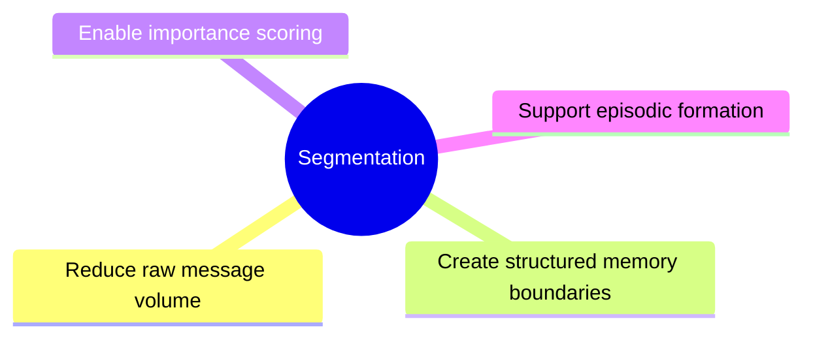
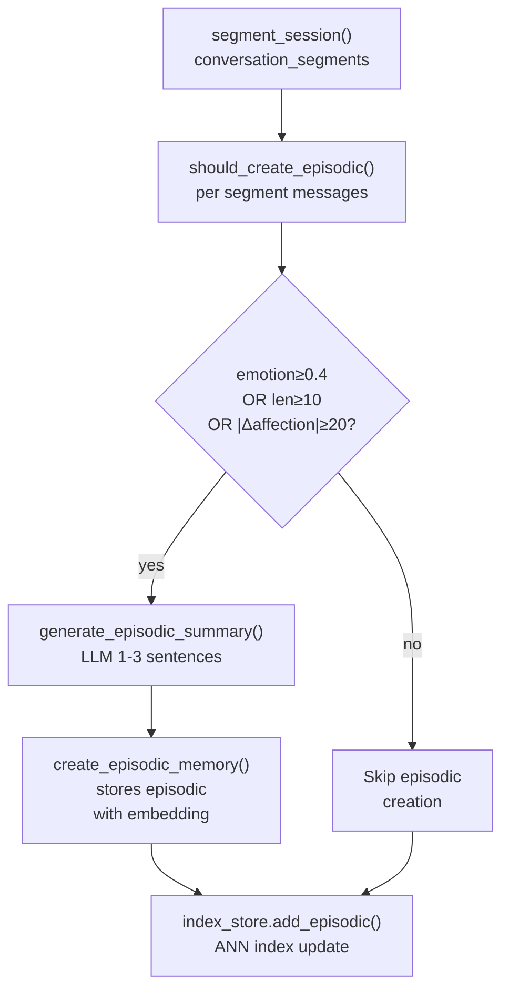

# Episodic Segmentation

Segmentation converts raw message streams into structured memory units
(`conversation_segments` table), which are then summarized into episodic
memories.

---

## Purpose



---

## What Is a Segment

A segment is a bounded group of consecutive messages representing:
- A task or workflow
- A discussion topic
- An emotional exchange
- A decision
- A meaningful interaction

Segments are stored in the `conversation_segments` table and later
processed into episodic memories.

---

## Segmentation Rules

```mermaid
flowchart TD
    A["Unsegmented\nmessages"] --> B{"Message\ncount\n≥ 20?"}
    B -->|yes| C["Close segment\nStart new group"]
    B --> D{"Time gap\n≥ 15 min?"}
    D -->|yes| C
    D -->|no| E["Add to\ncurrent group"]
    C --> F["Final group\n≥ 5 msgs?"}
    F -->|yes| G["Store segment"]
    F -->|no| H["Discard"]
```

**Three triggers for segment boundaries:**

| Rule | Threshold | Reason |
|---|---|---|
| Time gap | > 15 minutes between messages | Topic/context shift |
| Message count | ≥ 20 messages in group | Prevent oversized segments |
| Minimum size | ≥ 5 messages | Discard noise from tiny fragments |

---

## Segmentation Algorithm

```
1. Fetch all unsegmented messages (id > last segmented end_message_id)
2. Iterate messages chronologically:
   - If time gap ≥ 15 min → close current group, start new one
   - If group size ≥ 20 → close current group, start new one
   - Otherwise → add message to current group
3. If final group has ≥ 5 messages → store as segment
4. Return count of segments created
```

---

## From Segments to Episodic Memory



**Episodic creation triggers:**
- Emotional weight ≥ 0.4 (LLM-assessed)
- Message count ≥ 10 in the segment
- Affection delta ≥ 20 (from companion affection system)

---

## Segment vs. Episodic

| | Segment | Episodic Memory |
|---|---|---|
| Table | `conversation_segments` | `episodic_memory` |
| Granularity | Message window | LLM summary of a window |
| Trigger | Time/size rules | Emotional weight / message count |
| Summary | LLM-generated | LLM-generated |
| Embedding | ✅ yes | ✅ yes |
| Use case | Raw context retrieval | Long-term event memory |

---

## ANN Indexing

After a segment is created, its summary embedding is added to the ANN index:

```python
index_store.add_segment(seg_id, np.array(vector, dtype=np.float32))
```

This enables semantic search over conversation segments during retrieval.

---

## Module Responsibilities

**File:** `app/memory/segmenter.py`

| Function | Description |
|---|---|
| `_get_unsegmented_messages(session_id)` | Fetch messages not yet in any segment |
| `_detect_boundaries(messages)` | Apply time-gap (15 min) and size (20 msgs) rules |
| `_create_segment(session_id, group)` | Store ConversationSegment, embed summary |
| `segment_session(session_id)` | Main entry; returns number of segments created |

**Key constants:**
| Constant | Value |
|---|---|
| `MAX_MESSAGES_PER_SEGMENT` | 20 |
| `TIME_GAP_MINUTES` | 15 |
| Minimum segment size | 5 messages |
