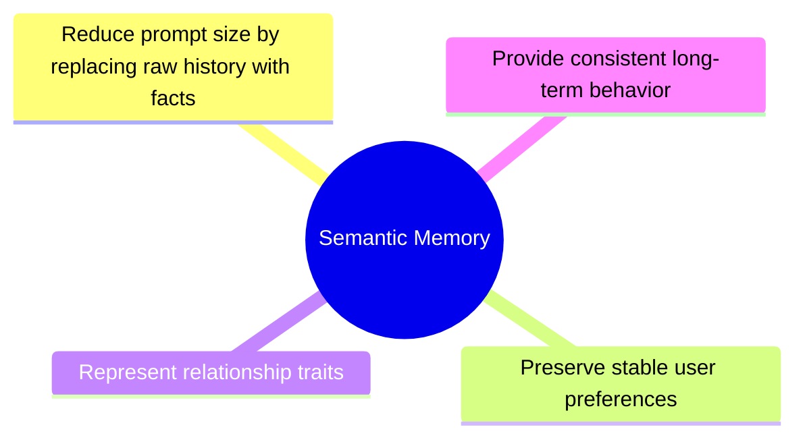
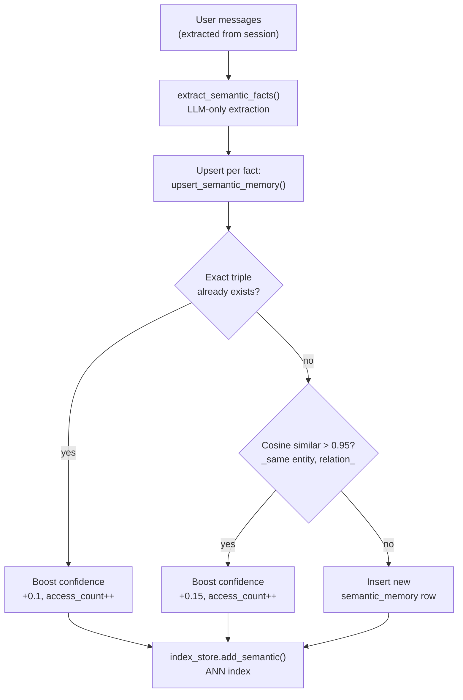

# Semantic Memory

Semantic memory stores long-term, generalized knowledge about the user,
the assistant, and their relationship.

Unlike episodic memory, which stores specific events, semantic memory
represents stable facts extracted from user messages.

Example:
```
(entity: "User", relation: "Preference", target: "concise answers")
(entity: "User", relation: "Identity", target: "Name is Bani, from Jakarta")
```

---

## Purpose



---

## Data Model

**Table:** `semantic_memory`

| Column | Type | Description |
|---|---|---|
| `id` | INTEGER PK | |
| `session_id` | INTEGER | |
| `entity` | TEXT | Always "User" |
| `relation` | TEXT | See taxonomy below |
| `target` | TEXT | Max 200 chars |
| `confidence` | REAL | 0.0–1.0, increases on duplicate facts |
| `importance` | REAL | 0.0–1.0, decays over time |
| `source_episodic_ids` | TEXT | JSON array of episodic memory IDs this fact was derived from |
| `embedding_vector` | BLOB | Vector of "entity relation target" text |
| `access_count` | INTEGER | |
| `last_accessed` | DATETIME | |
| `created_at` | DATETIME | |

---

## Relation Taxonomy

Each fact is classified with exactly one relation type:

| Relation | Definition | Example |
|---|---|---|
| `Preference` | Likes, dislikes, habits | "User Prefers dark mode" |
| `Identity` | Name, location, job, demographics | "User Identity Lives in Jakarta" |
| `Interest` | Topics they want to learn or explore | "User Interest wants to learn AI" |
| `Guideline` | How they want to be treated | "User Guideline call me Bani" |
| `Goal` | Things they want to achieve | "User Goal ship yuzu-v2" |
| `Relationship` | People in their life | "User Relationship girlfriend named Sari" |
| `Experience` | Skills, tools, past projects | "User Experience uses Python" |
| `Personality` | Behavioral patterns and tendencies | "User Personality works late nights" |

---

## Confidence Model

| Range | Interpretation |
|---|---|
| 0.0–0.3 | Weak signal — minor preference or casual mention |
| 0.3–0.6 | Probable pattern — regular knowledge |
| 0.6–0.85 | Strong preference — clearly stated |
| 0.85–1.0 | Core identity / goal — emotionally significant |

> These zones are interpretive guidance. The system does not enforce hard
> boundaries. Confidence increments by **+0.1** on exact-match duplicates
> and **+0.15** on cosine-similar duplicates (threshold > 0.95).

---

## Importance Model

| Range | Meaning |
|---|---|
| 0.0–0.3 | Minor, easily overridden |
| 0.4–0.6 | Regular knowledge |
| 0.7–1.0 | Core identity, goals, emotionally significant |

Importance is set by the LLM during extraction and decays over time via
the FSRS model in `review.py`.

---

## Extraction Process



**LLM extraction prompt assigns importance during extraction:**
- 0.0–0.3: minor preference
- 0.4–0.6: regular knowledge
- 0.7–1.0: core identity or emotionally significant

---

## Fact Deduplication

Two-layer dedup:

1. **Exact match** — same `(entity, relation, target)` → boost confidence +0.1
2. **Semantic similarity** — same `(entity, relation)`, cosine sim > 0.95 on embeddings → boost confidence +0.15

This prevents the same fact from being stored multiple times while
reinforcing genuinely repeated knowledge.

---

## Decay

Semantic memory decays via `review.decay_semantic_memories()`:
```
importance = importance × exp(-hours_since_last_access / stability)
stability = max(24 × (1 + access_count × 0.5), 24h)
```

Frequently accessed memories (high `access_count`) decay much more slowly.

---

## Retrieval Role

Semantic memory is always retrieved **before** episodic memory.

- Top 15 facts by hybrid score
- Sorted by: cosine_sim × 0.6 + importance × 0.2 + confidence × 0.2
- On retrieval: `access_count` increments, importance bumps +0.05 (capped at 1.0)

---

## Module Responsibilities

**File:** `app/memory/extractor.py`

| Function | Description |
|---|---|
| `extract_semantic_facts(messages)` | LLM-only extraction; returns `{entity, relation, target, importance}` |
| `_build_semantic_text(e, r, t)` | Builds "entity relation target" string for embedding |
| `_find_similar_semantic(...)` | Cosine similarity check for dedup |
| `upsert_semantic_memory(...)` | Insert or reinforce semantic triple |
| `process_messages_for_memory(...))` | Main entry; deduplicates by message hash, calls extraction pipeline |
