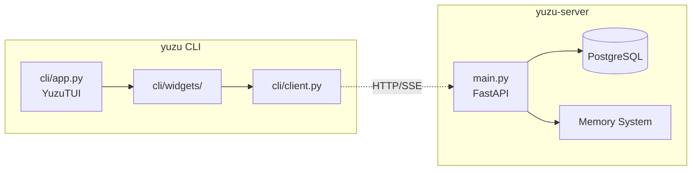

# Yuzu Companion — CLI Module

Thin-client Textual TUI for Yuzu Companion. Communicates exclusively via HTTP with the FastAPI backend — never imports database models or internal services.

---

## Quick Start

```bash
# Start backend server
yuzu-server
# or: python3 main.py

# In another terminal, launch TUI
yuzu
# or: python3 -m cli.app
```

---

## Architecture



**Key principle:** CLI only uses HTTP endpoints (`/api/*`). Zero direct database or internal module imports.

---

## Directory Structure

```
cli/
├── __init__.py
├── app.py                  # Textual YuzuTUI application
├── client.py               # Async HTTP client (YuzuClient)
├── widgets/
│   ├── __init__.py
│   ├── chat_log.py         # Scrollable chat history with Markdown
│   ├── input_box.py        # User input widget with message submission
│   └── session_list.py     # Session sidebar with switching
├── screens/                # Future: multi-screen layouts
├── styles/
│   └── app.tcss            # Textual CSS styling
└── utils/                  # Future: helper utilities
```

---

## Usage

### Keyboard Shortcuts

| Key | Action |
|-----|--------|
| `Ctrl+C` | Quit application |
| `Enter` | Send message |
| `↑/↓` | Navigate session list |
| `Enter` (on session) | Switch to selected session |

### Session Management

- Default session: `default` (created automatically)
- Session list on left sidebar shows all available sessions
- Sessions persist across restarts (stored in backend PostgreSQL)

---

## HTTP Client

`cli/client.py` — `YuzuClient` class:

```python
async with YuzuClient(backend_url="http://localhost:5000") as client:
    # Health check
    await client.check_health()
    
    # Send message (non-streaming)
    response = await client.send_message(session_id, message)
    
    # Stream message (SSE)
    async for chunk in client.stream_message(session_id, message):
        print(chunk)
    
    # Get chat history
    history = await client.get_history(session_id)
```

---

## Widget System

### ChatLog (`cli/widgets/chat_log.py`)

- Scrollable container for chat messages
- Markdown rendering via `rich.markdown.Markdown`
- Auto-scroll to bottom on new messages
- Methods: `add_message(role, content)`, `clear_messages()`

### InputBox (`cli/widgets/input_box.py`)

- User input widget with Enter-to-submit
- Emits `MessageSubmitted` event
- History navigation (up/down arrows)

### SessionList (`cli/widgets/session_list.py`)

- `OptionList` sidebar showing all sessions
- Emits `SessionSelected` event on selection
- Updates when backend sessions change

---

## Styling

`cli/styles/app.tcss` — Textual CSS for layout:

```
#sidebar {
    width: 30;
    dock: left;
}

#chat-container {
    width: 3fr;
}

InputBox {
    dock: bottom;
    height: auto;
}
```

---

## Testing

```bash
# Run CLI tests (when implemented)
pytest tests/test_cli/ -v
```

---

## Development Notes

- **Adding new widgets:** Place in `cli/widgets/`, import in `cli/widgets/__init__.py`
- **Adding new screens:** Create in `cli/screens/`, mount from `YuzuTUI`
- **HTTP client extensions:** Add methods to `cli/client.py` — never bypass HTTP layer
- **Backend changes:** Ensure `/api/` endpoints support both web and CLI clients

---

*This module is part of the Yuzu Companion project. For backend architecture, see `file app/README.md`. For full system topology, see `file docs/ARCHITECTURE.md`.*
