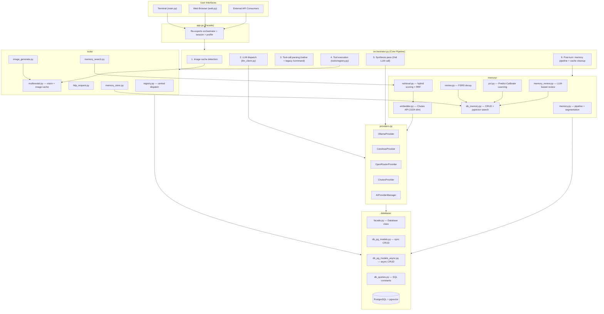
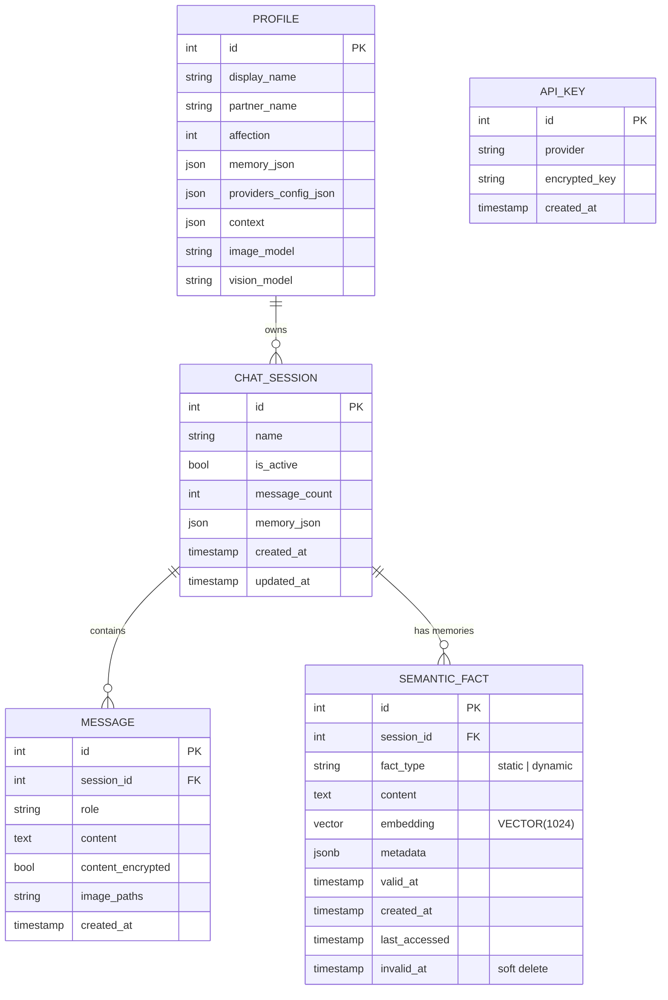

# Yuzu Companion — Structural Blueprint

> **Version:** 3.0.3 · **Python:** 3.12+ (3.13 compatible) · **Database:** PostgreSQL + pgvector · **Web:** FastAPI + Jinja2

---

## Table of Contents

1. [System Topology](#1-system-topology)
2. [Tech Stack Map](#2-tech-stack-map)
3. [Directory Structure](#3-directory-structure)
4. [Component Map](#4-component-map)
5. [Data Flow Pipelines](#5-data-flow-pipelines)
6. [Database Schema](#6-database-schema)
7. [API Surface](#7-api-surface)
8. [Frontend Architecture](#8-frontend-architecture)

---

## 1. System Topology



---

## 2. Tech Stack Map

```markdown
┌─────────────────────────────────────────────────────────────────┐
│                        Tech Stack                               │
├──────────────┬──────────────────────────────────────────────────┤
│ Language     │ Python 3.12+ (3.13 compatible)                  │
│              │ Vanilla JavaScript (ESM, no build step)         │
├──────────────┼──────────────────────────────────────────────────┤
│ Web          │ FastAPI + uvicorn (ASGI)                        │
│              │ Jinja2 templates                                │
│              │ Pydantic v2 request/response models             │
├──────────────┼──────────────────────────────────────────────────┤
│ Database     │ PostgreSQL + pgvector extension                 │
│              │ psycopg v3 (raw SQL, no ORM)                    │
│              │ ThreadedConnectionPool                          │
├──────────────┼──────────────────────────────────────────────────┤
│ LLM          │ Ollama (local/cloud)                                  │
│              │ Cerebras (cloud)                                │
│              │ OpenRouter (cloud)                              │
│              │ Chutes (cloud)                                  │
├──────────────┼──────────────────────────────────────────────────┤
│ Embedding    │ Qwen3-Embedding-0.6B via Chutes API            │
│              │ 1024-dimensional vectors                        │
├──────────────┼──────────────────────────────────────────────────┤
│ Memory       │ FSRS v6.3.1 (Free Spaced Repetition Scheduler) │
│              │ pgvector Exact Nearest Neighbor search          │
├──────────────┼──────────────────────────────────────────────────┤
│ Frontend     │ Marked.js v18 (markdown rendering)              │
│              │ Mermaid (diagrams)                              │
│              │ SSE (Server-Sent Events for streaming)          │
├──────────────┼──────────────────────────────────────────────────┤
│ Encryption   │ ChaCha20-Poly1305 (pycryptodome)               │
├──────────────┼──────────────────────────────────────────────────┤
│ Terminal UI  │ Rich + prompt_toolkit                           │
├──────────────┼──────────────────────────────────────────────────┤
│ Testing      │ pytest                                          │
├──────────────┼──────────────────────────────────────────────────┤
│ Linting      │ ruff (Python) · biome (JS)                     │
└──────────────┴──────────────────────────────────────────────────┘
```

---

## 3. Directory Structure

```markdown
yuzu-companion/
├── main.py                    # CLI entry (Rich TUI)
├── web.py                     # FastAPI entry (web server)
├── app/
│   ├── __init__.py
│   ├── app.py                 # Backward-compatible facade / re-exports
│   ├── orchestrator.py        # Core message pipeline
│   ├── llm_client.py          # LLM dispatch + vision routing + chutes_chat()
│   ├── prompts.py             # System prompt assembly + message context
│   ├── commands.py            # /command detection, StreamFilter, image guards
│   ├── providers.py           # AIProvider hierarchy + AIProviderManager
│   ├── session_lifecycle.py   # Session start/end, auto-naming
│   ├── profile_analysis.py    # Memory summarization, global profile analysis
│   ├── visual_context.py      # Persistent visual context buffer
│   ├── encryption.py          # ChaCha20-Poly1305 encryptor
│   ├── logging_config.py      # Centralized logging
│   ├── api/
│   │   ├── __init__.py        # Exposes api_router
│   │   └── routes.py          # All /api/* endpoints
│   ├── tools/
│   │   ├── __init__.py
│   │   ├── schemas.py         # ToolParam + ToolDefinition dataclasses
│   │   ├── registry.py        # Central tool registry
│   │   ├── image_generate.py  # Image generation via Chutes
│   │   ├── http_request.py    # HTTP GET/POST tool
│   │   ├── memory_search.py   # Memory retrieval tool
│   │   ├── memory_store.py    # Memory persistence tool
│   │   └── multimodal.py      # Vision routing, image caching
│   ├── memory/
│   │   ├── __init__.py
│   │   ├── memory.py          # Background pipeline + segmentation
│   │   ├── db_memory.py       # Unified CRUD over semantic_facts
│   │   ├── db_memory_queries.py # SQL constants + query builders
│   │   ├── embedder.py        # Chutes API embedding client
│   │   ├── extractor.py       # Semantic + episodic extraction
│   │   ├── retrieval.py       # Hybrid scoring + RRF
│   │   ├── review.py          # FSRS decay
│   │   ├── memory_review.py   # LLM-based memory review
│   │   ├── pcl.py             # Predict-Calibrate Learning
│   │   └── docs/
│   │       └── architecture.md
│   └── database/
│       ├── __init__.py
│       ├── facade.py          # Database class
│       ├── db_pg.py           # Connection pool
│       ├── db_pg_models.py    # Sync CRUD
│       ├── db_pg_models_async.py # Async CRUD
│       └── db_queries.py      # SQL constants, parsers, DDL
├── static/
│   ├── css/                   # Stylesheets (theme, marked, chat, etc.)
│   ├── js/                    # Vanilla JS (chat, renderer, config, etc.)
│   ├── generated_images/      # AI-generated images
│   ├── image_cache/           # Downloaded remote images
│   └── uploads/               # User-uploaded files
├── templates/                 # Jinja2 HTML templates
├── tests/                     # pytest test suite
├── CHANGELOG.md
├── README.md
└── INSTALL.md
```

---

## 4. Component Map

### Backend Components

| Component | File | Responsibility |
| --- | --- | --- |
| **Orchestrator** |  | Single entry point for all user messages. Coordinates image caching, LLM dispatch, tool execution, synthesis, and post-turn effects. |
| **LLM Client** |  | Builds messages, resolves providers, handles vision routing, dispatches sync/streaming calls. Exposes `chutes_chat()` for internal LLM tasks. |
| **Commands** |  | `/command` text detection, `StreamFilter` for streaming, markdown image guards. |
| **Prompts** |  | Assembles system prompt with identity, rules, memory context, affection mode, and session metadata. |
| **Providers** |  | Pluggable LLM provider hierarchy (`AIProvider` base + 4 concrete providers) managed by `AIProviderManager` singleton. |
| **Tools Registry** |  | Central tool dispatch. Lazy-loads tool modules, resolves aliases, returns structured results. |
| **Tool Schemas** |  | `ToolParam` and `ToolDefinition` dataclasses for declarative tool registration. |
| **Image Generation** |  | Image generation via Chutes API. |
| **HTTP Request** |  | HTTP GET/POST tool for web requests. |
| **Memory Search** |  | Hybrid memory retrieval tool. |
| **Memory Store** |  | Semantic fact persistence tool. |
| **Multimodal** |  | Vision model routing, image downloading/caching, base64 encoding. |
| **Memory Pipeline** |  | Background segmentation, pipeline gating, request-scoped caching. |
| **Memory CRUD** |  | Unified CRUD over `semantic_facts` with pgvector search. |
| **Memory Queries** |  | SQL constants and query builders for memory operations. |
| **Embedder** |  | Chutes API client for Qwen3-Embedding-0.6B (1024-dim). |
| **Extractor** |  | LLM-based semantic and episodic fact extraction. |
| **Retrieval** |  | Hybrid scoring (similarity + importance + confidence), RRF merge, combined static+dynamic retrieval. |
| **Review** |  | FSRS-based decay for episodic memories. |
| **Memory Review** |  | LLM-based memory quality review (Again/Hard/Good/Easy ratings). |
| **PCL** |  | Predict-Calibrate Learning: PREDICT → CALIBRATE → CONSOLIDATE pipeline. |
| **Session Lifecycle** |  | Session start/end, auto-naming, memory bootstrap. |
| **Profile Analysis** |  | Memory summarization, global profile analysis. |
| **Visual Context** |  | Thread-safe buffer for follow-up image references (3-turn TTL). |
| **Encryption** |  | ChaCha20-Poly1305 encryptor for API keys at rest. |
| **Database Facade** |  | `Database` class — stable API over raw psycopg2 with session_id defaulting. |
| **DB Pool** |  | `ThreadedConnectionPool` with sync/async context managers. |
| **DB Models (sync)** |  | Sync CRUD operations via raw psycopg2. |
| **DB Models (async)** |  | Async CRUD for FastAPI routes. |
| **DB Queries** |  | Single source of truth for SQL strings, DDL, and row parsers. |
| **API Routes** |  | All `/api/*` endpoints (\~700 lines). |

### Frontend Components

| Component | File | Responsibility |
| --- | --- | --- |
| **Chat UI** |  | Chat interface, SSE streaming, typing indicator, scroll management, dynamic layout. |
| **Renderer** |  | Marked.js v18 configuration, Mermaid diagram rendering, code highlighting. |
| **Config** |  | Fetches `/api/config` on page load, populates `appConfig`. |
| **Theme** |  | Design tokens (CSS variables). |
| **Markdown CSS** |  | Markdown rendering styles. |
| **Chat CSS** |  | Chat layout (flex-column, dynamic padding). |

---

## 5. Data Flow Pipelines

### 5.1 Message Processing (Synchronous)

```markdown
User Message
    │
    ▼
orchestrator.handle_user_message()
    │
    ├─► _cache_images_from_message()          [multimodal.py]
    │     └─ Extract image paths/URLs from message
    │     └─ Download remote → static/image_cache/
    │     └─ Validate paths (traversal protection)
    │
    ├─► /imagine fast path?
    │     └─ YES → execute_tool("image_generate") → return markdown
    │
    ├─► generate_ai_response()                [llm_client.py]
    │     ├─ build_system_message()           [prompts.py]
    │     │     ├─ retrieve_memories_combined()  [retrieval.py]
    │     │     │     ├─ embed_text()         [embedder.py → Chutes API]
    │     │     │     ├─ pgvector search (static + dynamic)
    │     │     │     └─ RRF merge + hybrid scoring
    │     │     ├─ _legacy_memory_block()     [Database facade]
    │     │     └─ Affection → closeness mode
    │     ├─ build_messages()                 [history from Database]
    │     ├─ _apply_vision_routing()          [multimodal.py]
    │     └─ _send_to_provider()              [providers.py]
    │           └─ AIProviderManager → Ollama/Cerebras/OpenRouter/Chutes
    │
    ├─► Response processing
    │     ├─ Native tool_calls? → _execute_tool_calls() → _run_synthesis()
    │     ├─ Legacy /command?   → execute_command()     → _run_synthesis()
    │     └─ Plain text         → persist + return
    │
    └─► _post_turn()
          ├─ auto_name_session_if_needed()
          ├─ summarize_memory() (if triggered)
          ├─ trigger_memory_pipeline_async() (every 5th turn)
          └─ _clear_request_cache() + _clear_embedding_cache()
```

### 5.2 Message Processing (Streaming)

```markdown
User Message
    │
    ▼
orchestrator.handle_user_message_streaming()
    │
    ├─► _cache_images_from_message()          [multimodal.py]
    │
    ├─► /imagine fast path?
    │     └─ YES → execute_tool → yield markdown
    │
    ├─► StreamFilter.buffering               [commands.py]
    │     ├─ Buffer chunks until first-line /command confirmed/ruled out
    │     ├─ No command → yield chunks live
    │     └─ Command detected → suppress command line, execute tool, stream synthesis
    │
    ├─► generate_ai_response_streaming()      [llm_client.py]
    │     └─ Same message building as sync path
    │     └─ Provider streaming API → yield chunks
    │
    └─► _post_turn() (same as sync)
```

### 5.3 Memory Pipeline

```markdown
Every 5th turn (throttled)
    │
    ▼
orchestrator._trigger_memory_pipeline()
    │
    ▼
memory.trigger_memory_pipeline_async()         [memory.py]
    │
    ├─► Gate check
    │     ├─ Delta ≥ 40 + idle ≥ 3h → trigger
    │     └─ Delta ≥ 50 → force trigger
    │
    ├─► batch_segment()                       [memory.py]
    │     ├─ Time-gap fast-path (≥ 15 min, no LLM)
    │     └─ LLM boundary detection (topic shift / surprise)
    │
    ├─► create_episodic_memory()              [extractor.py]
    │     └─ Summarized events → semantic_facts (fact_type='dynamic')
    │
    ├─► run_predict_calibrate()               [pcl.py]
    │     ├─ PREDICT: LLM predicts from existing facts
    │     ├─ CALIBRATE: Identify knowledge gaps
    │     └─ CONSOLIDATE: new/reinforce/update/invalidate
    │
    ├─► embed_text()                          [embedder.py]
    │     └─ Qwen3-Embedding-0.6B → 1024-dim vector
    │
    └─► save_fact()                           [db_memory.py]
          └─ INSERT INTO semantic_facts (pgvector)
```

### 5.4 Memory Retrieval (Per-Turn Context Building)

```markdown
prompts.build_system_message()
    │
    ▼
retrieval.retrieve_memories_combined()         [retrieval.py]
    │
    ├─► Embedding cache check
    │     └─ Miss → embed_text() [embedder.py → Chutes API]
    │
    ├─► pgvector search (single embedding, two queries)
    │     ├─ Static:  fact_type='static'  → top 10
    │     └─ Dynamic: fact_type='dynamic' → top 5
    │
    ├─► Hybrid scoring
    │     └─ score = similarity×0.6 + importance×0.2 + confidence×0.2
    │
    ├─► RRF merge
    │     └─ RRF_score = Σ 1/(k + rank), k=60
    │
    └─► Return (static_ids, static_context, dynamic_context)
          └─ Injected into system prompt
```

### 5.5 Tool Execution

```markdown
LLM Response (text or tool_calls)
    │
    ├─ Native tool_calls?                     [orchestrator.py]
    │     └─ _parse_raw_tool_calls() → _execute_tool_calls()
    │
    ├─ Legacy /command?                       [commands.py]
    │     └─ detect_command() → execute_command()
    │
    ▼
tools.registry.execute_tool()                  [registry.py]
    │
    ├─► Resolve alias (imagine→image_generate, request→http_request)
    ├─► Lazy-load tool module
    ├─► Inject session_id if needed
    ├─► module.execute(arguments, session_id)
    │
    └─► Return {"ok": bool, "data": {}, "markdown": "<details>..."}
          │
          ├─ Terminal tool (image_generate) → return directly
          └─ Non-terminal tool → synthesis pass (2nd LLM call)
```

### 5.6 Multimodal Pipeline

```markdown
Image in User Message
    │
    ▼
orchestrator._cache_images_from_message()
    │
    ├─ Local path? → validate + cache
    ├─ URL? → multimodal.download_image_to_cache() → static/image_cache/
    └─ Upload? → validate path (traversal protection)
    │
    ▼
llm_client._apply_vision_routing()
    │
    ├─ Images detected? → Route to OpenRouter (moonshotai/kimi-k2.5)
    └─ No images? → Use configured provider
    │
    ▼
Vision analysis → attached to conversation context
```

```markdown
/imagine Command
    │
    ▼
tools.image_generate.execute()
    │
    ├─ Chutes image API (HunYuan / Z-Turbo / Qwen)
    ├─ Save → static/generated_images/
    └─ Return markdown with image path
    │
    ▼
visual_context.store_visual_context()
    └─ Store base64 for 3 follow-up turns
```

---

## 6. Database Schema

### Entity-Relationship Diagram



### Table Summary

| Table | Purpose | Key Columns |
| --- | --- | --- |
| `profiles` | User/companion settings | `display_name`, `partner_name`, `affection`, `memory_json`, `providers_config_json` |
| `chat_sessions` | Session tracking | `name`, `is_active`, `message_count`, `memory_json` |
| `messages` | Conversation log | `session_id`, `role`, `content`, `content_encrypted`, `image_paths` |
| `api_keys` | Encrypted API key storage | `provider`, `encrypted_key` (ChaCha20-Poly1305) |
| `semantic_facts` | Unified memory store | `fact_type`, `content`, `embedding VECTOR(1024)`, `metadata JSONB`, `invalid_at` |

### Indexing Strategy

- **Primary keys**: B-tree on `id` for all tables
- **Metadata**: GIN index on `semantic_facts.metadata` (jsonb_path_ops)
- **Vector search**: Exact Nearest Neighbor (Sequential Scan). No HNSW/IVFFlat due to SIGILL on Termux ARM. 100% recall at \~36ms for 3,500 rows.

---

## 7. API Surface

### REST Endpoints

| Endpoint | Method | Handler | Response |
| --- | --- | --- | --- |
| `/api/config` | GET | `get_config()` | Vision models by provider |
| `/api/send_message` | POST | `send_message()` | `{response, session_id}` |
| `/api/send_message_stream` | POST | `send_message_stream()` | SSE stream |
| `/api/get_profile` | GET | `get_profile()` | Profile JSON |
| `/api/update_profile` | POST | `update_profile()` | Updated profile |
| `/api/providers` | GET | `get_providers()` | Provider list + models |
| `/api/providers/switch` | POST | `switch_provider()` | Status message |
| `/api/providers/test` | POST | `test_provider()` | Connection test result |
| `/api/sessions` | GET | `get_sessions()` | Session list |
| `/api/sessions/create` | POST | `create_session()` | New session |
| `/api/sessions/switch` | POST | `switch_session()` | Status message |
| `/api/sessions/rename` | POST | `rename_session()` | Status message |
| `/api/sessions/delete` | POST | `delete_session()` | Status message |
| `/api/memory_stats` | GET | `get_memory_stats()` | Memory statistics |
| `/api/api_keys` | GET | `get_api_keys()` | Key list |
| `/api/api_keys/add` | POST | `add_api_key()` | Status message |
| `/api/api_keys/delete` | POST | `delete_api_key()` | Status message |
| `/api/set_vision_model` | POST | `set_vision_model()` | Status message |
| `/api/upload_image` | POST | `upload_image()` | Upload result |
| `/api/generated_images/{filename}` | GET | `serve_generated_image()` | Image file |

### HTML Page Routes

| Path | Template | Purpose |
| --- | --- | --- |
| `/` |  | Home page |
| `/chat` |  | Chat interface |
| `/config` |  | Configuration page |
| `/about` |  | About page |

### Static Mounts

| Mount | Directory | Purpose |
| --- | --- | --- |
| `/static` | `static/` | CSS, JS, assets |
| `/uploads` | `static/uploads/` | User uploads |
| `/generated_images` | `static/generated_images/` | AI-generated images |

---

## 8. Frontend Architecture

### Component Diagram

```markdown
┌─────────────────────────────────────────────────────────────┐
│                      Browser                                 │
│                                                              │
│  ┌──────────────┐  ┌──────────────┐  ┌──────────────────┐  │
│  │  index.html  │  │  chat.html   │  │  config.html     │  │
│  └──────┬───────┘  └──────┬───────┘  └────────┬─────────┘  │
│         │                 │                    │             │
│  ┌──────▼───────┐  ┌──────▼───────┐  ┌────────▼─────────┐  │
│  │  home.js     │  │  chat.js     │  │  config.js       │  │
│  │  about.js    │  │  renderer.js │  │                  │  │
│  │  sidebar.js  │  │              │  │                  │  │
│  └──────────────┘  └──────┬───────┘  └──────────────────┘  │
│                           │                                  │
│                    ┌──────▼───────┐                          │
│                    │  /api/*      │                          │
│                    │  (SSE + REST)│                          │
│                    └──────────────┘                          │
└─────────────────────────────────────────────────────────────┘
```

### SSE Streaming Flow

```markdown
Browser                                    Server
   │                                         │
   │  POST /api/send_message_stream          │
   │ ──────────────────────────────────────► │
   │                                         │
   │  SSE: "data: {chunk}..."                │
   │ ◄────────────────────────────────────── │
   │                                         │
   │  chat.js appends chunk to DOM           │
   │  (incremental rendering)                │
   │                                         │
   │  SSE: "event: done"                     │
   │ ◄────────────────────────────────────── │
   │                                         │
   │  renderer.js renders Mermaid/code       │
   │  hideTypingIndicator()                  │
   │  scrollToBottom()                       │
```

### Rendering Pipeline

```markdown
Raw Markdown Chunk
    │
    ▼
renderer.renderSync()                     [renderer.js]
    │
    ├─ Marked.js v18 (GFM parsing)
    ├─ Mermaid diagram detection → mermaid.render()
    └─ Code block highlighting
    │
    ▼
innerHTML injection into .message-content
```

### Dynamic Layout System

```markdown
updateDynamicLayout()                     [chat.js]
    │
    ├─ paddingTop = header height (48px) + margin
    └─ paddingBottom = input area height + 60px margin

Triggered by:
    ├─ Page load
    ├─ Textarea input (auto-resize)
    ├─ Window resize
    └─ ResizeObserver on input area
```

---

*This document describes the structural blueprint of Yuzu Companion — what the system is and how the pieces fit together. For operational guidelines and safety rules, see `file AGENTS.md`.*