# Yuzu Companion - Architecture Documentation

## Table of Contents

1. [Overview](#overview)
2. [System Architecture](#system-architecture)
3. [Core Components](#core-components)
4. [Data Flows](#data-flows)
5. [Database Schema](#database-schema)
6. [API Reference](#api-reference)
7. [Tool System](#tool-system)
8. [Provider Architecture](#provider-architecture)
9. [Memory System](#memory-system)
10. [Frontend Architecture](#frontend-architecture)

---

## Overview

Yuzu Companion is a multimodal AI companion system with persistent memory, encrypted conversations, and support for multiple AI providers. The system is designed around a clean separation between the orchestration layer, provider layer, and tool layer.

### Key Features

| Feature | Description |
|---------|-------------|
| Multimodal Support | Text, image upload, and image generation |
| Persistent Memory | Session-based and global memory with structured storage |
| Multi-Provider | OpenRouter, Cerebras, Chutes, Ollama |
| Encrypted Storage | API keys encrypted at rest |
| Web & Terminal | Dual interface support |
| Tool System | Deterministic command-based tool execution |

---

## System Architecture

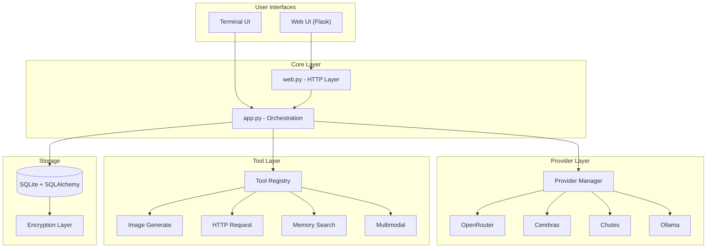

### Architecture Principles

| Principle | Implementation |
|-----------|---------------|
| Deterministic Tools | Command-based execution, no agentic looping |
| Provider Agnostic | Pure text interface to all providers |
| Single Source of Truth | Tool registry centralises all tool dispatch |
| No Schema Leakage | Providers never see tool definitions |

---

## Core Components

### Component Overview

| Component | File | Responsibility |
|-----------|------|----------------|
| Orchestration | `app.py` | Message handling, tool detection, provider routing |
| Web Interface | `web.py` | Flask routes, API endpoints, session management |
| Database | `database.py` | SQLAlchemy models, migrations, CRUD operations |
| Providers | `providers.py` | Provider implementations, connection management |
| Encryption | `encryption.py` | ChaCha20-Poly1305 for API key storage |
| Tool Registry | `tools/registry.py` | Tool dispatch, result formatting |

### Module Dependencies

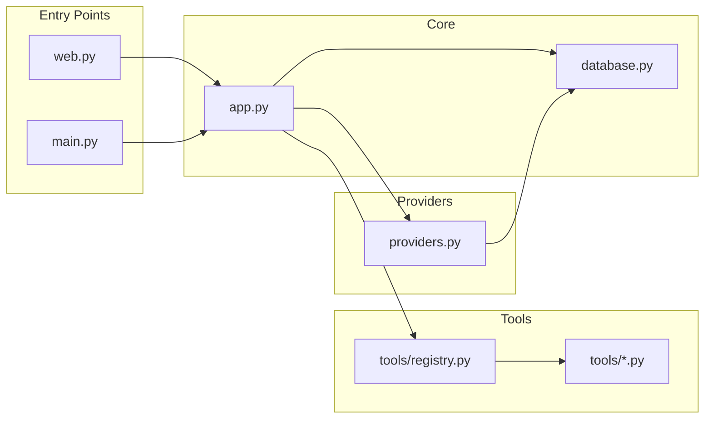

---

## Data Flows

### Standard Message Flow

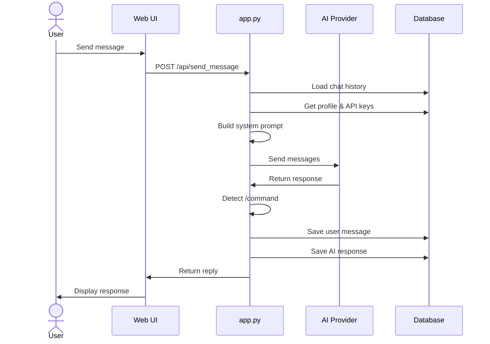

### Tool Execution Flow

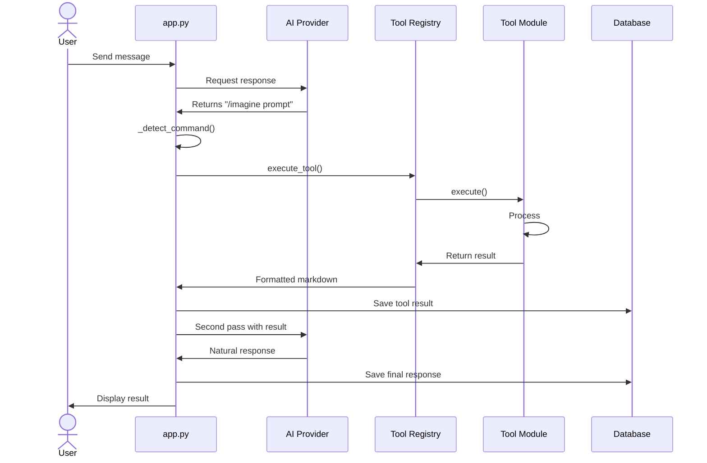

### Image Upload Flow

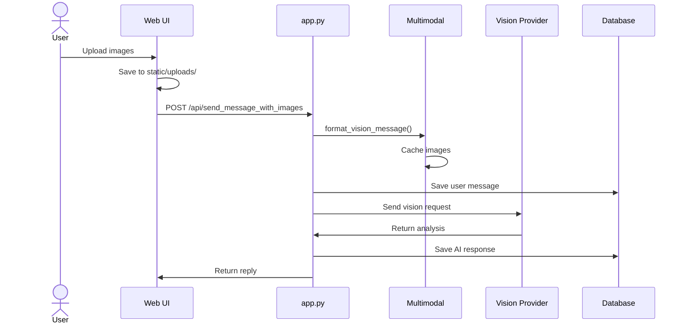

---

## Database Schema

### Entity Relationship Diagram

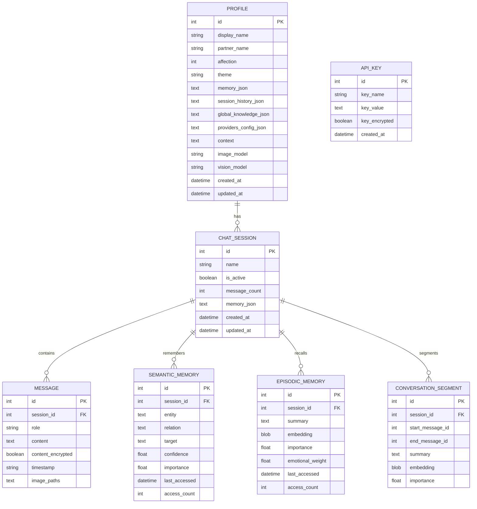

### Table Descriptions

| Table | Purpose | Key Columns |
|-------|---------|-------------|
| `profiles` | Singleton table for user/partner configuration | `display_name`, `partner_name`, `vision_model`, `image_model` |
| `chat_sessions` | Conversation containers | `name`, `is_active`, `message_count` |
| `messages` | All conversation messages | `role`, `content`, `timestamp`, `image_paths` |
| `semantic_memories` | Fact-based knowledge | `entity`, `relation`, `target`, `confidence` |
| `episodic_memories` | Event-based memories | `summary`, `emotional_weight`, `importance` |
| `conversation_segments` | Thematic message groupings | `start_message_id`, `end_message_id`, `summary` |
| `api_keys` | Encrypted provider credentials | `key_name`, `key_value`, `key_encrypted` |

---

## API Reference

### Profile & Settings

| Endpoint | Method | Description |
|----------|--------|-------------|
| `/api/get_profile` | GET | Get complete profile with chat history |
| `/api/update_profile` | POST | Update profile fields |
| `/api/update_image_model` | POST | Set image generation model |
| `/api/update_vision_model` | POST | Set vision analysis model |
| `/api/global_knowledge/update` | POST | Update global knowledge facts |
| `/api/update_location` | POST | Set location coordinates |

### Messaging

| Endpoint | Method | Description |
|----------|--------|-------------|
| `/api/send_message` | POST | Send text message |
| `/api/send_message_with_images` | POST | Send message with image uploads |
| `/api/clear_chat` | POST | Clear current session history |

### Sessions

| Endpoint | Method | Description |
|----------|--------|-------------|
| `/api/sessions/list` | GET | List all sessions |
| `/api/sessions/create` | POST | Create new session |
| `/api/sessions/switch` | POST | Switch to session |
| `/api/sessions/rename` | POST | Rename session |
| `/api/sessions/delete` | POST | Delete session |

### AI Providers

| Endpoint | Method | Description |
|----------|--------|-------------|
| `/api/providers/list` | GET | List available providers and models |
| `/api/providers/set_preferred` | POST | Set preferred provider/model |
| `/api/providers/test_connection` | POST | Test provider connectivity |

### Memory

| Endpoint | Method | Description |
|----------|--------|-------------|
| `/api/memory_stats` | GET | Get structured memory statistics |
| `/api/rebuild_structured_memory` | POST | Rebuild semantic/episodic memory |
| `/api/run_memory_decay` | POST | Apply FSRS-style forgetting |
| `/api/update_global_profile` | POST | Analyze all sessions for profile |

### API Keys

| Endpoint | Method | Description |
|----------|--------|-------------|
| `/api/add_api_key` | POST | Store new API key |
| `/api/remove_api_key` | POST | Remove stored key |

---

## Tool System

### Available Tools

| Tool Name | Command | Role | Terminal | Description |
|-----------|---------|------|----------|-------------|
| Image Generate | `/imagine` | `image_tools` | Yes | Generate images via Chutes |
| HTTP Request | `/request` | `request_tools` | No | Fetch data from URLs |
| Memory Search | `/memory_search` | `memory_search_tools` | No | Semantic memory search |
| Memory SQL | `/memory_sql` | `memory_sql_tools` | No | Direct SQL on memories |

### Tool Execution Architecture

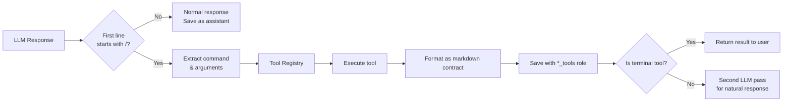

### Tool Result Format

All tool results are stored as markdown contracts:

```html
<details>
<summary>🔧 {tool_role}</summary>

```bash
{partner}$ /{command} {args}
```

> {result_line_1}
> {result_line_2}

</details>
```

### Tool Orchestration Framework

The tool orchestration framework is designed to be flexible and extensible. It consists of three main components:

1. **Tool Registry**: A central registry that maps commands to their corresponding tool implementations. This is responsible for parsing the LLM response, extracting the command and arguments, and dispatching the request to the appropriate tool.

2. **Tool Interface**: A simple interface that all tools must implement. This ensures that the orchestration layer can call any tool in a consistent way, regardless of the underlying implementation.

3. **Tool Execution**: The actual execution of the tool. This is where the business logic for each tool is implemented. The orchestration layer is responsible for calling the tool, passing in the arguments, and handling the result.

The framework is designed to be easily extended. New tools can be added by implementing the `ToolInterface` and registering them with the `ToolRegistry`. The orchestration layer will automatically detect and use the new tool.

---

## Provider Architecture

### Provider Hierarchy

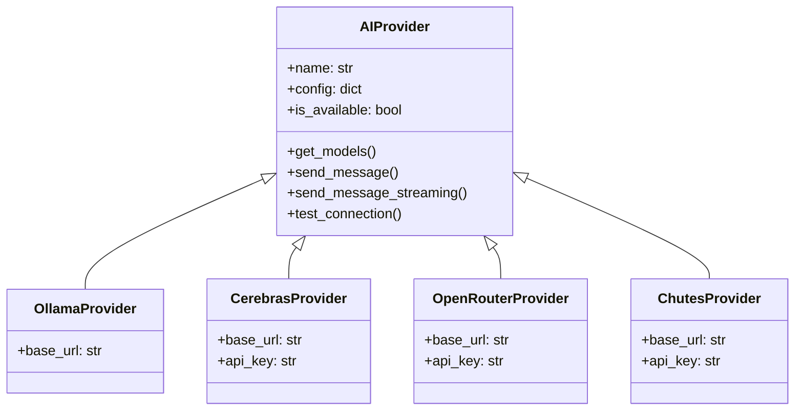

### Provider Capabilities

| Provider | Models | Vision | Streaming | Authentication |
|----------|--------|--------|-----------|----------------|
| Ollama | Local models | Model-dependent | Yes | None |
| Cerebras | Qwen, GPT-OSS, Llama | No | Yes | API key |
| OpenRouter | 20+ models | Yes (kimi-k2.5) | Yes | API key |
| Chutes | Qwen, DeepSeek, Kimi, GLM | Yes | Yes | API key |

### Vision Model Support

| Provider | Vision Model | Endpoint |
|----------|--------------|----------|
| Chutes | `moonshotai/Kimi-K2.5-TEE` | `llm.chutes.ai` |
| Chutes | `Qwen/Qwen3.5-397B-A17B-TEE` | `llm.chutes.ai` |
| OpenRouter | `moonshotai/kimi-k2.5` | `openrouter.ai` |

---

## Memory System

### Memory Types

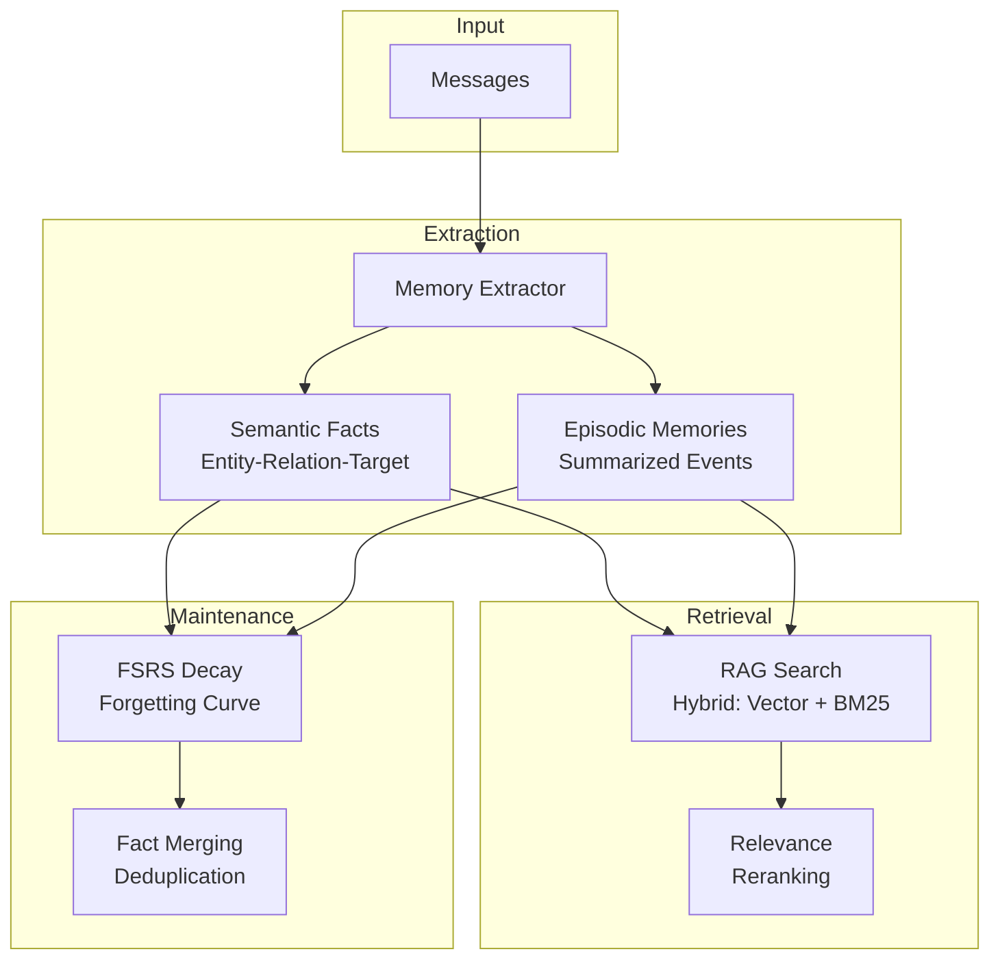

### Memory Schema

| Memory Type | Structure | Use Case |
|-------------|-----------|----------|
| Semantic | `(entity, relation, target, confidence)` | Facts about user/preferences |
| Episodic | `(summary, embedding, emotional_weight)` | Significant events |
| Conversation Segment | `(summary, start_id, end_id)` | Thematic chunks |

### Decay Parameters

| Parameter | Default | Description |
|-----------|---------|-------------|
| Requested retention | 90% | Target probability of recall |
| Minimum threshold | 0.3 | Minimum importance to retain |
| Access boost | +0.1 | Importance increment per access |

---

## Frontend Architecture

### Page Structure

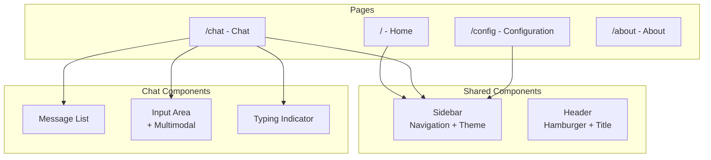

### CSS Architecture

| File | Purpose | Scope |
|------|---------|-------|
| `style.css` | Global utilities, reset, animations | All pages |
| `theme.css` | CSS variables for theming | All pages |
| `chat.css` | Chat layout, messages, input | Chat only |
| `sidebar.css` | Navigation drawer | All pages |
| `config.css` | Form styling | Config only |
| `multimodal.css` | Image upload UI | Chat only |
| `mobile.css` | Mobile optimisations | All pages |

### JavaScript Modules

| File | Responsibility | Dependencies |
|------|---------------|--------------|
| `chat.js` | Message handling, API calls | `marked.js`, `hljs` |
| `config.js` | Settings forms, provider tests | None |
| `sidebar.js` | Navigation, theme switching | None |
| `renderer.js` | Markdown rendering, code blocks | `marked.js`, `hljs` |
| `mobile-enhancements.js` | Touch gestures, paste | None |

### Multimodal Flow

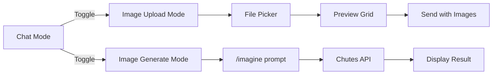

---

## Configuration

### Environment Variables

| Variable | Purpose | Default |
|----------|---------|---------|
| `TERMUX_VERSION` | Auto-detect Termux | None |
| `HOST` | Web server bind address | `127.0.0.1` |
| `PORT` | Web server port | `5000` |

### Profile Settings

| Setting | Type | Stored In |
|---------|------|-----------|
| Display name | String | `profiles.display_name` |
| Partner name | String | `profiles.partner_name` |
| Affection level | Integer (0-100) | `profiles.affection` |
| Theme | Enum | `profiles.theme` |
| Image model | Enum | `profiles.image_model` |
| Vision model | Enum | `profiles.vision_model` |
| Provider config | JSON | `profiles.providers_config_json` |
| Global knowledge | JSON | `profiles.global_knowledge_json` |
| Memory | JSON | `profiles.memory_json` |

---

## Security Considerations

| Layer | Protection | Implementation |
|-------|-----------|---------------|
| API Keys | Encryption at rest | ChaCha20-Poly1305 via `pycryptodome` |
| Database | File permissions | `0600` on SQLite file |
| Input Validation | SQL injection prevention | Parameterized queries, role whitelist |
| URL Validation | SSRF prevention | Scheme whitelist, localhost block |

---

## Further Reading

- [INSTALL.md](../INSTALL.md) - Setup instructions
- [QUICK_FIXES.md](../QUICK_FIXES.md) - Recent improvements summary
- [AUDIT_REPORT.md](../AUDIT_REPORT.md) - Full codebase audit
