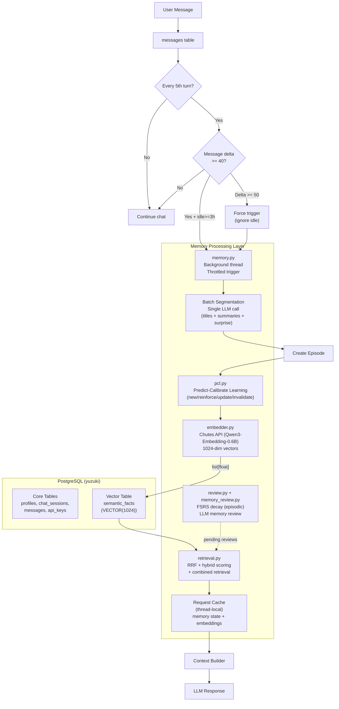
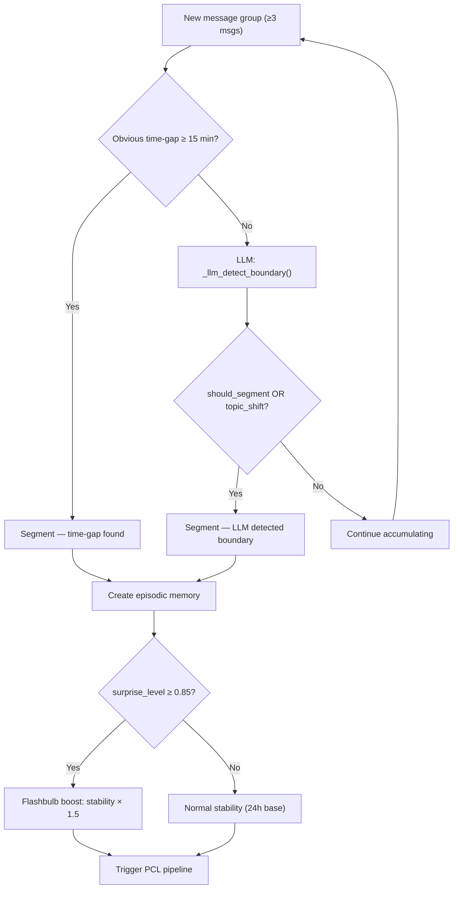
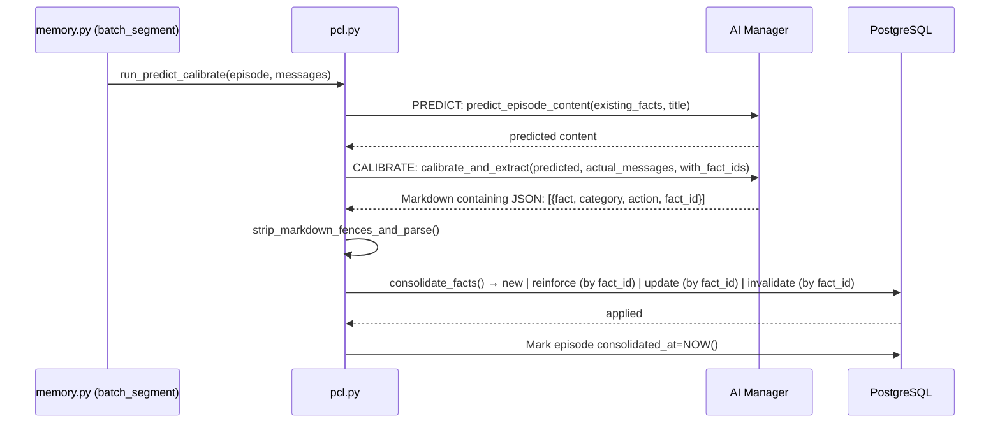
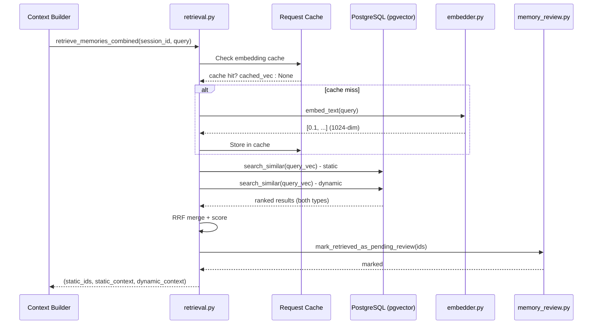

# Memory Architecture — PostgreSQL + pgvector

This document defines the structure, database schema, and data flow of the long-term memory system used by the Yuzu companion.

The memory subsystem transforms raw chat logs into structured, retrievable, vector-searchable memory layers — all stored in PostgreSQL with pgvector extension.


**Inspired by [plast-mem](https://github.com/moeru-ai/plast-mem)** patterns for temporal validity and FSRS scope — a reference implementation for persistent AI memory systems.

---

## Architecture Overview



---

## Database Layer

### PostgreSQL + pgvector

All data lives in a single PostgreSQL database with the pgvector extension for vector similarity search.

**Key Design:**

- No SQLite. No FAISS. No BLOB serialization.
- Embeddings stored as native `VECTOR(1024)` columns.
- psycopg v3 handles `list[float]` directly via string interpolation of float lists.

### Unified Memory Table (`semantic_facts`)

| Column | Type | Description |
| --- | --- | --- |
| `id` | SERIAL PK | Auto-increment ID |
| `fact_type` | VARCHAR(20) | `static` (semantic) or `dynamic` (episodic/segment) |
| `content` | TEXT | The memory content |
| `embedding` | VECTOR(1024) | pgvector embedding (native, no serialization) |
| `metadata` | JSONB | Flexible per-type fields |
| `valid_at` | TIMESTAMP | When fact became true (plast-mem pattern) |
| `created_at` | TIMESTAMP | Creation timestamp |
| `last_accessed` | TIMESTAMP | Last retrieval timestamp |
| `invalid_at` | TIMESTAMP | Soft delete — `NULL` = active, set = invalidated |

**Index:** Primary key only. Vector indexing (HNSW/IVFFlat) intentionally omitted due to SIGILL on Termux ARM environment. Using Exact Nearest Neighbor (Sequential Scan) with perfect 100% recall. Performance is stable for current scale (&lt; 50k rows).

**Text Search:** GIN on `metadata` (jsonb_path_ops) for metadata queries. pg_trgm available for fuzzy matching.

---

## Memory Types

| fact_type | Scope | Decay? | Description |
| --- | --- | --- | --- |
| `static` | Global (no session filter) | NO — uses `invalid_at` | Semantic facts (preferences, identity, etc.) |
| `dynamic` | Per-session | YES — FSRS-style | Episodic memories + conversation segments |

### Metadata per Type

**static (semantic):**

```json
{
  "category": "Preference",
  "entity": "User",
  "relation": "Preference",
  "target": "...fact...",
  "confidence": 0.7,
  "importance": 0.7,
  "source_table": "semantic_memories",
  "source_episodic_ids": [1, 2, 3],
  "stability": 1.0,
  "difficulty": 1.0,
  "pending_review": false,
  "last_reviewed_at": null
}
```

**Note:** `source_table` values (`semantic_memories`, `episodic_memories`, `conversation_segments`) are **logical identifiers** indicating the memory's origin type, not actual table names. All data lives in the unified `semantic_facts` table.

**dynamic (episodic):**

```json
{
  "importance": 0.6,
  "emotional_weight": 0.4,
  "summary": "User discussed their coding project",
  "source_table": "episodic_memories",
  "consolidated_at": "2026-04-05T10:00:00",
  "stability": 1.5,
  "surprise_level": 0.2
}
```

**dynamic (segment):**

```json
{
  "start_message_id": 42,
  "end_message_id": 61,
  "importance": 0.5,
  "source_table": "conversation_segments"
}
```

---

## Segmentation System

Segmentation converts raw message streams into structured memory units. Dual-channel: time-gap rules (fast-path) + LLM boundary detection (refinement).

### Segmentation Rules

| Rule | Threshold | Channel |
| --- | --- | --- |
| **Time Gap** | ≥ 15 minutes | Fast-path (no LLM) |
| **Max Size** | 20 messages | Always enforced |
| **LLM Detection** | topic shift OR surprise | LLM channel |
| **Flashbulb** | surprise ≥ 0.85 | Stability boost |

### Dual-Channel Algorithm



---

## Semantic Extraction + PCL Pipeline

Semantic facts are extracted via the Predict-Calibrate Learning (PCL) pipeline, triggered after episodic memory creation.

### PCL Flow



### Consolidation Actions

| Action | When | Behavior |
| --- | --- | --- |
| `new` | No duplicate found | Insert with embedding + source_episodic_ids |
| `reinforce` | Duplicate/Strengthen existing fact | Requires valid `fact_id`. Appends to source_episodic_ids, bumps confidence |
| `update` | Same fact, new nuance | Requires valid `fact_id`. Invalidates old, inserts new version referencing the old fact |
| `invalidate` | Contradicted | Requires valid `fact_id`. Sets invalid_at=NOW() on old fact |

### JSON Extraction from Markdown
The PCL pipeline enforces stable JSON parsing by stripping markdown fences (e.g., ` ```json ` blocks) from the LLM's response before deserialization, ensuring reliable fact extraction even if the model hallucinates formatting.

### 8-Category Taxonomy

Every semantic fact is assigned exactly one category:

| Category | Captures |
| --- | --- |
| `Identity` | name, profession, location, company, education |
| `Preference` | likes, dislikes, favorites, stylistic choices |
| `Interest` | topics, hobbies, domains engaged with |
| `Personality` | communication style, emotional tendencies |
| `Relationship` | dynamics, shared routines, inside jokes |
| `Experience` | skills, past events, professional background |
| `Goal` | plans, aspirations, things being worked toward |
| `Guideline` | how the assistant should behave |

### Module: `file pcl.py`

```python
run_predict_calibrate(episode_id, messages, session_id)   # Main entry
load_relevant_semantic_facts(session_id, limit=10)       # Fetch top facts
predict_episode_content(existing_facts, episode_title)   # PREDICT phase
calibrate_and_extract(predicted_content, actual_messages) # CALIBRATE phase
consolidate_facts(extracted, session_id)                 # CONSOLIDATE phase
```

---

## Retrieval System

### Hybrid Scoring Formula

```markdown
score = similarity × 0.6 + importance × 0.2 + confidence × 0.2
```

**Note:** All values are normalized 0-1. Cosine similarity from pgvector is always in range \[0, 2\] and is normalized by dividing by 2. `importance` and `confidence` from metadata should be stored in range \[0, 1\].

### RRF Merge

When both static and dynamic results are available, Reciprocal Rank Fusion merges them:

```markdown
RRF_score = Σ 1.0 / (k + rank)  per list, k=60
```

Tie-breaking: higher individual score first, then lower ID.

### Retrieval Pipeline



**Optimizations:**

- Single embedding call for both static + dynamic retrieval
- Request-scoped cache avoids duplicate embeddings per turn
- Short queries (&lt; 4 chars) skip embedding entirely

### Context Assembly Order

1. System message
2. Static memories (global semantic facts)
3. Dynamic memories (episodic memories)
4. Temporal messages (time-window filtered)
5. Recent raw messages

### Modules

| Module | Key Functions |
| --- | --- |
|  | `retrieve_memory()`, `retrieve_static_memories()`, `retrieve_dynamic_memories()`, `retrieve_segments()`, `format_memory()` |
|  | `review_memory()`, `mark_retrieved_as_pending_review()` |

---

## FSRS-Inspired Retention

### Scope: Episodic Only

**Semantic (static) facts do NOT decay.** They use temporal validity (`invalid_at`) instead.

**Episodic (dynamic) facts decay via FSRS.**

### Library Integration

Uses `fsrs>=6.3.1` Python library for proper FSRS state transitions (aligned with plast-mem's `fsrs` crate).

```python
from fsrs import Scheduler, Card, Rating, State

# Create scheduler instance
scheduler = Scheduler()

# Create card with current state
card = Card(
    stability=current_stability,
    difficulty=current_difficulty,
    state=current_state,
    due=current_due,
    last_review=current_last_review,
)

# Review the card and get next state
rating_enum = Rating.Good  # or Again/Hard/Easy
new_card, review_log = scheduler.review_card(card, rating_enum)

# Extract new FSRS parameters
new_stability = new_card.stability
new_difficulty = new_card.difficulty
```

**Note:** The fsrs library uses `Scheduler.review_card(card, rating)`, NOT `fsrs.repeat()`.

### Core Variables

| Variable | Applies To | Description |
| --- | --- | --- |
| `importance` | Both | Primary relevance score |
| `stability` | Episodic | Resistance to decay |
| `difficulty` | Episodic | How hard to memorize |
| `access_count` | Both | Times retrieved |

### Decay Formula (Retrievability)

```markdown
retrievability = exp(-hours_since_last_access / stability)
final_score = rrf_score * (0.5 + 0.5 * retrievability)
```

### Memory Review (LLM-based)

After retrieval, facts are marked pending review. When `review_memory()` is called:

| Rating | Stability | Difficulty | Effect |
| --- | --- | --- | --- |
| `again` | × 0.5 | +0.15 | Memory was noise |
| `hard` | × 0.9 | +0.05 | Weak connection |
| `good` | × 1.2 | −0.05 | Directly relevant |
| `easy` | × 1.5 | −0.10 | Core pillar |

### Modules

| Module | Key Functions |
| --- | --- |
|  | `run_decay()`, `reinforce_memory()` |
|  | `review_memory()`, `mark_retrieved_as_pending_review()` |

---

## Core Modules Summary

| Module | Purpose | Key Functions |
| --- | --- | --- |
|  | Background memory pipeline runner (now: memory.py) | `run_memory_pipeline()`, `batch_segment()`, `create_episode_and_pcl()`, `trigger_memory_pipeline_async()` |
|  | Unified CRUD over `semantic_facts` | `save_fact()`, `search_similar()`, `invalidate_fact()`, `increment_importance()`, `decay_facts()` |
|  | Chutes API embedding client | `embed_text()`, `embed_texts()`, `EMBEDDING_DIM=1024` |
|  | Semantic fact storage helper | `upsert_semantic_memory()` (used by PCL), `calculate_emotional_weight()` |
|  | Hybrid scoring + RRF retrieval | `retrieve_memory()`, `retrieve_static_memories()`, `retrieve_segments()`, `format_memory()` |
|  | FSRS decay for episodic memories | `run_decay()`, `reinforce_memory()` |
|  | LLM-based memory review | `review_memory()`, `mark_retrieved_as_pending_review()` |
|  | Predict-Calibrate Learning pipeline | `run_predict_calibrate()`, `consolidate_facts()` |

**Removed:** `memory.py (batch_segment)` and `file vector_store.py` — replaced by `batch_segment()` and `file db_memory.py`

---

## Directory Structure

```markdown
app/memory/
├── __init__.py
├── memory.py              # Background memory pipeline
├── db_memory.py           # Unified memory CRUD (PostgreSQL + pgvector)
├── db_memory_queries.py   # SQL constants + query builders
├── embedder.py            # Chutes API embedding client (1024-dim)
├── extractor.py           # Semantic fact storage (upsert_semantic_memory)
├── retrieval.py           # RRF + hybrid scoring retrieval
├── review.py              # FSRS-style decay (episodic only)
├── memory_review.py       # LLM-based memory review + FSRS updates
├── pcl.py                 # Predict-Calibrate Learning pipeline
└── docs/
    └── architecture.md    # This file (single source of truth)
```

---

## Request Caching

To minimize API calls per turn, two thread-local caches are used:

### Memory State Cache (`file memory.py`)

Caches `get_memory_state()` results within a single request:

```python
_request_cache = threading.local()

def _get_cached_memory_state(session_id: int) -> dict:
    if not hasattr(_request_cache, 'state'):
        _request_cache.state = {}
    if session_id not in _request_cache.state:
        _request_cache.state[session_id] = get_memory_state(session_id)
    return _request_cache.state[session_id]
```

### Embedding Cache (`file retrieval.py`)

Caches query embeddings within a single request:

```python
_embedding_cache = threading.local()
_MIN_QUERY_LEN_FOR_EMBEDDING = 4  # Skip embedding for short queries

def _get_cached_embedding(query: str) -> list[float] | None:
    if not hasattr(_embedding_cache, 'vec'):
        return None
    if _embedding_cache.query == query:
        return _embedding_cache.vec
    return None
```

### Cache Lifecycle

Both caches are cleared at the end of each turn in `file orchestrator.py`:

```python
def _clear_request_cache() -> None:
    try:
        from app.memory.memory import _clear_request_cache as clear_memory
        clear_memory()
    except Exception:
        pass
    try:
        from app.memory.retrieval import _clear_embedding_cache
        _clear_embedding_cache()
    except Exception:
        pass
```

---

## Integration Points

### orchestrator.py

```python
from app.memory.memory import trigger_memory_pipeline_async, _clear_request_cache
from app.memory.review import run_decay
from app.memory.retrieval import retrieve_memories_combined, _clear_embedding_cache

# On session start — queue background pipeline
run_decay(session_id)

# After each turn — THROTTLED trigger (every 5th turn only)
_PIPELINE_CHECK_INTERVAL = 5
msg_count = Database.get_session_messages_count(session_id)
if msg_count % _PIPELINE_CHECK_INTERVAL == 0:
    trigger_memory_pipeline_async(session_id, msg_count)

# Context building — combined retrieval (single embedding)
static_ids, static_context, dynamic_context = retrieve_memories_combined(
    session_id, query=user_message, limit=10
)

# Mark retrieved facts as pending review for later LLM-based review
if static_ids:
    from app.memory.memory_review import mark_retrieved_as_pending_review
    mark_retrieved_as_pending_review(static_ids, session_id)

# End of turn — clear request caches
_clear_request_cache()
```

---

## Key Design Decisions

 1. **1024-dim Embeddings**: Qwen3-Embedding-0.6B via Chutes API — smaller, faster, still high quality.
 2. **Soft Delete**: Facts never hard-deleted. `invalid_at` preserves history and enables temporal queries.
 3. **PCL Pipeline**: Predict-Calibrate Learning extracts durable knowledge from episodic episodes — closes the complementary learning systems loop.
 4. **Batch Segmentation**: Single LLM call generates all segment titles, summaries, and surprise levels at once — amortizes cost.
 5. **Background Thread**: Memory pipeline runs in daemon thread — non-blocking, chat responses return immediately.
 6. **Throttled Pipeline Trigger**: Pipeline check runs every 5th turn. Triggers when delta &gt;= 40 messages AND idle &gt;= 3 hours, or force at delta &gt;= 50. Reduces per-turn overhead by 80%.
 7. **RRF Merge**: Combines static and dynamic retrieval rankings without BM25 (unavailable on Termux).
 8. **FSRS Scope Restriction**: Semantic facts don't decay — they use `invalid_at` for temporal validity.
 9. **Vector Literal Interpolation**: psycopg v3 cannot adapt Vector objects over the wire protocol — vectors are interpolated as string literals directly in SQL.
10. **Request-Scoped Caching**: Memory state and embeddings cached per-request, cleared at turn end — reduces DB queries and API calls 70-80%.